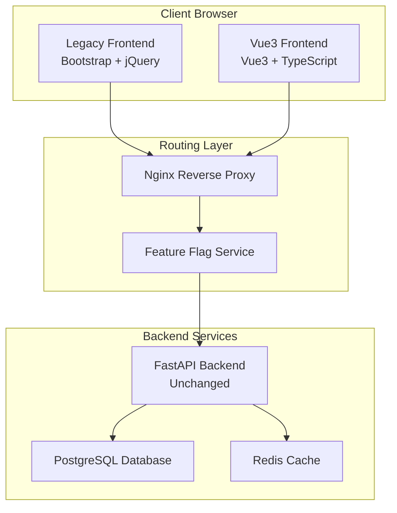

# MIGRATION STRATEGY DOCUMENT

**Project**: CINERENTAL Vue3 Frontend Migration
**Document Version**: 1.0
**Date**: 2025-08-29
**Status**: Phase 1 - Strategic Planning
**Author**: Migration Strategy Team

---

## Executive Summary

This document outlines the comprehensive migration strategy for transitioning CINERENTAL's cinema equipment rental management system from Bootstrap + jQuery to Vue3 + TypeScript. The strategy employs a dual-frontend approach to ensure zero business disruption while enabling gradual user adoption and feature rollout.

### Strategic Approach

- **Dual Frontend Architecture**: Run both legacy and Vue3 frontends simultaneously
- **Gradual Migration**: Phase-by-phase feature migration with user opt-in capability
- **Zero Downtime Guarantee**: Maintain full business operations throughout migration
- **Rollback Safety**: Immediate fallback to legacy system if critical issues arise

---

## Migration Philosophy

### Core Principles

1. **Business Continuity First**: No disruption to cinema equipment rental operations
2. **User-Centric Approach**: Preserve familiar workflows while enhancing experience
3. **Risk Minimization**: Multiple fallback layers and comprehensive testing
4. **Iterative Enhancement**: Continuous improvement with user feedback integration
5. **Performance Preservation**: Maintain or improve current system performance

### Success Definition

Migration is successful when:

- 100% feature parity achieved between legacy and Vue3 frontends
- All user workflows function identically or better in Vue3
- System performance meets or exceeds current benchmarks
- Users can seamlessly switch between frontends
- Development team can maintain Vue3 codebase effectively

---

## Dual Frontend Architecture

### Technical Implementation



### Routing Strategy

#### URL Structure Design

```text
Legacy Frontend Routes:
├── / (Dashboard)
├── /equipment (Equipment List)
├── /equipment/{id} (Equipment Detail)
├── /projects (Project List)
├── /projects/{id} (Project Detail)
├── /scanner (Scanner Interface)
├── /clients (Client Management)
└── /bookings (Booking Management)

Vue3 Frontend Routes:
├── /vue/ (Vue3 Dashboard)
├── /vue/equipment (Vue3 Equipment List)
├── /vue/equipment/{id} (Vue3 Equipment Detail)
├── /vue/projects (Vue3 Project List)
├── /vue/projects/{id} (Vue3 Project Detail)
├── /vue/scanner (Vue3 Scanner Interface)
├── /vue/clients (Vue3 Client Management)
└── /vue/bookings (Vue3 Booking Management)
```

#### Nginx Configuration

```nginx
# nginx.conf
server {
    listen 80;
    server_name localhost;

    # Feature flag for Vue3 frontend
    set $vue_enabled "false";
    if ($cookie_vue_frontend = "enabled") {
        set $vue_enabled "true";
    }

    # Vue3 frontend routes
    location ~ ^/vue/ {
        alias /app/vue-dist/;
        try_files $uri $uri/ /vue/index.html;

        # Security headers
        add_header X-Frame-Options DENY;
        add_header X-Content-Type-Options nosniff;
    }

    # Legacy frontend with conditional Vue3 redirect
    location / {
        # Check if user should see Vue3 version
        if ($vue_enabled = "true") {
            return 302 /vue$request_uri;
        }

        proxy_pass http://backend;
        proxy_set_header Host $host;
        proxy_set_header X-Real-IP $remote_addr;
    }

    # Shared API endpoints
    location /api/ {
        proxy_pass http://backend;
        proxy_set_header Host $host;
        proxy_set_header X-Real-IP $remote_addr;

        # CORS for Vue3 frontend
        if ($request_method = 'OPTIONS') {
            add_header Access-Control-Allow-Origin '*';
            add_header Access-Control-Allow-Methods 'GET, POST, PUT, DELETE, OPTIONS';
            add_header Access-Control-Allow-Headers 'Content-Type, Authorization';
            return 204;
        }
    }
}
```

### Feature Flag System

#### Implementation Strategy

```typescript
// services/featureFlags.ts
export class FeatureFlagService {
  private flags: Map<string, boolean> = new Map()

  constructor() {
    this.loadFlags()
  }

  private loadFlags(): void {
    // Load from cookie
    const cookieFlags = document.cookie
      .split(';')
      .find(row => row.startsWith('feature_flags='))
      ?.split('=')[1]

    if (cookieFlags) {
      const parsed = JSON.parse(decodeURIComponent(cookieFlags))
      Object.entries(parsed).forEach(([key, value]) => {
        this.flags.set(key, value as boolean)
      })
    }

    // Load from localStorage as backup
    const localFlags = localStorage.getItem('feature_flags')
    if (localFlags && !cookieFlags) {
      const parsed = JSON.parse(localFlags)
      Object.entries(parsed).forEach(([key, value]) => {
        this.flags.set(key, value as boolean)
      })
    }
  }

  isEnabled(flag: string): boolean {
    return this.flags.get(flag) || false
  }

  enable(flag: string): void {
    this.flags.set(flag, true)
    this.persistFlags()
  }

  disable(flag: string): void {
    this.flags.set(flag, false)
    this.persistFlags()
  }

  private persistFlags(): void {
    const flagsObject = Object.fromEntries(this.flags)

    // Save to cookie for server-side routing
    document.cookie = `feature_flags=${encodeURIComponent(JSON.stringify(flagsObject))}; path=/; max-age=31536000`

    // Save to localStorage as backup
    localStorage.setItem('feature_flags', JSON.stringify(flagsObject))
  }
}
```

---

## Migration Phases

### Phase 1: Foundation Setup (Weeks 1-2)

#### Objectives

- Establish Vue3 development environment
- Create dual-frontend routing infrastructure
- Implement basic component library
- Set up continuous integration pipeline

#### Deliverables

**Technical Infrastructure**:

```bash
frontend-vue3/
├── src/
│   ├── main.ts              # Vue3 application entry point
│   ├── App.vue              # Root application component
│   ├── router/              # Vue Router configuration
│   └── components/          # Basic component library
├── vite.config.ts           # Vite build configuration
├── tsconfig.json            # TypeScript configuration
├── package.json             # Dependencies and scripts
└── .env.example             # Environment variables template
```

**Development Tools**:

- ESLint + Prettier configuration for code quality
- Vitest setup for unit testing
- Playwright configuration for E2E testing
- GitHub Actions CI/CD pipeline
- Docker configuration for development environment

**Success Criteria**:

- [ ] Vue3 application serves at `/vue/` route
- [ ] Basic navigation between legacy and Vue3 frontends
- [ ] Development environment with hot reload
- [ ] CI/CD pipeline runs tests and builds successfully

### Phase 2: Core Infrastructure (Weeks 3-4)

#### Objectives

- Implement navigation and layout systems
- Create reusable UI components
- Establish state management patterns
- Set up API integration layer

#### Deliverables

**Navigation System**:

```typescript
// components/navigation/AppNavigation.vue
export default defineComponent({
  setup() {
    const navigationStore = useNavigationStore()
    const route = useRoute()

    const navigationItems = [
      { path: '/vue/', name: 'Dashboard', icon: 'fas fa-home' },
      { path: '/vue/equipment', name: 'Equipment', icon: 'fas fa-camera' },
      { path: '/vue/projects', name: 'Projects', icon: 'fas fa-folder' },
      { path: '/vue/scanner', name: 'Scanner', icon: 'fas fa-qrcode' },
      { path: '/vue/clients', name: 'Clients', icon: 'fas fa-users' },
      { path: '/vue/bookings', name: 'Bookings', icon: 'fas fa-calendar' }
    ]

    return { navigationItems, currentRoute: route.path }
  }
})
```

**State Management Setup**:

```typescript
// stores/index.ts
export const stores = {
  auth: useAuthStore(),
  navigation: useNavigationStore(),
  cart: useCartStore(),
  equipment: useEquipmentStore(),
  projects: useProjectStore(),
  scanner: useScannerStore()
}
```

**Success Criteria**:

- [ ] Complete navigation system with active state management
- [ ] Responsive layout matching legacy design
- [ ] Basic API integration with authentication
- [ ] Pinia stores for core application state

### Phase 3: Critical Features Migration (Weeks 5-8)

#### Objectives

- Migrate Universal Cart system
- Implement equipment management workflows
- Create project management interface
- Integrate HID scanner functionality

#### Universal Cart Migration Strategy

**Implementation Approach**:

1. **Core Engine**: Migrate cart logic to Pinia store
2. **UI Components**: Create Vue3 cart components
3. **Integration Points**: Connect with search, scanner, and project systems
4. **Testing**: Extensive testing with existing data

**Compatibility Matrix**:

| Feature | Legacy Status | Vue3 Status | Migration Notes |
|---------|---------------|-------------|-----------------|
| Dual Mode (Embedded/Floating) | ✅ Working | 🔄 In Progress | Preserve exact behavior |
| Cross-page Persistence | ✅ Working | 🔄 In Progress | Pinia + localStorage |
| Quantity Management | ✅ Working | 🔄 In Progress | Validation rules preserved |
| Custom Date Ranges | ✅ Working | 🔄 In Progress | Per-item date customization |
| Barcode Integration | ✅ Working | 🔄 In Progress | Scanner service integration |
| Batch Operations | ✅ Working | 🔄 In Progress | API compatibility maintained |

**Testing Strategy**:

```typescript
// tests/integration/cart-migration.spec.ts
describe('Universal Cart Migration', () => {
  test('Legacy cart data loads in Vue3', async () => {
    // Populate legacy cart data
    const legacyData = {
      items: [
        { id: 1, name: 'Camera', quantity: 2 },
        { id: 2, name: 'Light', quantity: 1 }
      ],
      config: { type: 'project_view' }
    }

    localStorage.setItem('act_rental_cart_project_view_1', JSON.stringify(legacyData))

    // Initialize Vue3 cart
    const cartStore = useCartStore()
    await cartStore.initialize({ type: 'project_view' })

    // Verify data migration
    expect(cartStore.itemCount).toBe(2)
    expect(cartStore.cartItems[0].name).toBe('Camera')
  })
})
```

**Success Criteria**:

- [ ] Universal Cart functions identically to legacy version
- [ ] All cart operations preserve existing business logic
- [ ] Equipment management pages achieve feature parity
- [ ] Project workflows maintain familiar user experience

### Phase 4: Advanced Features (Weeks 9-10)

#### Objectives

- Complete scanner interface migration
- Implement real-time updates
- Add performance optimizations
- Integrate document generation

#### Scanner Integration Migration

**WebUSB Implementation**:

```typescript
// services/scanner/vue3-scanner.service.ts
export class Vue3ScannerService {
  private scannerService: ScannerService
  private cartStore = useCartStore()

  constructor() {
    this.scannerService = new WebUSBScannerService()
  }

  async initializeScanner(): Promise<boolean> {
    const initialized = await this.scannerService.initialize()

    if (initialized) {
      this.scannerService.on('barcode', this.handleBarcode)
    } else {
      // Fallback to keyboard scanner
      this.scannerService = new KeyboardScannerService()
      await this.scannerService.initialize()
    }

    return true
  }

  private handleBarcode = async (event: BarcodeEvent) => {
    try {
      const equipment = await equipmentApi.getByBarcode(event.barcode)

      if (equipment) {
        await this.cartStore.addItem({
          ...equipment,
          quantity: 1,
          source: 'scanner'
        })

        notificationStore.success(`${equipment.name} added via scanner`)
      }
    } catch (error) {
      notificationStore.error('Scanner processing failed')
    }
  }
}
```

**Success Criteria**:

- [ ] Scanner functionality matches legacy behavior exactly
- [ ] Real-time updates work across both frontends
- [ ] Performance meets or exceeds legacy benchmarks
- [ ] Document generation integrates seamlessly

### Phase 5: Testing & Optimization (Weeks 11-12)

#### Objectives

- Comprehensive testing across all features
- Performance optimization and monitoring
- User acceptance testing coordination
- Production deployment preparation

#### Testing Matrix

| Test Type | Scope | Tools | Success Criteria |
|-----------|-------|-------|------------------|
| Unit | Components, Stores, Utils | Vitest | 90% code coverage |
| Integration | API, Services | Vitest + MSW | All endpoints tested |
| E2E | User Workflows | Playwright | Critical paths validated |
| Performance | Core Web Vitals | Lighthouse | LCP < 2s, FID < 100ms |
| Accessibility | WCAG 2.1 AA | axe-core | Zero critical violations |
| Cross-browser | Chrome, Firefox, Safari | Playwright | Feature parity maintained |

**Performance Benchmarks**:

```typescript
// Performance targets for Vue3 frontend
const performanceTargets = {
  // Page Load Performance
  firstContentfulPaint: 1000, // ms
  largestContentfulPaint: 2000, // ms
  firstInputDelay: 100, // ms
  cumulativeLayoutShift: 0.1,

  // Application Performance
  equipmentSearchResponse: 500, // ms
  cartOperationTime: 200, // ms
  pageTransitionTime: 300, // ms
  scannerResponseTime: 100, // ms

  // Bundle Size Targets
  initialBundleSize: 250, // KB gzipped
  totalBundleSize: 1000, // KB gzipped
  chunkSize: 200, // KB per chunk
}
```

**Success Criteria**:

- [ ] All performance targets met or exceeded
- [ ] 100% feature parity validated through testing
- [ ] User acceptance testing completed successfully
- [ ] Production deployment pipeline operational

---

## User Adoption Strategy

### Rollout Plan

#### Phase A: Internal Team (Week 8)

**Participants**: Development team, QA engineers, system administrators
**Duration**: 1 week
**Objectives**:

- Validate core functionality with technical users
- Identify and fix critical issues
- Refine user experience based on technical feedback

**Success Metrics**:

- Zero critical bugs reported
- Core workflows function as expected
- Performance meets technical benchmarks

#### Phase B: Power Users (Week 10)

**Participants**: Equipment managers, experienced staff (5-10 users)
**Duration**: 2 weeks
**Objectives**:

- Test complex business workflows
- Validate Universal Cart and scanner integration
- Collect detailed user experience feedback

**Success Metrics**:

- User satisfaction score > 4.0/5.0
- No blocking issues for daily operations
- Positive feedback on performance improvements

#### Phase C: Departmental Rollout (Week 12)

**Participants**: All warehouse and booking staff
**Duration**: 2 weeks
**Objectives**:

- Full-scale testing with real business operations
- Monitor system performance under load
- Complete user training and documentation

**Success Metrics**:

- 95% of users successfully complete training
- System handles full operational load
- Support ticket volume remains normal

#### Phase D: Full Rollout (Week 14)

**Participants**: All CINERENTAL users
**Duration**: Ongoing
**Objectives**:

- Complete migration to Vue3 frontend
- Monitor system stability and performance
- Legacy frontend sunset planning

**Success Metrics**:

- 100% user adoption achieved
- System stability maintained
- Legacy frontend dependency eliminated

### User Communication Plan

#### Pre-Migration Communication (Week 6)

**Channels**: Email, in-app notifications, training sessions
**Content**:

- Migration benefits and timeline
- What to expect during transition
- Training schedule and resources
- Support contact information

#### During Migration Communication (Weeks 8-14)

**Channels**: In-app messages, email updates, help desk
**Content**:

- Weekly progress updates
- Issue resolution status
- New feature highlights
- Success stories and feedback

#### Post-Migration Communication (Week 15+)

**Channels**: Documentation, help system, user community
**Content**:

- Complete user guides
- Advanced feature tutorials
- Troubleshooting resources
- Feedback collection mechanisms

---

## Risk Management

### Risk Assessment Matrix

| Risk | Probability | Impact | Mitigation Strategy |
|------|-------------|--------|-------------------|
| **Universal Cart Migration Failure** | Medium | High | Comprehensive testing, phased rollout, immediate rollback capability |
| **Scanner Hardware Incompatibility** | Medium | High | Multi-protocol support, extensive device testing, fallback options |
| **Performance Degradation** | Low | High | Performance budgets, continuous monitoring, optimization sprints |
| **User Adoption Resistance** | Medium | Medium | Training programs, gradual rollout, user feedback integration |
| **Data Loss or Corruption** | Low | Critical | Backup systems, transaction safety, rollback procedures |
| **API Compatibility Issues** | Low | High | Contract testing, API versioning, backward compatibility |

### Rollback Strategy

#### Immediate Rollback (< 5 minutes)

**Triggers**: Critical system failure, data corruption, security breach
**Process**:

1. Disable Vue3 frontend via feature flag
2. Route all traffic to legacy frontend
3. Verify system stability
4. Communicate incident to users
5. Begin root cause analysis

#### Controlled Rollback (< 30 minutes)

**Triggers**: Major functionality issues, performance problems
**Process**:

1. Assess issue scope and impact
2. Implement temporary fixes if possible
3. If fixes unsuccessful, initiate user migration back to legacy
4. Update documentation and communication
5. Plan remediation and retry schedule

#### Gradual Rollback (1-7 days)

**Triggers**: User adoption issues, minor functionality gaps
**Process**:

1. Identify affected user groups
2. Provide opt-out mechanism for affected users
3. Continue Vue3 development to address issues
4. Re-enable features as fixes are deployed
5. Resume full migration when issues resolved

### Contingency Planning

#### Critical System Failure Response

```typescript
// Emergency rollback script
const emergencyRollback = async () => {
  // Disable all Vue3 feature flags
  await featureFlagService.disable('vue_frontend')
  await featureFlagService.disable('vue_cart')
  await featureFlagService.disable('vue_scanner')

  // Clear Vue3-related storage
  localStorage.removeItem('vue_app_state')
  sessionStorage.clear()

  // Redirect to legacy frontend
  window.location.href = '/'

  // Log incident
  console.error('Emergency rollback executed')
  errorTracker.captureMessage('Emergency rollback to legacy frontend')
}
```

---

## Quality Assurance

### Testing Strategy

#### Pre-Migration Testing

- **Legacy System Baseline**: Document current performance and functionality
- **API Contract Testing**: Ensure Vue3 frontend API compatibility
- **Data Migration Testing**: Validate cart and session data preservation
- **Browser Compatibility**: Test Vue3 frontend across supported browsers

#### During Migration Testing

- **Parallel Testing**: Run identical tests on both frontends
- **User Acceptance Testing**: Validate workflows with real users
- **Performance Monitoring**: Continuous performance comparison
- **Integration Testing**: Verify cross-system functionality

#### Post-Migration Testing

- **Regression Testing**: Ensure no functionality loss
- **Load Testing**: Validate system performance under full load
- **Security Testing**: Verify security controls remain effective
- **Accessibility Testing**: Ensure WCAG compliance maintained

### Quality Gates

#### Development Quality Gates

- [ ] All unit tests pass with 90% coverage
- [ ] Integration tests validate API compatibility
- [ ] ESLint and TypeScript strict mode compliance
- [ ] Code review approval from senior developers

#### Pre-Production Quality Gates

- [ ] E2E tests cover all critical user workflows
- [ ] Performance benchmarks meet or exceed legacy system
- [ ] Security scan shows no new vulnerabilities
- [ ] Accessibility audit confirms WCAG 2.1 AA compliance

#### Production Quality Gates

- [ ] User acceptance testing completed successfully
- [ ] Rollback procedures tested and validated
- [ ] Monitoring and alerting systems operational
- [ ] Support documentation complete and accurate

---

## Success Metrics

### Technical Metrics

#### Performance Benchmarks

- **Page Load Time**: < 2 seconds (vs. legacy baseline)
- **API Response Time**: < 500ms for search operations
- **Cart Operations**: < 200ms for add/remove/update
- **Memory Usage**: Efficient component cleanup, no memory leaks
- **Bundle Size**: < 1MB total, < 250KB initial load

#### Quality Metrics

- **Bug Density**: < 0.1 bugs per KLOC
- **Test Coverage**: > 90% for critical business logic
- **Code Quality**: Zero ESLint errors, TypeScript strict mode
- **Accessibility Score**: 100% WCAG 2.1 AA compliance

### Business Metrics

#### User Experience

- **User Satisfaction**: > 4.0/5.0 in post-migration surveys
- **Task Completion Rate**: 100% of legacy workflows preserved
- **Training Time**: < 2 hours for existing users
- **Support Tickets**: No increase in frontend-related issues

#### Operational Metrics

- **System Uptime**: 99.9% availability during migration
- **Migration Timeline**: Complete within 12-week schedule
- **Development Velocity**: 50% improvement in feature development post-migration
- **Maintenance Effort**: 60% reduction in frontend bug fixing time

---

## Communication and Change Management

### Stakeholder Communication Plan

#### Executive Leadership

- **Frequency**: Bi-weekly status reports
- **Content**: High-level progress, risks, and business impact
- **Format**: Executive dashboard with key metrics
- **Escalation**: Immediate notification for critical issues

#### End Users

- **Frequency**: Weekly updates during active migration phases
- **Content**: Feature previews, training opportunities, support information
- **Format**: In-app notifications, email newsletters, training sessions
- **Feedback**: Regular surveys and feedback collection

#### Technical Teams

- **Frequency**: Daily during active development
- **Content**: Technical progress, blockers, architectural decisions
- **Format**: Stand-up meetings, Slack updates, technical documentation
- **Collaboration**: Code reviews, pair programming, knowledge sharing

### Training and Support

#### User Training Program

- **Pre-Migration**: Overview sessions and feature previews
- **During Migration**: Hands-on training with Vue3 interface
- **Post-Migration**: Advanced feature training and optimization tips
- **Resources**: Video tutorials, written guides, interactive demos

#### Support Structure

- **Level 1**: Help desk with Vue3 training
- **Level 2**: Technical support with migration expertise
- **Level 3**: Development team for complex issues
- **Documentation**: Comprehensive user guides and troubleshooting resources

---

## Conclusion

This migration strategy provides a comprehensive roadmap for transitioning CINERENTAL to Vue3 while maintaining business continuity and user satisfaction. The dual-frontend approach minimizes risk while enabling gradual adoption and thorough testing.

### Key Success Factors

1. **Comprehensive Planning**: Detailed phase-by-phase approach with clear deliverables
2. **Risk Mitigation**: Multiple fallback options and rollback procedures
3. **User-Centric Design**: Preservation of familiar workflows and extensive testing
4. **Quality Focus**: Rigorous testing and performance monitoring throughout migration
5. **Communication**: Regular stakeholder updates and user support

### Next Steps

1. **Week 1**: Begin Phase 1 implementation with development environment setup
2. **Week 2**: Complete dual-frontend routing infrastructure
3. **Week 3**: Initiate Phase 2 core component development
4. **Week 4**: Establish comprehensive testing framework

The migration strategy ensures CINERENTAL's cinema equipment rental operations continue uninterrupted while transitioning to modern, maintainable Vue3 architecture that will support future growth and enhancement.

---

*This Migration Strategy Document serves as the authoritative guide for CINERENTAL's Vue3 frontend migration, ensuring systematic, safe, and successful modernization of the cinema equipment rental management system.*
