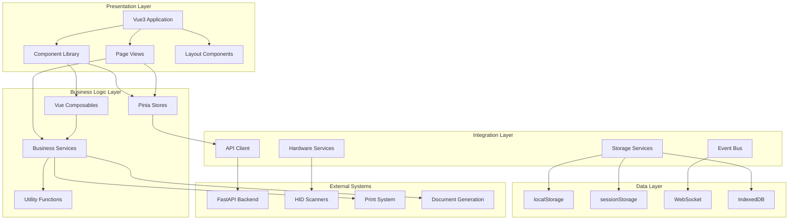

# SYSTEM ARCHITECTURE DOCUMENT

**Project**: CINERENTAL Vue3 Frontend Migration
**Document Version**: 1.0
**Date**: 2025-08-29
**Status**: Phase 2 - System Architecture
**Author**: System Architect
**Document ID**: SAD-CINERENTAL-VUE3-001

---

## Executive Summary

This System Architecture Document defines the comprehensive technical architecture for the CINERENTAL Vue3 frontend migration project. It establishes architectural patterns, system boundaries, integration strategies, and quality attributes to ensure a scalable, maintainable, and performant cinema equipment rental management system.

### Architectural Goals

- **Modernization**: Transition from monolithic jQuery architecture to component-based Vue3 system
- **Maintainability**: Clear separation of concerns with defined architectural boundaries
- **Performance**: Sub-2-second page loads with efficient data handling for 845+ equipment items
- **Scalability**: Architecture supporting business growth and feature expansion
- **Resilience**: Fault-tolerant design with graceful degradation capabilities

---

## ARCHITECTURAL ANALYSIS

### Current State

**Legacy Architecture Analysis**:

- **Frontend**: Bootstrap 5 + jQuery with 30+ JavaScript modules
- **State Management**: localStorage + DOM manipulation with complex synchronization
- **API Integration**: Direct fetch calls without abstraction layer
- **Component Architecture**: HTML templates with embedded JavaScript logic
- **Build System**: Basic webpack configuration with limited optimization

**Key Components and Responsibilities**:

- **Universal Cart System**: Complex state management across multiple page contexts
- **HID Scanner Integration**: Hardware abstraction with fallback mechanisms
- **Equipment Management**: Large dataset handling with pagination and filtering
- **Project Workflows**: Multi-step business processes with validation
- **Document Generation**: PDF creation and print functionality

**Major Pain Points**:

- **Code Duplication**: Similar logic repeated across multiple modules
- **State Synchronization**: Complex localStorage management with race conditions
- **Testing Complexity**: Limited testability due to tightly coupled architecture
- **Performance Issues**: DOM manipulation bottlenecks with large datasets
- **Maintenance Overhead**: Bug fixes requiring changes across multiple files

---

## Proposed Solution

### High-Level Architecture



### Component Responsibilities

**Presentation Layer**:

- **Vue3 Application**: Root application initialization and global configuration
- **Component Library**: Reusable UI components with consistent design system
- **Page Views**: Business-specific views handling user interactions
- **Layout Components**: Application shell and navigation structure

**Business Logic Layer**:

- **Pinia Stores**: Global state management with persistence and synchronization
- **Vue Composables**: Reusable reactive logic for cross-component functionality
- **Business Services**: Domain-specific business rules and workflow orchestration
- **Utility Functions**: Pure functions for data transformation and validation

**Integration Layer**:

- **API Client**: Centralized HTTP communication with error handling and caching
- **Hardware Services**: Abstract hardware integration with fallback mechanisms
- **Storage Services**: Client-side data persistence with quota management
- **Event Bus**: Cross-component communication and real-time updates

### Why This Architecture Solves Core Problems

1. **Component-Based Design**: Eliminates code duplication through reusable components
2. **Centralized State Management**: Resolves synchronization issues with predictable state flow
3. **Service Layer Abstraction**: Enables comprehensive testing and mocking capabilities
4. **Performance Optimization**: Virtual scrolling and lazy loading for large datasets
5. **Clear Separation of Concerns**: Reduces maintenance overhead with defined boundaries

---

## Implementation Plan

### Phase 1: Foundation Architecture (Weeks 1-2)

**Deliverables**:

1. **Project Structure Setup**

   ```text
   frontend-vue3/src/
   ├── components/          # Reusable UI components
   │   ├── base/           # Foundation components
   │   ├── business/       # Domain-specific components
   │   └── layout/         # Layout and navigation
   ├── composables/        # Vue composition functions
   ├── services/          # Business logic services
   ├── stores/           # Pinia state management
   ├── types/            # TypeScript definitions
   └── utils/            # Pure utility functions
   ```

2. **Core Infrastructure**
   - TypeScript configuration with strict mode
   - Vue3 + Vite development environment
   - ESLint + Prettier code quality tools
   - Vitest testing framework setup

3. **Base Services**
   - API client with interceptors and error handling
   - Storage abstraction layer
   - Event bus implementation
   - Logging and monitoring utilities

### Phase 2: State Management Architecture (Weeks 3-4)

**Deliverables**:

1. **Pinia Store Implementation**

   ```typescript
   // Core store modules
   stores/
   ├── auth.ts           # Authentication state
   ├── cart.ts           # Universal Cart state
   ├── equipment.ts      # Equipment catalog state
   ├── projects.ts       # Project management state
   ├── scanner.ts        # Scanner session state
   └── notifications.ts  # UI feedback state
   ```

2. **Composables Library**

   ```typescript
   composables/
   ├── useApi.ts         # API integration composable
   ├── useCart.ts        # Cart management logic
   ├── useScanner.ts     # Scanner hardware integration
   ├── usePagination.ts  # Pagination logic
   └── useValidation.ts  # Form validation composable
   ```

3. **Service Layer**

   ```typescript
   services/
   ├── api/              # API service modules
   ├── hardware/         # Hardware integration services
   ├── storage/          # Client-side storage services
   └── business/         # Business rule services
   ```

### Phase 3: Integration Layer Implementation (Weeks 5-8)

**Deliverables**:

1. **Hardware Integration Services**
   - WebUSB scanner service with keyboard fallback
   - Session management with server synchronization
   - Error handling and device detection

2. **API Integration Services**
   - Resource-specific API services (equipment, projects, clients)
   - Caching layer with invalidation strategies
   - Request/response transformation and validation

3. **Storage Services**
   - Intelligent localStorage management with compression
   - Quota monitoring and automatic cleanup
   - Cross-tab synchronization mechanisms

---

## Risk Assessment

### Major Risks and Mitigation Strategies

**High Priority Risks**:

| Risk | Impact | Probability | Mitigation Strategy |
|------|--------|-------------|-------------------|
| **Universal Cart Migration Complexity** | High | Medium | Incremental migration with feature parity validation, comprehensive testing suite, rollback capability |
| **State Management Performance** | High | Low | Performance monitoring, lazy loading strategies, virtual scrolling implementation |
| **Hardware Integration Compatibility** | High | Medium | Multi-protocol support, extensive device testing, graceful fallback mechanisms |

**Medium Priority Risks**:

| Risk | Impact | Probability | Mitigation Strategy |
|------|--------|-------------|-------------------|
| **API Compatibility Issues** | Medium | Low | Contract testing, API versioning, backward compatibility layers |
| **Storage Quota Limitations** | Medium | Medium | Intelligent data management, automatic cleanup, user notifications |
| **Cross-Browser Compatibility** | Medium | Low | Progressive enhancement, polyfills, automated testing |

**Technical Risk Management**:

1. **Fallback Mechanisms**: Every critical feature has a fallback implementation
2. **Progressive Enhancement**: Core functionality works without JavaScript
3. **Performance Budgets**: Automated monitoring with CI/CD integration
4. **Error Boundaries**: Comprehensive error handling with user feedback

---

## Quality Attributes

### Performance Requirements

**Response Time Targets**:

- Initial Page Load: < 2 seconds
- Search Operations: < 500ms
- Cart Operations: < 200ms
- Navigation: < 300ms

**Scalability Targets**:

- Equipment Items: Support 1000+ items with virtual scrolling
- Concurrent Users: 50+ simultaneous users
- Storage Efficiency: < 10MB localStorage usage

**Memory Management**:

- Component Cleanup: Automatic event listener removal
- Memory Leak Prevention: Proper observable unsubscription
- Garbage Collection: Efficient object lifecycle management

### Security Architecture

**Input Validation**:

```typescript
// Client-side validation with server-side verification
interface ValidationRules<T> {
  [K in keyof T]: ValidationRule[]
}

const equipmentValidation: ValidationRules<Equipment> = {
  name: [
    { validator: (v) => v.length > 0, message: 'Name required' },
    { validator: (v) => v.length < 255, message: 'Name too long' }
  ],
  dailyRate: [
    { validator: (v) => v > 0, message: 'Rate must be positive' }
  ]
}
```

**XSS Protection**:

- Vue3 template escaping by default
- DOMPurify integration for HTML content
- Content Security Policy implementation

**Data Protection**:

- Sensitive data encryption in localStorage
- Automatic token refresh mechanisms
- Session timeout with cleanup

### Scalability Architecture

**Component Scalability**:

```typescript
// Lazy loading strategy
const routes = [
  {
    path: '/equipment',
    component: () => import('@/views/EquipmentListView.vue')
  },
  {
    path: '/projects',
    component: () => import('@/views/ProjectListView.vue')
  }
]

// Dynamic component loading
const DynamicComponent = defineAsyncComponent({
  loader: () => import('./HeavyComponent.vue'),
  loadingComponent: LoadingSpinner,
  errorComponent: ErrorMessage,
  delay: 200,
  timeout: 3000
})
```

**Data Management Scalability**:

- Virtual scrolling for large lists
- Pagination with server-side filtering
- Intelligent caching with LRU eviction
- Background data prefetching

---

## Integration Patterns

### API Integration Architecture

**Centralized API Client**:

```typescript
class ApiClient {
  private baseURL: string
  private interceptors: RequestInterceptor[] = []

  constructor(config: ApiConfig) {
    this.baseURL = config.baseURL
    this.setupInterceptors()
  }

  private setupInterceptors(): void {
    // Authentication interceptor
    this.addInterceptor(async (config) => {
      const token = await authService.getToken()
      config.headers.Authorization = `Bearer ${token}`
      return config
    })

    // Logging interceptor
    this.addInterceptor(async (config) => {
      logger.debug(`API Request: ${config.method} ${config.url}`)
      return config
    })

    // Error handling interceptor
    this.addInterceptor(async (config) => {
      try {
        return await this.executeRequest(config)
      } catch (error) {
        return this.handleApiError(error)
      }
    })
  }
}
```

**Resource Services Pattern**:

```typescript
// Equipment service example
export class EquipmentService {
  constructor(private apiClient: ApiClient) {}

  async getEquipment(query: EquipmentQuery): Promise<PaginatedResponse<Equipment>> {
    return this.apiClient.get('/api/v1/equipment/', { params: query })
  }

  async searchByBarcode(barcode: string): Promise<Equipment | null> {
    try {
      return await this.apiClient.get(`/api/v1/equipment/barcode/${barcode}`)
    } catch (error) {
      if (error.status === 404) return null
      throw error
    }
  }
}
```

### Hardware Integration Architecture

**Scanner Service Abstraction**:

```typescript
interface ScannerService {
  initialize(): Promise<boolean>
  startListening(): Promise<void>
  stopListening(): void
  on(event: string, callback: Function): void
}

class WebUSBScannerService implements ScannerService {
  async initialize(): Promise<boolean> {
    try {
      this.device = await navigator.usb.requestDevice({
        filters: [{ vendorId: 0x05e0 }] // Symbol/Zebra
      })
      return true
    } catch (error) {
      console.warn('WebUSB unavailable, falling back to keyboard')
      return false
    }
  }
}

class KeyboardScannerService implements ScannerService {
  async initialize(): Promise<boolean> {
    document.addEventListener('keydown', this.handleKeyInput)
    return true
  }
}

// Service factory with fallback
export const createScannerService = async (): Promise<ScannerService> => {
  const webUSBService = new WebUSBScannerService()

  if (await webUSBService.initialize()) {
    return webUSBService
  }

  return new KeyboardScannerService()
}
```

---

## Deployment Architecture

### Build and Distribution Strategy

**Multi-Environment Configuration**:

```typescript
// vite.config.ts
export default defineConfig(({ mode }) => {
  const env = loadEnv(mode, process.cwd(), '')

  return {
    define: {
      __API_URL__: JSON.stringify(env.API_URL),
      __APP_VERSION__: JSON.stringify(process.env.npm_package_version)
    },

    build: {
      rollupOptions: {
        output: {
          manualChunks: {
            'vue-vendor': ['vue', 'vue-router', 'pinia'],
            'ui-vendor': ['primevue/button', 'primevue/datatable'],
            'business': ['./src/stores/', './src/services/']
          }
        }
      },

      // Performance budgets
      chunkSizeWarningLimit: 1000
    }
  }
})
```

**Dual Frontend Strategy**:

```nginx
# nginx configuration for dual frontend support
server {
    listen 80;
    server_name cinerental.local;

    # Vue3 frontend (new)
    location /vue/ {
        alias /app/vue-dist/;
        try_files $uri $uri/ /vue/index.html;

        # Caching strategy
        location ~* \.(js|css|png|jpg|jpeg|gif|ico|svg)$ {
            expires 1y;
            add_header Cache-Control "public, immutable";
        }
    }

    # Legacy frontend (existing)
    location / {
        proxy_pass http://backend:8000;

        # Feature flag based routing
        set $use_vue "false";
        if ($cookie_frontend_version = "vue3") {
            set $use_vue "true";
        }

        if ($use_vue = "true") {
            return 302 /vue$request_uri;
        }
    }

    # Shared API endpoints
    location /api/ {
        proxy_pass http://backend:8000;
        proxy_set_header Host $host;
        proxy_set_header X-Real-IP $remote_addr;
    }
}
```

### Monitoring and Observability

**Performance Monitoring**:

```typescript
// Performance tracking service
class PerformanceTracker {
  trackPageLoad(pageName: string): void {
    const navigationEntry = performance.getEntriesByType('navigation')[0] as PerformanceNavigationTiming

    this.sendMetric({
      name: 'page_load_time',
      value: navigationEntry.loadEventEnd - navigationEntry.fetchStart,
      tags: { page: pageName }
    })
  }

  trackUserInteraction(action: string, component: string): void {
    const startTime = performance.now()

    requestIdleCallback(() => {
      this.sendMetric({
        name: 'interaction_duration',
        value: performance.now() - startTime,
        tags: { action, component }
      })
    })
  }
}
```

**Error Tracking and Logging**:

```typescript
// Global error handler
app.config.errorHandler = (error, instance, info) => {
  errorTracker.captureException(error, {
    extra: {
      componentInfo: info,
      componentName: instance?.$options.name
    }
  })
}

// Unhandled promise rejection handler
window.addEventListener('unhandledrejection', event => {
  errorTracker.captureException(event.reason)
})
```

---

## Technology Stack Decisions

### Frontend Technology Choices

**Core Framework**: Vue3 with Composition API

- **Rationale**: Modern reactivity system, excellent TypeScript support, smaller bundle size
- **Alternatives Considered**: React, Angular
- **Decision Factors**: Team familiarity, migration path from jQuery, component ecosystem

**State Management**: Pinia

- **Rationale**: Official Vue3 state management, excellent TypeScript integration, devtools support
- **Alternatives Considered**: Vuex, plain reactive objects
- **Decision Factors**: Type safety, modularity, persistence plugins

**Build Tool**: Vite

- **Rationale**: Fast development server, optimized production builds, excellent Vue3 integration
- **Alternatives Considered**: Webpack, Rollup
- **Decision Factors**: Development speed, modern ESM support, plugin ecosystem

**Component Library**: PrimeVue + Custom Components

- **Rationale**: Comprehensive component set, accessibility compliance, theme customization
- **Alternatives Considered**: Vuetify, Quasar, Ant Design Vue
- **Decision Factors**: Design flexibility, accessibility standards, documentation quality

### Integration Technology Choices

**HTTP Client**: Native fetch with custom wrapper

- **Rationale**: No external dependencies, modern browser support, full control over implementation
- **Alternatives Considered**: Axios, ky
- **Decision Factors**: Bundle size, customization needs, error handling requirements

**Testing Framework**: Vitest + Playwright

- **Rationale**: Fast execution, excellent Vue3 integration, comprehensive testing capabilities
- **Alternatives Considered**: Jest + Cypress
- **Decision Factors**: Development speed, TypeScript support, modern testing features

---

## Conclusion

This system architecture provides a robust foundation for the CINERENTAL Vue3 migration, addressing current pain points while establishing patterns for future growth. The modular design enables incremental migration with minimal business disruption.

### Key Success Factors

1. **Component-Based Architecture**: Eliminates code duplication and improves maintainability
2. **Centralized State Management**: Resolves synchronization issues with predictable data flow
3. **Service Layer Abstraction**: Enables comprehensive testing and business logic separation
4. **Performance-First Design**: Ensures system responsiveness with large datasets
5. **Progressive Enhancement**: Maintains functionality across different environments

### Implementation Readiness

The architecture is designed for immediate implementation with clear phase boundaries and success criteria. Risk mitigation strategies ensure business continuity throughout the migration process.

**Next Steps**:

1. Begin Phase 1 foundation setup with project structure and core services
2. Implement base component library with consistent design patterns
3. Migrate Universal Cart system as proof of concept
4. Establish comprehensive testing and monitoring frameworks

This architecture will transform CINERENTAL from a legacy jQuery application to a modern, maintainable Vue3 system that supports cinema equipment rental operations at scale.

---

*This System Architecture Document serves as the definitive technical blueprint for the CINERENTAL Vue3 frontend migration, ensuring architectural consistency and implementation success.*
