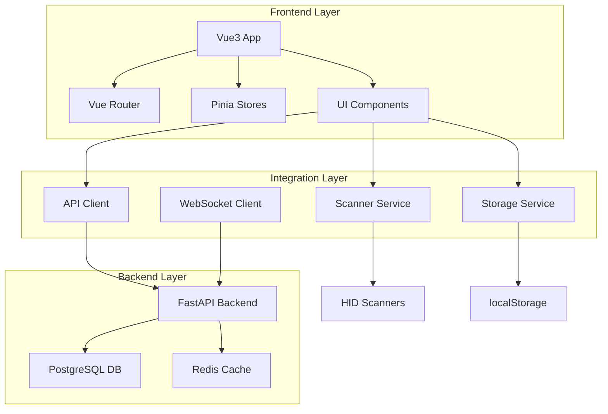

# TECHNICAL DESIGN DOCUMENT

**Project**: CINERENTAL Vue3 Frontend Migration
**Document Version**: 1.0
**Date**: 2025-08-29
**Status**: Phase 1 - Architecture Design
**Author**: Technical Lead

---

## Executive Summary

This document outlines the technical architecture for migrating CINERENTAL's cinema equipment rental management system from Bootstrap + jQuery to Vue3 + TypeScript. The design ensures 100% feature parity while introducing modern development practices, improved performance, and maintainability.

### Key Architecture Decisions

- **Vue3 Composition API**: For reactive, composable, and maintainable component logic
- **TypeScript Strict Mode**: For type safety and enhanced developer experience
- **Pinia State Management**: For global state with persistence and devtools support
- **Vite Build System**: For fast development and optimized production builds
- **Dual Frontend Approach**: Gradual migration with zero business disruption

---

## System Architecture Overview

### High-Level Architecture



### Technology Stack Comparison

| Component | Current | Target | Rationale |
|-----------|---------|---------|-----------|
| **Framework** | Bootstrap + jQuery | Vue3 + Composition API | Modern reactivity, component architecture |
| **Language** | JavaScript ES6 | TypeScript (strict) | Type safety, enhanced tooling |
| **Build Tool** | Webpack | Vite | Faster development, optimized builds |
| **State Management** | localStorage + DOM | Pinia + composables | Predictable state, devtools support |
| **Component Library** | Bootstrap 5 | PrimeVue + custom | Consistent design system |
| **Testing** | Manual | Vitest + Playwright | Automated quality assurance |
| **Package Manager** | npm | pnpm | Faster installs, disk efficiency |

---

## Component Architecture

### Directory Structure

```text
frontend-vue3/
├── src/
│   ├── components/          # Reusable UI components
│   │   ├── common/         # Global components (buttons, inputs, modals)
│   │   ├── equipment/      # Equipment-specific components
│   │   ├── project/        # Project-specific components
│   │   ├── scanner/        # Scanner-related components
│   │   └── cart/          # Universal Cart components
│   ├── composables/        # Vue composition functions
│   │   ├── useApi.ts      # API integration composable
│   │   ├── useScanner.ts  # Scanner hardware integration
│   │   ├── useCart.ts     # Cart management logic
│   │   └── usePagination.ts # Pagination logic
│   ├── stores/            # Pinia state management
│   │   ├── auth.ts        # Authentication state
│   │   ├── cart.ts        # Universal Cart state
│   │   ├── equipment.ts   # Equipment data state
│   │   └── scanner.ts     # Scanner session state
│   ├── services/          # API and external service integration
│   │   ├── api/           # API client modules
│   │   ├── scanner/       # Scanner hardware integration
│   │   └── storage/       # Client-side storage management
│   ├── views/             # Page-level components
│   │   ├── Dashboard.vue
│   │   ├── EquipmentList.vue
│   │   ├── ProjectDetail.vue
│   │   └── ScannerInterface.vue
│   ├── router/            # Vue Router configuration
│   ├── types/             # TypeScript type definitions
│   └── utils/             # Utility functions
├── tests/                 # Test suites
│   ├── unit/             # Component unit tests
│   ├── integration/      # API integration tests
│   └── e2e/              # End-to-end tests
├── public/               # Static assets
└── docs/                 # Component documentation
```

### Core Component Patterns

#### Base Component Structure

```vue
<template>
  <div class="component-name" :class="componentClasses">
    <!-- Template content with proper accessibility -->
  </div>
</template>

<script setup lang="ts">
import { computed, ref } from 'vue'
import type { ComponentProps } from '@/types'

interface Props {
  // Strongly typed props with defaults
}

const props = withDefaults(defineProps<Props>(), {
  // Default values
})

const emit = defineEmits<{
  // Strongly typed events
}>()

// Reactive state and computed properties
const isLoading = ref(false)
const componentClasses = computed(() => ({
  'loading': isLoading.value
}))

// Methods and lifecycle hooks
</script>

<style scoped>
/* Component-specific styles using CSS modules or scoped styles */
</style>
```

#### Composable Pattern

```typescript
// composables/useEquipmentSearch.ts
export function useEquipmentSearch() {
  const searchQuery = ref('')
  const searchResults = ref<Equipment[]>([])
  const isSearching = ref(false)

  const debouncedSearch = useDebounceFn(async (query: string) => {
    if (!query.trim()) {
      searchResults.value = []
      return
    }

    isSearching.value = true
    try {
      const results = await equipmentApi.search(query)
      searchResults.value = results
    } catch (error) {
      console.error('Search failed:', error)
    } finally {
      isSearching.value = false
    }
  }, 300)

  watch(searchQuery, debouncedSearch)

  return {
    searchQuery: readonly(searchQuery),
    searchResults: readonly(searchResults),
    isSearching: readonly(isSearching)
  }
}
```

---

## State Management Architecture

### Pinia Store Design

#### Universal Cart Store

```typescript
// stores/cart.ts
interface CartState {
  items: Map<string, CartItem>
  config: CartConfig
  isVisible: boolean
  isEmbedded: boolean
  isExecutingAction: boolean
  actionProgress: number
}

export const useCartStore = defineStore('cart', {
  state: (): CartState => ({
    items: new Map(),
    config: defaultCartConfig,
    isVisible: false,
    isEmbedded: false,
    isExecutingAction: false,
    actionProgress: 0
  }),

  getters: {
    cartItems: (state) => Array.from(state.items.values()),
    itemCount: (state) => state.items.size,
    totalQuantity: (state) => {
      return Array.from(state.items.values())
        .reduce((total, item) => total + item.quantity, 0)
    }
  },

  actions: {
    async addItem(item: Partial<CartItem>) {
      // Business logic for adding items with validation
    },

    async executeAction(config: ActionConfig) {
      // Batch booking creation with progress tracking
    }
  },

  // Persistence plugin configuration
  persist: {
    storage: localStorage,
    key: 'cart-state',
    serializer: {
      serialize: (value) => JSON.stringify(value, mapReplacer),
      deserialize: (value) => JSON.parse(value, mapReviver)
    }
  }
})
```

#### Equipment Store

```typescript
// stores/equipment.ts
export const useEquipmentStore = defineStore('equipment', {
  state: () => ({
    equipment: new Map<string, Equipment>(),
    categories: [] as Category[],
    filters: {
      category: null,
      status: null,
      query: ''
    } as EquipmentFilters,
    pagination: {
      page: 1,
      size: 20,
      total: 0
    } as PaginationState
  }),

  getters: {
    filteredEquipment: (state) => {
      // Apply filters and return filtered results
    },

    availableEquipment: (state) => {
      return Array.from(state.equipment.values())
        .filter(item => item.status === 'AVAILABLE')
    }
  },

  actions: {
    async fetchEquipment(params?: EquipmentQuery) {
      const response = await equipmentApi.getEquipment(params)
      this.equipment.clear()
      response.items.forEach(item => {
        this.equipment.set(item.id, item)
      })
      this.pagination = response.pagination
    },

    async searchEquipment(query: string) {
      const results = await equipmentApi.search(query)
      return results
    }
  }
})
```

---

## Integration Architecture

### API Client Design

#### Base API Client

```typescript
// services/api/client.ts
class ApiClient {
  private baseURL: string
  private timeout: number

  constructor(config: ApiConfig) {
    this.baseURL = config.baseURL
    this.timeout = config.timeout || 10000
  }

  async request<T>(
    method: string,
    url: string,
    data?: any,
    options?: RequestOptions
  ): Promise<T> {
    const config: RequestConfig = {
      method,
      url: `${this.baseURL}${url}`,
      timeout: this.timeout,
      headers: {
        'Content-Type': 'application/json',
        ...this.getAuthHeaders(),
        ...options?.headers
      }
    }

    if (data && ['POST', 'PUT', 'PATCH'].includes(method)) {
      config.data = data
    }

    try {
      const response = await fetch(config.url, config)

      if (!response.ok) {
        throw new ApiError(response.status, await response.text())
      }

      return await response.json()
    } catch (error) {
      throw this.handleError(error)
    }
  }

  private getAuthHeaders(): Record<string, string> {
    const token = localStorage.getItem('auth_token')
    return token ? { Authorization: `Bearer ${token}` } : {}
  }

  private handleError(error: any): ApiError {
    if (error instanceof ApiError) {
      return error
    }

    return new ApiError(500, 'Network request failed')
  }
}
```

#### Equipment API Service

```typescript
// services/api/equipment.ts
export class EquipmentApiService {
  constructor(private client: ApiClient) {}

  async getEquipment(params?: EquipmentQuery): Promise<PaginatedResponse<Equipment>> {
    const searchParams = new URLSearchParams()

    if (params?.page) searchParams.set('page', params.page.toString())
    if (params?.size) searchParams.set('size', params.size.toString())
    if (params?.category) searchParams.set('category', params.category)
    if (params?.status) searchParams.set('status', params.status)
    if (params?.query) searchParams.set('q', params.query)

    const url = `/api/v1/equipment/?${searchParams.toString()}`
    return this.client.request<PaginatedResponse<Equipment>>('GET', url)
  }

  async searchByBarcode(barcode: string): Promise<Equipment | null> {
    const response = await this.client.request<Equipment[]>(
      'GET',
      `/api/v1/equipment/search/barcode/${barcode}`
    )

    return response.length > 0 ? response[0] : null
  }

  async checkAvailability(
    equipmentId: string,
    startDate: string,
    endDate: string
  ): Promise<AvailabilityResult> {
    return this.client.request<AvailabilityResult>(
      'GET',
      `/api/v1/equipment/${equipmentId}/availability`,
      null,
      { params: { start_date: startDate, end_date: endDate } }
    )
  }
}
```

### Scanner Integration Architecture

#### WebUSB Scanner Service

```typescript
// services/scanner/webusb-scanner.ts
export class WebUSBScannerService implements ScannerService {
  private device: USBDevice | null = null
  private listeners: Map<string, Set<ScannerEventCallback>> = new Map()

  async initialize(): Promise<boolean> {
    try {
      // Request USB device access
      this.device = await navigator.usb.requestDevice({
        filters: [
          { vendorId: 0x05e0 }, // Symbol/Zebra
          { vendorId: 0x0c2e }, // Honeywell
          // Add more scanner vendor IDs
        ]
      })

      await this.device.open()
      await this.device.selectConfiguration(1)
      await this.device.claimInterface(0)

      this.startListening()
      return true
    } catch (error) {
      console.error('WebUSB scanner initialization failed:', error)
      return false
    }
  }

  private async startListening(): Promise<void> {
    if (!this.device) return

    try {
      while (this.device.opened) {
        const result = await this.device.transferIn(1, 64)

        if (result.data) {
          const barcode = this.parseBarcode(result.data)
          if (barcode) {
            this.emit('barcode', { barcode, timestamp: new Date() })
          }
        }
      }
    } catch (error) {
      console.error('Scanner reading error:', error)
      this.emit('error', { error })
    }
  }

  private parseBarcode(data: DataView): string | null {
    // Parse USB HID data to extract barcode string
    // Implementation depends on scanner protocol
    return null // Placeholder
  }

  on(event: string, callback: ScannerEventCallback): void {
    if (!this.listeners.has(event)) {
      this.listeners.set(event, new Set())
    }
    this.listeners.get(event)!.add(callback)
  }

  private emit(event: string, data: any): void {
    const callbacks = this.listeners.get(event)
    if (callbacks) {
      callbacks.forEach(callback => callback(data))
    }
  }
}
```

#### Keyboard Fallback Scanner

```typescript
// services/scanner/keyboard-scanner.ts
export class KeyboardScannerService implements ScannerService {
  private buffer: string = ''
  private timeout: number | null = null
  private isListening: boolean = false

  async initialize(): Promise<boolean> {
    return true // Always available
  }

  startListening(): void {
    if (this.isListening) return

    this.isListening = true
    document.addEventListener('keydown', this.handleKeydown)
  }

  stopListening(): void {
    this.isListening = false
    document.removeEventListener('keydown', this.handleKeydown)
    this.clearBuffer()
  }

  private handleKeydown = (event: KeyboardEvent): void => {
    // Only process if not typing in an input field
    if (event.target instanceof HTMLInputElement ||
        event.target instanceof HTMLTextAreaElement) {
      return
    }

    if (event.key === 'Enter') {
      if (this.buffer.length > 0) {
        this.emit('barcode', {
          barcode: this.buffer,
          timestamp: new Date()
        })
        this.clearBuffer()
      }
    } else if (event.key.length === 1) {
      this.buffer += event.key
      this.resetTimeout()
      event.preventDefault()
    }
  }

  private resetTimeout(): void {
    if (this.timeout) {
      clearTimeout(this.timeout)
    }

    // Clear buffer after 2 seconds of inactivity
    this.timeout = window.setTimeout(() => {
      this.clearBuffer()
    }, 2000)
  }

  private clearBuffer(): void {
    this.buffer = ''
    if (this.timeout) {
      clearTimeout(this.timeout)
      this.timeout = null
    }
  }
}
```

---

## Performance Architecture

### Lazy Loading Strategy

#### Route-Based Code Splitting

```typescript
// router/index.ts
const routes: RouteRecordRaw[] = [
  {
    path: '/',
    name: 'Dashboard',
    component: () => import('@/views/Dashboard.vue')
  },
  {
    path: '/equipment',
    name: 'EquipmentList',
    component: () => import('@/views/EquipmentList.vue'),
    children: [
      {
        path: ':id',
        name: 'EquipmentDetail',
        component: () => import('@/views/EquipmentDetail.vue')
      }
    ]
  },
  {
    path: '/projects',
    name: 'ProjectList',
    component: () => import('@/views/ProjectList.vue'),
    children: [
      {
        path: ':id',
        name: 'ProjectDetail',
        component: () => import('@/views/ProjectDetail.vue')
      }
    ]
  }
]
```

#### Component-Level Lazy Loading

```vue
<template>
  <div class="equipment-list">
    <div class="filters">
      <SearchInput v-model="searchQuery" />
      <CategoryFilter v-model="selectedCategory" />
    </div>

    <!-- Virtual scrolling for large datasets -->
    <VirtualList
      :items="filteredEquipment"
      :item-height="80"
      :buffer-size="5"
      #default="{ item }"
    >
      <EquipmentCard :equipment="item" />
    </VirtualList>

    <!-- Lazy loaded modal -->
    <Suspense>
      <EquipmentModal
        v-if="showModal"
        :equipment-id="selectedEquipmentId"
        @close="closeModal"
      />
      <template #fallback>
        <ModalSkeleton />
      </template>
    </Suspense>
  </div>
</template>
```

### Caching Strategy

#### API Response Caching

```typescript
// services/api/cache.ts
export class ApiCache {
  private cache = new Map<string, CacheEntry>()
  private readonly defaultTTL = 5 * 60 * 1000 // 5 minutes

  get<T>(key: string): T | null {
    const entry = this.cache.get(key)

    if (!entry) return null

    if (Date.now() > entry.expiry) {
      this.cache.delete(key)
      return null
    }

    return entry.data as T
  }

  set<T>(key: string, data: T, ttl: number = this.defaultTTL): void {
    this.cache.set(key, {
      data,
      expiry: Date.now() + ttl
    })
  }

  invalidate(pattern: string): void {
    const regex = new RegExp(pattern)
    const keysToDelete = Array.from(this.cache.keys())
      .filter(key => regex.test(key))

    keysToDelete.forEach(key => this.cache.delete(key))
  }
}
```

---

## Security Architecture

### Input Validation

#### Form Validation Composable

```typescript
// composables/useValidation.ts
export function useValidation<T>(rules: ValidationRules<T>) {
  const errors = ref<ValidationErrors<T>>({})
  const isValid = computed(() => Object.keys(errors.value).length === 0)

  const validate = (data: T): boolean => {
    errors.value = {}

    for (const [field, fieldRules] of Object.entries(rules)) {
      const value = data[field as keyof T]

      for (const rule of fieldRules) {
        const result = rule.validator(value)
        if (!result) {
          if (!errors.value[field]) {
            errors.value[field] = []
          }
          errors.value[field].push(rule.message)
        }
      }
    }

    return isValid.value
  }

  return {
    errors: readonly(errors),
    isValid: readonly(isValid),
    validate
  }
}
```

### XSS Protection

#### Safe HTML Rendering

```vue
<template>
  <div class="equipment-description">
    <!-- Safe HTML rendering with sanitization -->
    <div v-html="sanitizedDescription"></div>
  </div>
</template>

<script setup lang="ts">
import DOMPurify from 'dompurify'

const props = defineProps<{
  description: string
}>()

const sanitizedDescription = computed(() => {
  return DOMPurify.sanitize(props.description, {
    ALLOWED_TAGS: ['p', 'br', 'strong', 'em'],
    ALLOWED_ATTR: []
  })
})
</script>
```

---

## Testing Architecture

### Unit Testing Strategy

#### Component Testing

```typescript
// tests/unit/components/EquipmentCard.spec.ts
describe('EquipmentCard', () => {
  it('renders equipment information correctly', () => {
    const equipment: Equipment = {
      id: '1',
      name: 'Professional Camera',
      category: 'Cameras',
      status: 'AVAILABLE',
      daily_rate: 100.00
    }

    const wrapper = mount(EquipmentCard, {
      props: { equipment },
      global: {
        plugins: [createTestingPinia()]
      }
    })

    expect(wrapper.find('.equipment-name').text()).toBe(equipment.name)
    expect(wrapper.find('.equipment-category').text()).toBe(equipment.category)
    expect(wrapper.find('.equipment-rate').text()).toContain('100.00')
  })

  it('emits add-to-cart event when button is clicked', async () => {
    const wrapper = mount(EquipmentCard, {
      props: { equipment: mockEquipment }
    })

    await wrapper.find('.add-to-cart').trigger('click')

    expect(wrapper.emitted('add-to-cart')).toBeTruthy()
    expect(wrapper.emitted('add-to-cart')?.[0]).toEqual([mockEquipment])
  })
})
```

#### Store Testing

```typescript
// tests/unit/stores/cart.spec.ts
describe('useCartStore', () => {
  let store: ReturnType<typeof useCartStore>

  beforeEach(() => {
    setActivePinia(createPinia())
    store = useCartStore()
  })

  it('adds item to cart correctly', async () => {
    const item = { id: '1', name: 'Camera', quantity: 1 }

    await store.addItem(item)

    expect(store.itemCount).toBe(1)
    expect(store.cartItems[0]).toMatchObject(item)
  })

  it('aggregates quantity for duplicate items', async () => {
    const item1 = { id: '1', name: 'Camera', quantity: 1 }
    const item2 = { id: '1', name: 'Camera', quantity: 2 }

    await store.addItem(item1)
    await store.addItem(item2)

    expect(store.itemCount).toBe(1)
    expect(store.cartItems[0].quantity).toBe(3)
  })
})
```

### Integration Testing

#### API Integration Tests

```typescript
// tests/integration/api/equipment.spec.ts
describe('Equipment API Integration', () => {
  it('fetches equipment list with pagination', async () => {
    const mockResponse: PaginatedResponse<Equipment> = {
      items: [mockEquipment1, mockEquipment2],
      total: 2,
      page: 1,
      size: 20
    }

    vi.mocked(fetch).mockResolvedValueOnce(
      new Response(JSON.stringify(mockResponse))
    )

    const result = await equipmentApi.getEquipment({ page: 1, size: 20 })

    expect(result.items).toHaveLength(2)
    expect(result.total).toBe(2)
  })
})
```

### E2E Testing

#### User Workflow Tests

```typescript
// tests/e2e/equipment-workflow.spec.ts
test('complete equipment selection and cart workflow', async ({ page }) => {
  await page.goto('/equipment')

  // Search for equipment
  await page.fill('[data-test="search-input"]', 'camera')
  await page.waitForSelector('[data-test="equipment-card"]:first-child')

  // Add to cart
  await page.click('[data-test="add-to-cart"]:first-child')

  // Verify cart visibility
  await expect(page.locator('[data-test="cart-container"]')).toBeVisible()
  await expect(page.locator('[data-test="cart-item"]')).toHaveCount(1)

  // Execute action
  await page.click('[data-test="execute-action"]')

  // Verify success
  await expect(page.locator('.toast-success')).toBeVisible()
})
```

---

## Deployment Architecture

### Build Configuration

#### Vite Production Build

```typescript
// vite.config.ts
export default defineConfig({
  plugins: [
    vue(),
    // Bundle analyzer for optimization
    process.env.ANALYZE && bundleAnalyzer()
  ],

  build: {
    target: 'es2020',
    cssCodeSplit: true,
    sourcemap: process.env.NODE_ENV !== 'production',

    rollupOptions: {
      output: {
        manualChunks: {
          'vendor': ['vue', 'vue-router', 'pinia'],
          'ui': ['primevue/button', 'primevue/inputtext'],
          'utils': ['lodash-es', 'dayjs']
        }
      }
    },

    // Performance budgets
    chunkSizeWarningLimit: 1000,
  },

  optimizeDeps: {
    include: ['vue', 'vue-router', 'pinia', 'primevue/button']
  }
})
```

### Dual Frontend Strategy

#### Nginx Configuration

```nginx
# nginx.conf
upstream backend {
    server backend:8000;
}

server {
    listen 80;
    server_name localhost;

    # Static assets for both frontends
    location /static/ {
        alias /app/static/;
        expires 1y;
        add_header Cache-Control "public, immutable";
    }

    # Vue3 frontend (new)
    location /vue/ {
        alias /app/vue-dist/;
        try_files $uri $uri/ /vue/index.html;

        # Enable gzip compression
        gzip on;
        gzip_types text/css application/javascript application/json;
    }

    # Legacy frontend (existing)
    location / {
        proxy_pass http://backend;
        proxy_set_header Host $host;
        proxy_set_header X-Real-IP $remote_addr;
    }

    # API endpoints (shared)
    location /api/ {
        proxy_pass http://backend;
        proxy_set_header Host $host;
        proxy_set_header X-Real-IP $remote_addr;
    }
}
```

#### Feature Flag Configuration

```typescript
// config/features.ts
export const featureFlags = {
  VUE_FRONTEND: process.env.VUE_ENABLED === 'true',
  WEBUSB_SCANNER: 'navigator' in window && 'usb' in navigator,
  VIRTUAL_SCROLLING: true,
  PROGRESSIVE_ENHANCEMENT: true
} as const

export function isFeatureEnabled(flag: keyof typeof featureFlags): boolean {
  return featureFlags[flag] === true
}
```

---

## Monitoring and Observability

### Performance Monitoring

#### Core Web Vitals Tracking

```typescript
// utils/performance.ts
export class PerformanceMonitor {
  static measureCoreWebVitals(): void {
    // Largest Contentful Paint
    new PerformanceObserver((list) => {
      const entries = list.getEntries()
      const lastEntry = entries[entries.length - 1]

      console.log('LCP:', lastEntry.startTime)
    }).observe({ entryTypes: ['largest-contentful-paint'] })

    // First Input Delay
    new PerformanceObserver((list) => {
      const entries = list.getEntries()
      entries.forEach((entry) => {
        console.log('FID:', entry.processingStart - entry.startTime)
      })
    }).observe({ entryTypes: ['first-input'] })

    // Cumulative Layout Shift
    let clsValue = 0
    new PerformanceObserver((list) => {
      const entries = list.getEntries()
      entries.forEach((entry) => {
        if (!entry.hadRecentInput) {
          clsValue += entry.value
        }
      })
      console.log('CLS:', clsValue)
    }).observe({ entryTypes: ['layout-shift'] })
  }
}
```

### Error Tracking

#### Global Error Handler

```typescript
// main.ts
const app = createApp(App)

app.config.errorHandler = (error: unknown, instance, info) => {
  console.error('Vue error:', error, info)

  // Send to error tracking service
  if (import.meta.env.PROD) {
    errorTracker.captureException(error, {
      extra: { info, component: instance?.$options.name }
    })
  }
}

window.addEventListener('unhandledrejection', (event) => {
  console.error('Unhandled promise rejection:', event.reason)

  if (import.meta.env.PROD) {
    errorTracker.captureException(event.reason)
  }
})
```

---

## Migration Strategy

### Phase Implementation

#### Phase 1: Foundation (Weeks 1-2)

- Vue3 project setup with TypeScript and Vite
- Basic component library integration
- API client infrastructure
- Development tooling configuration

#### Phase 2: Core Components (Weeks 3-4)

- Navigation and layout components
- Pagination and search functionality
- Modal and dialog systems
- Basic state management setup

#### Phase 3: Critical Features (Weeks 5-8)

- Universal Cart system migration
- Equipment management pages
- Project management workflows
- Scanner integration implementation

#### Phase 4: Advanced Features (Weeks 9-10)

- Scanner interface completion
- Real-time updates integration
- Performance optimizations
- Document generation workflows

#### Phase 5: Testing & Deployment (Weeks 11-12)

- Comprehensive testing suite
- Performance optimization
- Production deployment pipeline
- User acceptance testing

### Risk Mitigation

#### Technical Risk Management

- **Fallback Mechanisms**: Legacy frontend remains operational
- **Progressive Enhancement**: Features work without JavaScript
- **Performance Budgets**: Automated monitoring and alerts
- **Browser Compatibility**: Polyfills and feature detection

---

## Conclusion

This technical design provides a comprehensive architecture for migrating CINERENTAL to Vue3 while maintaining system reliability and user experience. The modular component design, robust state management, and comprehensive testing strategy ensure a successful transition to modern frontend architecture.

**Next Steps**:

1. Set up development environment with Vue3 + TypeScript
2. Implement core component library and design system
3. Begin Universal Cart system migration
4. Establish testing framework and CI/CD pipeline

The architecture supports both immediate migration needs and future scalability requirements for the cinema equipment rental management system.
