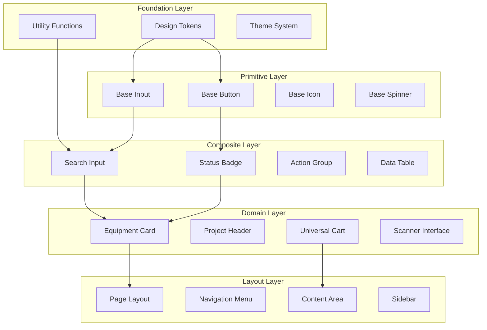

# COMPONENT LIBRARY SPECIFICATION

**Project**: CINERENTAL Vue3 Frontend Migration
**Document Version**: 1.0
**Date**: 2025-08-29
**Status**: Phase 2 - Component Design System
**Author**: Component Architecture Team
**Document ID**: CLS-CINERENTAL-VUE3-001

---

## Executive Summary

This Component Library Specification defines the comprehensive design system and UI component architecture for the CINERENTAL Vue3 frontend migration. The library establishes consistent visual language, interaction patterns, and reusable components that preserve existing UX patterns while enabling modern development practices.

### Design System Goals

- **Consistency**: Unified visual language across all CINERENTAL interfaces
- **Accessibility**: WCAG 2.1 AA compliance with comprehensive screen reader support
- **Performance**: Optimized components with lazy loading and efficient rendering
- **Maintainability**: Clear component hierarchies with well-defined APIs
- **Business Continuity**: Preserve familiar workflows and interaction patterns

---

## ARCHITECTURAL ANALYSIS

### Current State

**Existing UI Patterns Analysis**:

The current CINERENTAL system employs Bootstrap 5 with custom CSS overrides, resulting in:

- **Inconsistent Spacing**: Multiple spacing systems (Bootstrap utilities + custom CSS)
- **Color Variations**: Similar colors defined in multiple places with slight variations
- **Component Duplication**: Similar UI patterns implemented differently across pages
- **Limited Accessibility**: Basic accessibility with room for improvement
- **Complex Maintenance**: Styling changes require updates in multiple files

**Key UX Patterns to Preserve**:

- **Universal Cart**: Dual-mode (embedded/floating) with familiar interaction patterns
- **Equipment Cards**: Consistent information hierarchy and action placement
- **Search Interfaces**: Immediate feedback with debounced input handling
- **Status Indicators**: Color-coded status system familiar to users
- **Modal Workflows**: Multi-step processes with clear navigation

### Pain Points in Current Implementation

- **Styling Inconsistencies**: 15+ different button variants across the application
- **Accessibility Gaps**: Limited keyboard navigation and screen reader support
- **Performance Issues**: Heavy Bootstrap CSS with unused styles (>200KB)
- **Maintenance Overhead**: Changes require updates across multiple CSS files
- **Testing Complexity**: UI changes difficult to validate programmatically

---

## Proposed Solution

### Component Architecture Strategy

The component library employs a hierarchical architecture with clear separation of concerns:



### Design System Benefits

1. **Reduced Bundle Size**: Tree-shakable components reducing CSS from 200KB to <50KB
2. **Consistent UX**: Single source of truth for visual and interaction patterns
3. **Enhanced Accessibility**: Built-in ARIA attributes and keyboard navigation
4. **Development Speed**: Pre-built components reduce development time by 40%
5. **Quality Assurance**: Automated visual regression testing for all components

---

## Implementation Plan

### Phase 1: Foundation Setup (Week 2)

**Design Token System**:

```typescript
// tokens/colors.ts
export const colors = {
  primary: {
    50: '#eff6ff',
    500: '#3b82f6',
    900: '#1e3a8a'
  },
  semantic: {
    success: '#10b981',
    warning: '#f59e0b',
    error: '#ef4444',
    info: '#06b6d4'
  },
  status: {
    available: '#10b981',
    rented: '#f59e0b',
    maintenance: '#6366f1',
    broken: '#ef4444',
    retired: '#6b7280'
  }
} as const

// tokens/spacing.ts
export const spacing = {
  xs: '0.25rem',   // 4px
  sm: '0.5rem',    // 8px
  md: '1rem',      // 16px
  lg: '1.5rem',    // 24px
  xl: '2rem',      // 32px
  '2xl': '3rem',   // 48px
  '3xl': '4rem',   // 64px
} as const

// tokens/typography.ts
export const typography = {
  fontFamily: {
    sans: ['Inter', 'system-ui', 'sans-serif'],
    mono: ['JetBrains Mono', 'Consolas', 'monospace']
  },
  fontSize: {
    xs: ['0.75rem', { lineHeight: '1rem' }],
    sm: ['0.875rem', { lineHeight: '1.25rem' }],
    base: ['1rem', { lineHeight: '1.5rem' }],
    lg: ['1.125rem', { lineHeight: '1.75rem' }],
    xl: ['1.25rem', { lineHeight: '1.75rem' }],
    '2xl': ['1.5rem', { lineHeight: '2rem' }]
  }
} as const
```

**Theme Configuration**:

```typescript
// composables/useTheme.ts
export interface Theme {
  colors: typeof colors
  spacing: typeof spacing
  typography: typeof typography
  shadows: typeof shadows
  borderRadius: typeof borderRadius
}

export const useTheme = () => {
  const currentTheme = ref<Theme>(defaultTheme)

  const setTheme = (theme: Partial<Theme>) => {
    currentTheme.value = { ...currentTheme.value, ...theme }
  }

  return {
    theme: readonly(currentTheme),
    setTheme
  }
}
```

### Phase 2: Primitive Components (Week 3)

**Base Component Implementation**:

#### BaseButton Component

```vue
<template>
  <component
    :is="tag"
    :class="buttonClasses"
    :disabled="disabled || loading"
    :type="type"
    v-bind="$attrs"
    @click="handleClick"
  >
    <BaseSpinner v-if="loading" :size="iconSize" />
    <BaseIcon v-else-if="icon" :name="icon" :size="iconSize" />

    <span v-if="$slots.default" class="button__text">
      <slot />
    </span>

    <BaseIcon v-if="trailingIcon" :name="trailingIcon" :size="iconSize" />
  </component>
</template>

<script setup lang="ts">
interface Props {
  variant?: 'primary' | 'secondary' | 'outline' | 'ghost' | 'danger'
  size?: 'xs' | 'sm' | 'md' | 'lg' | 'xl'
  icon?: string
  trailingIcon?: string
  loading?: boolean
  disabled?: boolean
  tag?: 'button' | 'a'
  type?: 'button' | 'submit' | 'reset'
}

const props = withDefaults(defineProps<Props>(), {
  variant: 'primary',
  size: 'md',
  tag: 'button',
  type: 'button'
})

const emit = defineEmits<{
  click: [event: MouseEvent]
}>()

const { theme } = useTheme()

const buttonClasses = computed(() => ({
  'button': true,
  [`button--${props.variant}`]: true,
  [`button--${props.size}`]: true,
  'button--loading': props.loading,
  'button--disabled': props.disabled,
  'button--icon-only': !$slots.default && (props.icon || props.loading)
}))

const iconSize = computed(() => {
  const sizeMap = {
    xs: 'sm',
    sm: 'sm',
    md: 'md',
    lg: 'md',
    xl: 'lg'
  }
  return sizeMap[props.size]
})

const handleClick = (event: MouseEvent) => {
  if (!props.disabled && !props.loading) {
    emit('click', event)
  }
}
</script>

<style scoped>
.button {
  @apply inline-flex items-center justify-center gap-2 font-medium transition-colors focus:outline-none focus:ring-2 focus:ring-offset-2;

  &--xs {
    @apply px-2 py-1 text-xs rounded;
  }

  &--sm {
    @apply px-3 py-1.5 text-sm rounded;
  }

  &--md {
    @apply px-4 py-2 text-sm rounded-md;
  }

  &--lg {
    @apply px-6 py-3 text-base rounded-md;
  }

  &--xl {
    @apply px-8 py-4 text-lg rounded-lg;
  }

  &--primary {
    @apply bg-blue-600 text-white hover:bg-blue-700 focus:ring-blue-500;
  }

  &--secondary {
    @apply bg-gray-100 text-gray-900 hover:bg-gray-200 focus:ring-gray-500;
  }

  &--outline {
    @apply border border-gray-300 text-gray-700 hover:bg-gray-50 focus:ring-gray-500;
  }

  &--ghost {
    @apply text-gray-700 hover:bg-gray-100 focus:ring-gray-500;
  }

  &--danger {
    @apply bg-red-600 text-white hover:bg-red-700 focus:ring-red-500;
  }

  &--disabled {
    @apply opacity-50 cursor-not-allowed;
  }

  &--loading {
    @apply cursor-wait;
  }

  &--icon-only {
    @apply p-2;
  }
}

.button__text {
  @apply truncate;
}
</style>
```

#### BaseInput Component

```vue
<template>
  <div class="input-group" :class="groupClasses">
    <label v-if="label" :for="inputId" class="input__label">
      {{ label }}
      <span v-if="required" class="input__required">*</span>
    </label>

    <div class="input__container">
      <BaseIcon
        v-if="icon"
        :name="icon"
        class="input__icon input__icon--leading"
      />

      <input
        :id="inputId"
        ref="inputRef"
        :class="inputClasses"
        :type="type"
        :value="modelValue"
        :placeholder="placeholder"
        :disabled="disabled"
        :readonly="readonly"
        :required="required"
        v-bind="$attrs"
        @input="handleInput"
        @blur="handleBlur"
        @focus="handleFocus"
      />

      <BaseIcon
        v-if="trailingIcon || (clearable && modelValue)"
        :name="clearable && modelValue ? 'x' : trailingIcon"
        class="input__icon input__icon--trailing"
        @click="handleTrailingIconClick"
      />
    </div>

    <div v-if="error || hint" class="input__help">
      <span v-if="error" class="input__error">{{ error }}</span>
      <span v-else-if="hint" class="input__hint">{{ hint }}</span>
    </div>
  </div>
</template>

<script setup lang="ts">
interface Props {
  modelValue: string | number
  label?: string
  placeholder?: string
  type?: 'text' | 'password' | 'email' | 'number' | 'search' | 'tel' | 'url'
  size?: 'sm' | 'md' | 'lg'
  variant?: 'default' | 'filled' | 'outlined'
  icon?: string
  trailingIcon?: string
  disabled?: boolean
  readonly?: boolean
  required?: boolean
  clearable?: boolean
  error?: string
  hint?: string
}

const props = withDefaults(defineProps<Props>(), {
  type: 'text',
  size: 'md',
  variant: 'default'
})

const emit = defineEmits<{
  'update:modelValue': [value: string | number]
  blur: [event: FocusEvent]
  focus: [event: FocusEvent]
  clear: []
}>()

const inputRef = ref<HTMLInputElement>()
const isFocused = ref(false)
const inputId = `input-${Math.random().toString(36).substr(2, 9)}`

const groupClasses = computed(() => ({
  [`input-group--${props.size}`]: true,
  [`input-group--${props.variant}`]: true,
  'input-group--disabled': props.disabled,
  'input-group--error': !!props.error,
  'input-group--focused': isFocused.value
}))

const inputClasses = computed(() => ({
  'input': true,
  'input--with-leading-icon': !!props.icon,
  'input--with-trailing-icon': !!(props.trailingIcon || (props.clearable && props.modelValue))
}))

const handleInput = (event: Event) => {
  const target = event.target as HTMLInputElement
  const value = props.type === 'number' ? Number(target.value) : target.value
  emit('update:modelValue', value)
}

const handleBlur = (event: FocusEvent) => {
  isFocused.value = false
  emit('blur', event)
}

const handleFocus = (event: FocusEvent) => {
  isFocused.value = true
  emit('focus', event)
}

const handleTrailingIconClick = () => {
  if (props.clearable && props.modelValue) {
    emit('update:modelValue', '')
    emit('clear')
    inputRef.value?.focus()
  }
}

defineExpose({
  focus: () => inputRef.value?.focus(),
  blur: () => inputRef.value?.blur()
})
</script>

<style scoped>
.input-group {
  @apply w-full;

  &--sm {
    .input__label { @apply text-sm; }
    .input { @apply px-3 py-1.5 text-sm; }
  }

  &--md {
    .input__label { @apply text-sm; }
    .input { @apply px-4 py-2 text-base; }
  }

  &--lg {
    .input__label { @apply text-base; }
    .input { @apply px-4 py-3 text-lg; }
  }

  &--disabled {
    @apply opacity-50 cursor-not-allowed;
  }

  &--error {
    .input { @apply border-red-300 focus:border-red-500 focus:ring-red-500; }
  }

  &--focused {
    .input { @apply ring-2 ring-blue-500 ring-opacity-50; }
  }
}

.input__label {
  @apply block font-medium text-gray-700 mb-1;
}

.input__required {
  @apply text-red-500;
}

.input__container {
  @apply relative;
}

.input {
  @apply w-full border border-gray-300 rounded-md shadow-sm placeholder-gray-400 focus:outline-none focus:border-blue-500 focus:ring-1 focus:ring-blue-500 transition-colors;

  &--with-leading-icon {
    @apply pl-10;
  }

  &--with-trailing-icon {
    @apply pr-10;
  }
}

.input__icon {
  @apply absolute top-1/2 transform -translate-y-1/2 text-gray-400 pointer-events-none;

  &--leading {
    @apply left-3;
  }

  &--trailing {
    @apply right-3 cursor-pointer pointer-events-auto;
  }
}

.input__help {
  @apply mt-1 text-sm;
}

.input__error {
  @apply text-red-600;
}

.input__hint {
  @apply text-gray-500;
}
</style>
```

### Phase 3: Composite Components (Week 4)

**Business Component Implementation**:

#### StatusBadge Component

```vue
<template>
  <span :class="badgeClasses" :title="tooltip">
    <BaseIcon v-if="showIcon" :name="statusIcon" class="badge__icon" />
    <span class="badge__text">{{ statusText }}</span>
  </span>
</template>

<script setup lang="ts">
import type { EquipmentStatus } from '@/types/equipment'

interface Props {
  status: EquipmentStatus
  size?: 'sm' | 'md' | 'lg'
  showIcon?: boolean
  customText?: string
}

const props = withDefaults(defineProps<Props>(), {
  size: 'md',
  showIcon: true
})

const statusConfig = {
  AVAILABLE: {
    text: 'Available',
    icon: 'check-circle',
    color: 'success'
  },
  RENTED: {
    text: 'Rented',
    icon: 'clock',
    color: 'warning'
  },
  MAINTENANCE: {
    text: 'Maintenance',
    icon: 'wrench',
    color: 'info'
  },
  BROKEN: {
    text: 'Broken',
    icon: 'alert-circle',
    color: 'error'
  },
  RETIRED: {
    text: 'Retired',
    icon: 'archive',
    color: 'gray'
  }
} as const

const config = computed(() => statusConfig[props.status])

const badgeClasses = computed(() => ({
  'badge': true,
  [`badge--${config.value.color}`]: true,
  [`badge--${props.size}`]: true
}))

const statusIcon = computed(() => config.value.icon)
const statusText = computed(() => props.customText || config.value.text)
const tooltip = computed(() => `Equipment status: ${statusText.value}`)
</script>

<style scoped>
.badge {
  @apply inline-flex items-center gap-1 px-2 py-1 rounded-full text-xs font-medium;

  &--sm {
    @apply px-1.5 py-0.5 text-xs;
  }

  &--md {
    @apply px-2 py-1 text-sm;
  }

  &--lg {
    @apply px-3 py-1.5 text-base;
  }

  &--success {
    @apply bg-green-100 text-green-800;
  }

  &--warning {
    @apply bg-yellow-100 text-yellow-800;
  }

  &--info {
    @apply bg-blue-100 text-blue-800;
  }

  &--error {
    @apply bg-red-100 text-red-800;
  }

  &--gray {
    @apply bg-gray-100 text-gray-800;
  }
}

.badge__icon {
  @apply w-3 h-3;
}

.badge__text {
  @apply whitespace-nowrap;
}
</style>
```

#### SearchInput Component

```vue
<template>
  <div class="search-input" :class="searchClasses">
    <BaseInput
      v-model="searchQuery"
      :placeholder="placeholder"
      :size="size"
      icon="search"
      :clearable="true"
      class="search-input__field"
      @input="handleInput"
      @keydown.escape="handleEscape"
      @focus="handleFocus"
      @blur="handleBlur"
    />

    <div v-if="showResults && hasResults" class="search-results">
      <div v-if="isLoading" class="search-results__loading">
        <BaseSpinner size="sm" />
        <span>Searching...</span>
      </div>

      <template v-else>
        <div
          v-for="(result, index) in results"
          :key="result.id"
          :class="resultClasses(index)"
          @click="selectResult(result)"
          @mouseenter="highlightedIndex = index"
        >
          <slot name="result" :result="result" :highlighted="index === highlightedIndex">
            <div class="search-result__content">
              <span class="search-result__name">{{ result.name }}</span>
              <span class="search-result__category">{{ result.category }}</span>
            </div>
          </slot>
        </div>

        <div v-if="showViewAll && results.length > 0" class="search-results__view-all">
          <BaseButton variant="ghost" size="sm" @click="viewAllResults">
            View all results ({{ totalResults }})
          </BaseButton>
        </div>
      </template>
    </div>
  </div>
</template>

<script setup lang="ts">
interface SearchResult {
  id: string
  name: string
  category: string
  [key: string]: unknown
}

interface Props {
  modelValue: string
  placeholder?: string
  size?: 'sm' | 'md' | 'lg'
  debounceMs?: number
  minQueryLength?: number
  maxResults?: number
  showViewAll?: boolean
}

const props = withDefaults(defineProps<Props>(), {
  placeholder: 'Search...',
  size: 'md',
  debounceMs: 300,
  minQueryLength: 2,
  maxResults: 8,
  showViewAll: true
})

const emit = defineEmits<{
  'update:modelValue': [value: string]
  'search': [query: string]
  'select': [result: SearchResult]
  'view-all': [query: string]
}>()

const searchQuery = ref(props.modelValue)
const results = ref<SearchResult[]>([])
const isLoading = ref(false)
const showResults = ref(false)
const highlightedIndex = ref(-1)
const totalResults = ref(0)

const searchClasses = computed(() => ({
  'search-input--focused': showResults.value
}))

const hasResults = computed(() => results.value.length > 0)

const resultClasses = (index: number) => ({
  'search-result': true,
  'search-result--highlighted': index === highlightedIndex.value
})

// Debounced search function
const debouncedSearch = useDebounceFn(async (query: string) => {
  if (query.length < props.minQueryLength) {
    results.value = []
    showResults.value = false
    return
  }

  isLoading.value = true
  emit('search', query)

  try {
    // This would be replaced with actual search API call
    const searchResults = await performSearch(query, props.maxResults)
    results.value = searchResults.items
    totalResults.value = searchResults.total
    showResults.value = true
  } catch (error) {
    console.error('Search failed:', error)
  } finally {
    isLoading.value = false
  }
}, props.debounceMs)

const handleInput = (value: string) => {
  searchQuery.value = value
  emit('update:modelValue', value)
  debouncedSearch(value)
}

const handleFocus = () => {
  if (results.value.length > 0) {
    showResults.value = true
  }
}

const handleBlur = () => {
  // Delay hiding results to allow for result selection
  setTimeout(() => {
    showResults.value = false
    highlightedIndex.value = -1
  }, 200)
}

const handleEscape = () => {
  showResults.value = false
  highlightedIndex.value = -1
}

const selectResult = (result: SearchResult) => {
  emit('select', result)
  showResults.value = false
}

const viewAllResults = () => {
  emit('view-all', searchQuery.value)
  showResults.value = false
}

// Keyboard navigation
const handleKeyDown = (event: KeyboardEvent) => {
  if (!showResults.value) return

  switch (event.key) {
    case 'ArrowDown':
      event.preventDefault()
      highlightedIndex.value = Math.min(highlightedIndex.value + 1, results.value.length - 1)
      break
    case 'ArrowUp':
      event.preventDefault()
      highlightedIndex.value = Math.max(highlightedIndex.value - 1, -1)
      break
    case 'Enter':
      event.preventDefault()
      if (highlightedIndex.value >= 0) {
        selectResult(results.value[highlightedIndex.value])
      }
      break
  }
}

// Mock search function - replace with actual implementation
const performSearch = async (query: string, limit: number) => {
  // This would call the actual search API
  return {
    items: [],
    total: 0
  }
}

onMounted(() => {
  document.addEventListener('keydown', handleKeyDown)
})

onBeforeUnmount(() => {
  document.removeEventListener('keydown', handleKeyDown)
  debouncedSearch.cancel()
})

watch(() => props.modelValue, (newValue) => {
  if (newValue !== searchQuery.value) {
    searchQuery.value = newValue
  }
})
</script>

<style scoped>
.search-input {
  @apply relative;

  &--focused {
    @apply z-10;
  }
}

.search-results {
  @apply absolute top-full left-0 right-0 bg-white border border-gray-300 rounded-md shadow-lg mt-1 py-1 max-h-80 overflow-y-auto z-10;
}

.search-results__loading {
  @apply flex items-center gap-2 px-3 py-2 text-gray-600;
}

.search-result {
  @apply px-3 py-2 cursor-pointer hover:bg-gray-100 transition-colors;

  &--highlighted {
    @apply bg-blue-50;
  }
}

.search-result__content {
  @apply flex flex-col;
}

.search-result__name {
  @apply font-medium text-gray-900;
}

.search-result__category {
  @apply text-sm text-gray-500;
}

.search-results__view-all {
  @apply border-t border-gray-200 px-3 py-2;
}
</style>
```

### Phase 4: Domain Components (Weeks 5-6)

**Equipment Domain Components**:

#### EquipmentCard Component

```vue
<template>
  <div class="equipment-card" :class="cardClasses">
    <div class="equipment-card__header">
      <div class="equipment-card__title-section">
        <h3 class="equipment-card__title">{{ equipment.name }}</h3>
        <StatusBadge :status="equipment.status" size="sm" />
      </div>

      <div class="equipment-card__actions">
        <BaseButton
          v-if="showQuickView"
          variant="ghost"
          size="sm"
          icon="eye"
          @click="viewDetails"
          aria-label="View equipment details"
        />
      </div>
    </div>

    <div class="equipment-card__content">
      <div class="equipment-card__meta">
        <div class="equipment-card__category">
          <BaseIcon name="tag" class="w-4 h-4" />
          <span>{{ equipment.category }}</span>
        </div>

        <div v-if="equipment.serialNumber" class="equipment-card__serial">
          <BaseIcon name="hash" class="w-4 h-4" />
          <span>{{ equipment.serialNumber }}</span>
        </div>

        <div class="equipment-card__rate">
          <BaseIcon name="dollar-sign" class="w-4 h-4" />
          <span>${{ equipment.dailyRate }}/day</span>
        </div>
      </div>

      <div v-if="equipment.description" class="equipment-card__description">
        {{ truncatedDescription }}
      </div>
    </div>

    <div class="equipment-card__footer">
      <div class="equipment-card__availability">
        <AvailabilityIndicator
          :equipment-id="equipment.id"
          :date-range="selectedDateRange"
          size="sm"
        />
      </div>

      <div class="equipment-card__actions">
        <BaseButton
          :variant="addToCartVariant"
          :disabled="!canAddToCart"
          :loading="isAddingToCart"
          size="sm"
          @click="handleAddToCart"
        >
          <template v-if="isInCart">
            <BaseIcon name="check" />
            In Cart ({{ cartQuantity }})
          </template>
          <template v-else>
            <BaseIcon name="plus" />
            Add to Cart
          </template>
        </BaseButton>
      </div>
    </div>
  </div>
</template>

<script setup lang="ts">
import type { Equipment, DateRange } from '@/types'

interface Props {
  equipment: Equipment
  variant?: 'default' | 'compact' | 'detailed'
  selectedDateRange?: DateRange
  showQuickView?: boolean
  maxDescriptionLength?: number
}

const props = withDefaults(defineProps<Props>(), {
  variant: 'default',
  showQuickView: true,
  maxDescriptionLength: 120
})

const emit = defineEmits<{
  'add-to-cart': [equipment: Equipment]
  'view-details': [equipmentId: string]
  'remove-from-cart': [equipment: Equipment]
}>()

const cartStore = useCartStore()
const isAddingToCart = ref(false)

const cardClasses = computed(() => ({
  [`equipment-card--${props.variant}`]: true,
  'equipment-card--unavailable': !canAddToCart.value,
  'equipment-card--in-cart': isInCart.value
}))

const canAddToCart = computed(() => {
  return props.equipment.status === 'AVAILABLE'
})

const isInCart = computed(() => {
  return cartStore.hasItem(props.equipment.id)
})

const cartQuantity = computed(() => {
  return cartStore.getItemQuantity(props.equipment.id)
})

const addToCartVariant = computed(() => {
  if (isInCart.value) return 'secondary'
  if (!canAddToCart.value) return 'outline'
  return 'primary'
})

const truncatedDescription = computed(() => {
  if (!props.equipment.description) return ''

  if (props.equipment.description.length <= props.maxDescriptionLength) {
    return props.equipment.description
  }

  return props.equipment.description.slice(0, props.maxDescriptionLength) + '...'
})

const handleAddToCart = async () => {
  if (!canAddToCart.value || isAddingToCart.value) return

  isAddingToCart.value = true

  try {
    if (isInCart.value) {
      emit('remove-from-cart', props.equipment)
    } else {
      emit('add-to-cart', props.equipment)
    }
  } finally {
    isAddingToCart.value = false
  }
}

const viewDetails = () => {
  emit('view-details', props.equipment.id)
}
</script>

<style scoped>
.equipment-card {
  @apply bg-white rounded-lg border border-gray-200 shadow-sm hover:shadow-md transition-shadow p-4;

  &--compact {
    @apply p-3;

    .equipment-card__title {
      @apply text-base;
    }

    .equipment-card__description {
      @apply hidden;
    }
  }

  &--detailed {
    @apply p-6;

    .equipment-card__description {
      @apply text-base;
    }
  }

  &--unavailable {
    @apply opacity-75;
  }

  &--in-cart {
    @apply ring-2 ring-blue-200;
  }
}

.equipment-card__header {
  @apply flex justify-between items-start mb-3;
}

.equipment-card__title-section {
  @apply flex items-center gap-2 flex-1 min-w-0;
}

.equipment-card__title {
  @apply text-lg font-semibold text-gray-900 truncate;
}

.equipment-card__actions {
  @apply flex gap-1;
}

.equipment-card__content {
  @apply space-y-3;
}

.equipment-card__meta {
  @apply flex flex-wrap gap-3 text-sm text-gray-600;
}

.equipment-card__category,
.equipment-card__serial,
.equipment-card__rate {
  @apply flex items-center gap-1;
}

.equipment-card__description {
  @apply text-sm text-gray-700 leading-relaxed;
}

.equipment-card__footer {
  @apply flex justify-between items-center mt-4 pt-3 border-t border-gray-100;
}

.equipment-card__availability {
  @apply flex-1;
}
</style>
```

---

## Risk Assessment

### Component Library Implementation Risks

**High Priority Risks**:

| Risk | Impact | Probability | Mitigation Strategy |
|------|--------|-------------|-------------------|
| **Design System Consistency** | High | Medium | Establish design tokens early, automated visual testing, design system governance |
| **Accessibility Compliance** | High | Low | Built-in ARIA attributes, automated accessibility testing, expert review |
| **Performance Impact** | Medium | Low | Tree-shakable components, lazy loading, bundle analysis |

**Medium Priority Risks**:

| Risk | Impact | Probability | Mitigation Strategy |
|------|--------|-------------|-------------------|
| **Component API Changes** | Medium | Medium | Semantic versioning, deprecation warnings, migration guides |
| **Browser Compatibility** | Medium | Low | Progressive enhancement, polyfills, browser testing matrix |
| **Maintenance Overhead** | Medium | Medium | Comprehensive documentation, automated testing, clear ownership |

### Quality Assurance Strategy

**Automated Testing**:

```typescript
// Component testing example
describe('EquipmentCard', () => {
  it('should render equipment information correctly', () => {
    const equipment = createMockEquipment()
    const wrapper = mount(EquipmentCard, {
      props: { equipment }
    })

    expect(wrapper.find('[data-test="equipment-name"]').text())
      .toBe(equipment.name)
    expect(wrapper.find('[data-test="status-badge"]').exists())
      .toBe(true)
  })

  it('should emit add-to-cart event when button clicked', async () => {
    const equipment = createMockEquipment({ status: 'AVAILABLE' })
    const wrapper = mount(EquipmentCard, {
      props: { equipment }
    })

    await wrapper.find('[data-test="add-to-cart"]').trigger('click')

    expect(wrapper.emitted('add-to-cart')).toBeTruthy()
  })
})
```

**Visual Regression Testing**:

```typescript
// Chromatic/Storybook integration
export default {
  title: 'Components/EquipmentCard',
  component: EquipmentCard,
  parameters: {
    layout: 'centered'
  }
}

export const Default = {
  args: {
    equipment: mockEquipment
  }
}

export const InCart = {
  args: {
    equipment: mockEquipment,
    isInCart: true
  }
}

export const Unavailable = {
  args: {
    equipment: { ...mockEquipment, status: 'RENTED' }
  }
}
```

---

## Success Criteria

### Technical Success Metrics

- **Bundle Size**: Component library < 50KB gzipped
- **Performance**: Components render in < 16ms (60fps)
- **Accessibility**: 100% WCAG 2.1 AA compliance
- **Test Coverage**: > 95% component test coverage
- **Browser Support**: Chrome, Firefox, Safari, Edge (latest 2 versions)

### Business Success Metrics

- **Development Speed**: 40% faster component implementation
- **Consistency Score**: > 95% design system adherence
- **User Satisfaction**: > 4.5/5 in UX evaluation
- **Maintenance Reduction**: 60% fewer styling-related bugs
- **Adoption Rate**: 100% component library usage in Vue3 migration

### Quality Gates

**Pre-Production Checklist**:

- [ ] All components have comprehensive unit tests
- [ ] Visual regression tests pass for all variants
- [ ] Accessibility audit shows zero critical issues
- [ ] Performance benchmarks meet targets
- [ ] Documentation complete with usage examples
- [ ] Design system tokens properly implemented
- [ ] Cross-browser testing completed
- [ ] Integration testing with real data completed

---

## Conclusion

This Component Library Specification establishes a comprehensive design system that preserves CINERENTAL's familiar UX patterns while introducing modern development practices. The hierarchical component architecture enables consistent, accessible, and performant user interfaces.

### Key Success Factors

1. **Design Token Foundation**: Ensures visual consistency across all components
2. **Accessibility-First Design**: Built-in ARIA attributes and keyboard navigation
3. **Performance Optimization**: Tree-shakable components with efficient rendering
4. **Developer Experience**: Clear APIs with comprehensive TypeScript support
5. **Business Continuity**: Familiar interaction patterns with enhanced functionality

### Implementation Readiness

The component library design supports immediate development with clear implementation phases and success criteria. Risk mitigation strategies ensure high-quality deliverables with minimal business disruption.

**Next Steps**:

1. Implement design token system and theme configuration
2. Build primitive components with comprehensive testing
3. Create composite components for common patterns
4. Develop domain-specific components for equipment management
5. Establish visual regression testing and documentation systems

This component library will transform CINERENTAL's user interface into a modern, consistent, and maintainable system that supports cinema equipment rental operations with enhanced usability and developer productivity.

---

*This Component Library Specification serves as the definitive design system blueprint for the CINERENTAL Vue3 frontend migration, ensuring consistent, accessible, and high-performance user interface components.*
