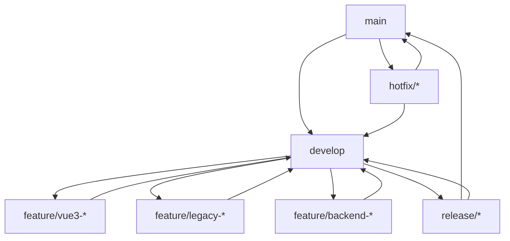

# Git Workflow & Branching Strategy

**CINERENTAL Vue3 Frontend Migration Project**

Version: 1.0
Last Updated: 2025-08-30
Status: Active

## Table of Contents

1. [Overview](#overview)
2. [Branch Strategy](#branch-strategy)
3. [Workflow Patterns](#workflow-patterns)
4. [Dual-Frontend Management](#dual-frontend-management)
5. [Feature Development Process](#feature-development-process)
6. [Release Management](#release-management)
7. [Hotfix Process](#hotfix-process)
8. [Code Review & Pull Request Process](#code-review--pull-request-process)
9. [Merge Strategies](#merge-strategies)
10. [CI/CD Integration](#cicd-integration)
11. [Quality Gates](#quality-gates)
12. [Branch Naming Conventions](#branch-naming-conventions)
13. [Common Scenarios](#common-scenarios)
14. [Best Practices](#best-practices)
15. [Troubleshooting](#troubleshooting)

---

## Overview

CINERENTAL is undergoing a strategic frontend migration from Bootstrap + jQuery to Vue3 + TypeScript while maintaining parallel development across:

- **Backend**: FastAPI backend (ongoing development)
- **Legacy Frontend**: Bootstrap + jQuery in `/frontend` (maintenance mode)
- **New Frontend**: Vue3 + TypeScript in `/frontend-vue3` (active development)

### Project Context

- **Current Version**: v0.15.0-beta.2
- **Main Branch**: `main`
- **Development Branch**: `develop`
- **Current Active Branch**: `feature/frontend-developing`
- **Team**: Multiple developers working on Vue3 migration
- **Deployment Strategy**: Dual-frontend coexistence with gradual rollout

---

## Branch Strategy

### Core Branch Structure

```
main                    # Production-ready releases
├── develop            # Integration branch for all development
├── release/*          # Release preparation branches
├── hotfix/*           # Emergency production fixes
├── feature/*          # New feature development
├── frontend-vue3/*    # Vue3-specific feature branches
├── frontend-legacy/*  # Legacy frontend maintenance
└── backend/*          # Backend-only changes
```

### Branch Descriptions

| Branch Type | Purpose | Base Branch | Merge Target | Lifespan |
|-------------|---------|-------------|--------------|----------|
| `main` | Production releases | - | - | Permanent |
| `develop` | Development integration | `main` | `main` | Permanent |
| `release/*` | Release preparation | `develop` | `main` + `develop` | Temporary |
| `hotfix/*` | Emergency fixes | `main` | `main` + `develop` | Temporary |
| `feature/*` | General features | `develop` | `develop` | Temporary |
| `frontend-vue3/*` | Vue3 components/features | `develop` | `develop` | Temporary |
| `frontend-legacy/*` | Legacy maintenance | `develop` | `develop` | Temporary |
| `backend/*` | Backend-only changes | `develop` | `develop` | Temporary |

---

## Workflow Patterns

### 1. Modified GitFlow for Dual-Frontend Development



### 2. Parallel Development Support

- **Vue3 Development**: Active feature development in `frontend-vue3/` directory
- **Legacy Maintenance**: Bug fixes and critical updates in `frontend/` directory
- **Backend Evolution**: Shared API development supporting both frontends
- **Coordinated Releases**: Synchronized deployments ensuring compatibility

---

## Dual-Frontend Management

### Directory Structure Impact

```
CINERENTAL/
├── backend/                 # Shared FastAPI backend
├── frontend/               # Legacy Bootstrap frontend
├── frontend-vue3/          # New Vue3 frontend
├── docs/                   # Project documentation
├── scripts/               # Build and deployment scripts
└── docker-compose*.yml    # Container configurations
```

### Branch Categorization by Component

#### Vue3 Frontend Branches

```bash
# Component development
frontend-vue3/universal-cart
frontend-vue3/equipment-management
frontend-vue3/booking-system

# Feature implementation
frontend-vue3/barcode-scanner-integration
frontend-vue3/responsive-layouts
```

#### Legacy Frontend Branches

```bash
# Critical bug fixes
frontend-legacy/fix-barcode-scanning
frontend-legacy/hotfix-booking-validation

# Security patches
frontend-legacy/security-update-*
```

#### Backend Branches

```bash
# API development
backend/api-v2-equipment
backend/performance-optimization

# Database changes
backend/migration-equipment-status
```

### Coordination Strategy

1. **API Compatibility**: Backend changes must support both frontends
2. **Feature Flags**: Use environment variables for gradual Vue3 rollout
3. **Synchronized Releases**: Coordinate deployments to prevent breaking changes
4. **Testing Strategy**: Separate test suites for each frontend with shared backend tests

---

## Feature Development Process

### 1. Feature Planning

```bash
# Check current development status
git status
git branch -a

# Update local branches
git fetch origin
git checkout develop
git pull origin develop
```

### 2. Create Feature Branch

```bash
# For Vue3 features
git checkout -b frontend-vue3/universal-cart develop

# For legacy fixes
git checkout -b frontend-legacy/fix-client-search develop

# For backend changes
git checkout -b backend/equipment-api-v2 develop
```

### 3. Development Workflow

```bash
# Regular commits during development
git add .
git commit -m "feat(vue3): implement universal cart base component"

# Push to remote for collaboration
git push -u origin frontend-vue3/universal-cart
```

### 4. Integration Preparation

```bash
# Before creating PR - sync with develop
git checkout develop
git pull origin develop
git checkout frontend-vue3/universal-cart
git merge develop

# Resolve conflicts if any
git add .
git commit -m "merge: resolve conflicts with develop"
```

---

## Release Management

### Release Preparation Process

#### 1. Create Release Branch

```bash
# Start release preparation
git checkout develop
git pull origin develop
git checkout -b release/v0.16.0

# Update version numbers
# - Update version in pyproject.toml
# - Update version in package.json (when Vue3 has one)
# - Update version badges in README.md
git add .
git commit -m "chore(release): bump version to v0.16.0"
```

#### 2. Release Testing

```bash
# Run comprehensive test suites
make test                    # Full backend test suite
npm run test                # Vue3 frontend tests (when implemented)
npm run test:legacy         # Legacy frontend tests (when implemented)

# Build verification
docker compose -f docker-compose.prod.yml build
docker compose -f docker-compose.prod.yml up -d
```

#### 3. Release Finalization

```bash
# Merge to main
git checkout main
git pull origin main
git merge --no-ff release/v0.16.0
git tag -a v0.16.0 -m "Release version 0.16.0"

# Merge back to develop
git checkout develop
git merge --no-ff release/v0.16.0

# Push everything
git push origin main
git push origin develop
git push origin v0.16.0

# Clean up release branch
git branch -d release/v0.16.0
git push origin --delete release/v0.16.0
```

### Coordinated Dual-Frontend Releases

#### Pre-Release Checklist

- [ ] Backend API compatibility verified for both frontends
- [ ] Legacy frontend functionality unchanged
- [ ] Vue3 frontend features properly implemented
- [ ] Database migrations tested in all environments
- [ ] Environment-specific configurations validated
- [ ] Docker builds successful for all configurations
- [ ] Documentation updated for new features

---

## Hotfix Process

### Emergency Production Fixes

#### 1. Create Hotfix Branch

```bash
# Critical production issue
git checkout main
git pull origin main
git checkout -b hotfix/security-patch-auth

# Implement fix
# ... make changes ...
git add .
git commit -m "fix(security): patch authentication vulnerability"
```

#### 2. Test and Validate

```bash
# Rapid testing cycle
make test-critical           # Run critical path tests
docker compose -f docker-compose.prod.yml build
# Manual verification of the fix
```

#### 3. Deploy Hotfix

```bash
# Merge to main
git checkout main
git merge --no-ff hotfix/security-patch-auth
git tag -a v0.15.0-beta.3 -m "Hotfix: Security patch"

# Merge to develop
git checkout develop
git merge --no-ff hotfix/security-patch-auth

# Deploy immediately
git push origin main
git push origin develop
git push origin v0.15.0-beta.3

# Clean up
git branch -d hotfix/security-patch-auth
git push origin --delete hotfix/security-patch-auth
```

### Dual-Frontend Hotfix Considerations

- **Impact Assessment**: Determine which frontend(s) are affected
- **Coordinated Deployment**: Ensure both frontends remain functional
- **Rollback Strategy**: Prepare rollback for both frontends if needed
- **Communication**: Notify team about production changes immediately

---

## Code Review & Pull Request Process

### Pull Request Creation

#### 1. Pre-PR Checklist

```bash
# Code quality checks
make lint                    # Run linting for backend
npm run lint                # Vue3 frontend linting (when implemented)
make format                 # Auto-format code
make test                   # Run test suites
```

#### 2. Create Pull Request

**Template Structure:**

```markdown
## Summary
Brief description of changes and motivation

## Type of Change
- [ ] Vue3 Frontend Feature
- [ ] Legacy Frontend Fix
- [ ] Backend API Change
- [ ] Documentation Update
- [ ] Bug Fix
- [ ] Performance Improvement

## Frontend Impact
- [ ] Vue3 Only
- [ ] Legacy Only
- [ ] Both Frontends
- [ ] Backend Only

## Testing
- [ ] Unit tests added/updated
- [ ] Integration tests passing
- [ ] Manual testing completed
- [ ] Both frontends tested (if applicable)

## Breaking Changes
- [ ] No breaking changes
- [ ] Breaking changes documented below

## Checklist
- [ ] Code follows project style guidelines
- [ ] Self-review completed
- [ ] Comments added for complex logic
- [ ] Documentation updated
- [ ] Tests pass locally
```

### Review Process

#### 1. Automated Checks

```yaml
# .github/workflows/pr-checks.yml
name: PR Quality Checks
on: [pull_request]
jobs:
  backend-tests:
    runs-on: ubuntu-latest
    steps:
      - uses: actions/checkout@v3
      - name: Run Backend Tests
        run: make test

  code-quality:
    runs-on: ubuntu-latest
    steps:
      - uses: actions/checkout@v3
      - name: Lint Backend
        run: make lint
      - name: Type Check
        run: mypy backend/

  vue3-tests:
    runs-on: ubuntu-latest
    steps:
      - uses: actions/checkout@v3
      - name: Run Vue3 Tests
        run: npm run test
        working-directory: ./frontend-vue3
```

#### 2. Manual Review Requirements

**Required Reviewers by Component:**

| Component | Required Reviewers | Special Requirements |
|-----------|-------------------|---------------------|
| Vue3 Frontend | 2 frontend developers | TypeScript expertise |
| Legacy Frontend | 1 senior developer | Bootstrap knowledge |
| Backend API | 2 backend developers | Database impact review |
| Database Migrations | 1 senior + 1 DBA | Migration safety check |
| CI/CD Changes | DevOps lead | Infrastructure impact |

#### 3. Review Criteria

**Code Quality:**

- [ ] Code follows established patterns
- [ ] Proper error handling implemented
- [ ] Security considerations addressed
- [ ] Performance implications considered

**Testing:**

- [ ] Adequate test coverage
- [ ] Tests are meaningful and maintainable
- [ ] Integration points properly tested

**Documentation:**

- [ ] Code comments where necessary
- [ ] API documentation updated
- [ ] User-facing documentation updated

---

## Merge Strategies

### Strategy by Branch Type

| Source Branch | Target Branch | Merge Strategy | Rationale |
|---------------|---------------|----------------|-----------|
| `feature/*` → `develop` | Fast-forward when possible | Squash merge | Clean history |
| `frontend-vue3/*` → `develop` | Squash merge | Clean component history |
| `frontend-legacy/*` → `develop` | Merge commit | Preserve fix context |
| `backend/*` → `develop` | Merge commit | Preserve API evolution |
| `develop` → `main` | Merge commit | Release tracking |
| `release/*` → `main` | Merge commit | Release documentation |
| `hotfix/*` → `main` | Merge commit | Emergency fix tracking |

### Merge Commands

#### Squash Merge (Feature Branches)

```bash
# Via GitHub UI (recommended)
# Select "Squash and merge" option

# Via command line
git checkout develop
git merge --squash frontend-vue3/universal-cart
git commit -m "feat(vue3): implement universal cart system

- Add cart state management
- Implement cart UI components
- Add item validation logic
- Include comprehensive tests"
```

#### Merge Commit (Important Branches)

```bash
git checkout main
git merge --no-ff release/v0.16.0
```

### Conflict Resolution Strategy

#### 1. Common Conflict Scenarios

**Dual-Frontend Conflicts:**

- Shared backend API changes
- Common styling or asset modifications
- Configuration file updates

**Resolution Process:**

```bash
# Start merge
git checkout develop
git merge frontend-vue3/universal-cart

# Resolve conflicts
# Edit conflicted files
git add resolved-files
git commit -m "resolve: merge conflicts with develop"
```

#### 2. Prevention Strategies

- Regular synchronization with develop branch
- Clear component boundaries between frontends
- Coordinated backend API changes
- Frequent communication between frontend teams

---

## CI/CD Integration

### GitHub Actions Workflow

#### Branch-Based Triggers

```yaml
# .github/workflows/ci.yml
name: CI Pipeline
on:
  push:
    branches: [main, develop]
  pull_request:
    branches: [main, develop]

jobs:
  changes:
    runs-on: ubuntu-latest
    outputs:
      backend: ${{ steps.changes.outputs.backend }}
      vue3: ${{ steps.changes.outputs.vue3 }}
      legacy: ${{ steps.changes.outputs.legacy }}
    steps:
      - uses: actions/checkout@v3
      - uses: dorny/paths-filter@v2
        id: changes
        with:
          filters: |
            backend:
              - 'backend/**'
              - 'requirements.txt'
              - 'pyproject.toml'
            vue3:
              - 'frontend-vue3/**'
            legacy:
              - 'frontend/**'

  backend-tests:
    needs: changes
    if: ${{ needs.changes.outputs.backend == 'true' }}
    runs-on: ubuntu-latest
    steps:
      - uses: actions/checkout@v3
      - name: Run Backend Tests
        run: make test

  vue3-tests:
    needs: changes
    if: ${{ needs.changes.outputs.vue3 == 'true' }}
    runs-on: ubuntu-latest
    steps:
      - uses: actions/checkout@v3
      - name: Setup Node.js
        uses: actions/setup-node@v3
        with:
          node-version: '18'
          cache: 'npm'
          cache-dependency-path: frontend-vue3/package-lock.json
      - name: Install dependencies
        run: npm ci
        working-directory: ./frontend-vue3
      - name: Run tests
        run: npm run test
        working-directory: ./frontend-vue3
```

### Environment-Specific Deployments

#### Development Environment

```yaml
deploy-dev:
  if: github.ref == 'refs/heads/develop'
  runs-on: ubuntu-latest
  steps:
    - uses: actions/checkout@v3
    - name: Deploy to Development
      run: |
        docker compose -f docker-compose.yml build
        # Deploy to dev environment
```

#### Production Environment

```yaml
deploy-prod:
  if: github.ref == 'refs/heads/main' && github.event_name == 'push'
  runs-on: ubuntu-latest
  steps:
    - uses: actions/checkout@v3
    - name: Deploy to Production
      run: |
        docker compose -f docker-compose.prod.yml build
        # Deploy to production environment
```

---

## Quality Gates

### Automated Quality Checks

#### 1. Pre-commit Hooks

```yaml
# .pre-commit-config.yaml
repos:
  - repo: https://github.com/psf/black
    rev: 22.3.0
    hooks:
      - id: black
        files: ^backend/

  - repo: https://github.com/pycqa/isort
    rev: 5.10.1
    hooks:
      - id: isort
        files: ^backend/
        args: ["--profile", "black"]

  - repo: https://github.com/pycqa/flake8
    rev: 4.0.1
    hooks:
      - id: flake8
        files: ^backend/

  - repo: local
    hooks:
      - id: vue3-lint
        name: Vue3 Lint
        entry: npm run lint
        language: system
        files: ^frontend-vue3/
        pass_filenames: false
```

#### 2. Branch Protection Rules

**Main Branch Protection:**

- Require pull request reviews (minimum 2)
- Require status checks to pass
- Require branches to be up to date
- Require signed commits
- Restrict pushes to administrators only

**Develop Branch Protection:**

- Require pull request reviews (minimum 1)
- Require status checks to pass
- Allow force pushes for maintainers

#### 3. Quality Metrics

**Backend Quality Gates:**

- Test coverage ≥ 80%
- All linting checks pass
- Type checking (mypy) passes
- Security scan passes

**Vue3 Frontend Quality Gates:**

- Test coverage ≥ 70%
- ESLint passes
- TypeScript compilation succeeds
- Bundle size within limits

**Legacy Frontend Quality Gates:**

- Critical functionality tests pass
- No new linting errors
- Security vulnerabilities addressed

---

## Branch Naming Conventions

### Standardized Naming Patterns

#### Feature Branches

```bash
# Vue3 frontend features
frontend-vue3/universal-cart
frontend-vue3/equipment-management
frontend-vue3/barcode-scanner
frontend-vue3/responsive-layout

# Legacy frontend fixes
frontend-legacy/fix-client-search
frontend-legacy/hotfix-booking-validation
frontend-legacy/security-patch-auth

# Backend features
backend/api-v2-equipment
backend/performance-optimization
backend/migration-equipment-status

# General features
feature/project-multiple-periods
feature/enhance-equipment-filtering
```

#### Branch Prefix Guidelines

| Prefix | Usage | Example |
|--------|-------|---------|
| `frontend-vue3/` | Vue3 component development | `frontend-vue3/universal-cart` |
| `frontend-legacy/` | Legacy frontend maintenance | `frontend-legacy/fix-booking-bug` |
| `backend/` | Backend-only changes | `backend/api-optimization` |
| `feature/` | Cross-component features | `feature/barcode-integration` |
| `fix/` | General bug fixes | `fix/date-validation` |
| `hotfix/` | Emergency production fixes | `hotfix/security-patch` |
| `release/` | Release preparation | `release/v0.16.0` |
| `chore/` | Maintenance tasks | `chore/dependency-updates` |
| `docs/` | Documentation updates | `docs/api-specification` |

#### Naming Best Practices

1. **Use kebab-case**: `frontend-vue3/equipment-management`
2. **Be descriptive**: `frontend-vue3/universal-cart-state-management`
3. **Include issue number**: `frontend-vue3/universal-cart-issue-123`
4. **Avoid abbreviations**: Use full words for clarity
5. **Component-specific**: Clearly indicate which part of the system

---

## Common Scenarios

### Scenario 1: Vue3 Component Development

```bash
# 1. Start new Vue3 component
git checkout develop
git pull origin develop
git checkout -b frontend-vue3/equipment-list-component

# 2. Develop component
# ... implement Vue3 component ...
git add .
git commit -m "feat(vue3): implement equipment list component with pagination"

# 3. Add tests
# ... write component tests ...
git add .
git commit -m "test(vue3): add comprehensive tests for equipment list component"

# 4. Sync with develop before PR
git checkout develop
git pull origin develop
git checkout frontend-vue3/equipment-list-component
git merge develop

# 5. Create PR
git push -u origin frontend-vue3/equipment-list-component
# Create PR via GitHub UI
```

### Scenario 2: Legacy Frontend Hotfix

```bash
# 1. Critical bug in production legacy frontend
git checkout main
git pull origin main
git checkout -b frontend-legacy/hotfix-booking-calculation

# 2. Implement fix
# ... fix booking calculation bug ...
git add .
git commit -m "fix(legacy): correct booking total calculation logic"

# 3. Test fix
make test
# Manual testing of fix

# 4. Deploy hotfix
git checkout main
git merge --no-ff frontend-legacy/hotfix-booking-calculation
git tag -a v0.15.0-beta.3 -m "Hotfix: Booking calculation fix"

# 5. Merge to develop
git checkout develop
git merge --no-ff frontend-legacy/hotfix-booking-calculation

# 6. Push and clean up
git push origin main
git push origin develop
git push origin v0.15.0-beta.3
git branch -d frontend-legacy/hotfix-booking-calculation
```

### Scenario 3: Coordinated Dual-Frontend Release

```bash
# 1. Prepare release branch
git checkout develop
git pull origin develop
git checkout -b release/v0.16.0

# 2. Update versions across components
# - backend/core/__init__.py
# - frontend-vue3/package.json (when it exists)
# - pyproject.toml
# - README.md
git add .
git commit -m "chore(release): bump version to v0.16.0"

# 3. Test both frontends
make test                    # Backend tests
# Test legacy frontend manually
# Test Vue3 frontend components

# 4. Build verification
docker compose -f docker-compose.prod.yml build

# 5. Finalize release
git checkout main
git merge --no-ff release/v0.16.0
git tag -a v0.16.0 -m "Release v0.16.0: Vue3 components and legacy fixes"

git checkout develop
git merge --no-ff release/v0.16.0

git push origin main
git push origin develop
git push origin v0.16.0

# 6. Clean up
git branch -d release/v0.16.0
git push origin --delete release/v0.16.0
```

### Scenario 4: Merge Conflict Resolution

```bash
# 1. Conflict during feature merge
git checkout develop
git merge frontend-vue3/universal-cart
# CONFLICT: Merge conflict in shared files

# 2. Identify conflicts
git status
# Shows conflicted files

# 3. Resolve conflicts
# Edit conflicted files manually
# Look for <<<<<<< markers

# 4. Mark as resolved
git add resolved-file.js
git add another-resolved-file.py

# 5. Complete merge
git commit -m "resolve: merge conflicts between universal-cart and develop

- Resolve API endpoint conflicts
- Maintain backward compatibility
- Update shared utility functions"

# 6. Verify resolution
make test
npm run test (in frontend-vue3/)
```

---

## Best Practices

### Development Workflow Best Practices

#### 1. Branch Hygiene

```bash
# Keep branches focused and short-lived
# Regular synchronization with develop
git checkout feature-branch
git merge develop

# Clean up old branches regularly
git branch -d old-feature-branch
git push origin --delete old-feature-branch

# Use descriptive commit messages
git commit -m "feat(vue3): implement equipment search with debouncing

- Add search input component with 300ms debounce
- Implement fuzzy search logic
- Add keyboard navigation support
- Include accessibility features"
```

#### 2. Communication and Coordination

- **Daily Stand-ups**: Discuss branch status and merge conflicts
- **Slack Notifications**: Automated notifications for important merges
- **Documentation Updates**: Keep branch strategy documentation current
- **Team Agreements**: Regular review of branching strategy effectiveness

#### 3. Risk Management

```bash
# Always backup important work
git push -u origin feature-branch

# Test thoroughly before merging
make test
make lint
make format

# Use feature flags for gradual rollout
# Environment variable: VUE3_ENABLED=true/false
```

### Code Quality Best Practices

#### 1. Commit Message Standards

```bash
# Use conventional commits
feat(vue3): add universal cart component
fix(legacy): resolve booking date validation
docs(api): update equipment endpoints
test(vue3): add unit tests for cart service
chore(deps): update Vue3 to latest version

# Include context and rationale
git commit -m "feat(vue3): implement barcode scanner integration

- Add HID scanner support for equipment lookup
- Implement automatic cart addition on scan
- Add scanner configuration management
- Include error handling for invalid barcodes

Closes #123"
```

#### 2. Pull Request Standards

- **Small, Focused PRs**: One feature or fix per PR
- **Comprehensive Testing**: Include both unit and integration tests
- **Documentation Updates**: Update relevant documentation
- **Backward Compatibility**: Ensure changes don't break existing functionality

#### 3. Review Standards

- **Security Review**: Check for security vulnerabilities
- **Performance Review**: Assess performance implications
- **Architecture Review**: Ensure changes align with project architecture
- **Accessibility Review**: Verify accessibility standards are met

---

## Troubleshooting

### Common Issues and Solutions

#### 1. Merge Conflicts in Shared Files

**Problem**: Conflicts between Vue3 and legacy frontend changes

**Solution**:

```bash
# 1. Identify the nature of conflicts
git diff HEAD~1

# 2. Understand both changes
git log --oneline --graph -10

# 3. Resolve systematically
# - Keep both changes if they don't conflict
# - Prioritize Vue3 changes for new features
# - Preserve legacy functionality for existing features

# 4. Test both frontends after resolution
make test
# Manual testing of both frontends
```

#### 2. Branch Protection Violations

**Problem**: Unable to push to protected branches

**Solution**:

```bash
# Use proper PR workflow
git checkout -b fix/branch-protection-issue
# Make changes
git push -u origin fix/branch-protection-issue
# Create PR via GitHub UI
```

#### 3. CI/CD Pipeline Failures

**Problem**: Tests failing in CI but passing locally

**Solution**:

```bash
# Replicate CI environment locally
docker compose -f docker-compose.test.yml up
docker compose -f docker-compose.test.yml run --rm test python -m pytest

# Check for environment-specific issues
# - Database state differences
# - Environment variable mismatches
# - Path differences between local and CI
```

#### 4. Version Conflicts During Release

**Problem**: Version numbers out of sync between components

**Solution**:

```bash
# Standardize version management
# 1. Update pyproject.toml (main version source)
# 2. Update package.json in frontend-vue3/ (if exists)
# 3. Update version badges in README.md
# 4. Update version in backend/core/__init__.py

# Use script to sync versions across components
./scripts/sync-versions.sh v0.16.0
```

### Emergency Procedures

#### 1. Broken Main Branch

```bash
# 1. Identify the breaking commit
git log --oneline main

# 2. Create immediate hotfix
git checkout main~1  # Go to last known good commit
git checkout -b hotfix/restore-main-stability

# 3. Revert breaking changes or implement fix
git revert <breaking-commit-hash>

# 4. Emergency merge
git checkout main
git merge --no-ff hotfix/restore-main-stability
git push origin main
```

#### 2. Corrupted Develop Branch

```bash
# 1. Backup current state
git checkout develop
git checkout -b backup/develop-$(date +%Y%m%d)

# 2. Reset to last known good state
git checkout main
git checkout -b develop-restore
# Cherry-pick good commits from backup branch

# 3. Replace develop branch
git branch -D develop
git checkout -b develop
git push -f origin develop
```

#### 3. Critical Production Issue

```bash
# 1. Immediate response (< 5 minutes)
git checkout main
git checkout -b hotfix/critical-production-fix

# 2. Implement minimal fix
# Focus on stopping the bleeding, not perfect solution
git add .
git commit -m "hotfix: immediate fix for critical production issue"

# 3. Deploy immediately
git checkout main
git merge --no-ff hotfix/critical-production-fix
git tag -a v0.15.0-beta.X -m "Emergency hotfix: Critical production fix"
git push origin main
git push origin v0.15.0-beta.X

# 4. Follow up with proper fix in separate PR
```

---

## Quick Reference

### Essential Commands

```bash
# Branch management
git checkout -b frontend-vue3/new-feature develop
git merge develop
git branch -d old-branch
git push origin --delete old-branch

# Release workflow
git checkout -b release/v0.16.0 develop
git checkout main && git merge --no-ff release/v0.16.0
git tag -a v0.16.0 -m "Release v0.16.0"

# Hotfix workflow
git checkout -b hotfix/critical-fix main
git checkout main && git merge --no-ff hotfix/critical-fix
git checkout develop && git merge --no-ff hotfix/critical-fix

# Quality checks
make test && make lint && make format
```

### Branch Protection Settings

```bash
# Apply to main branch
- Require pull request reviews: 2
- Require status checks: ✓
- Require branches up to date: ✓
- Restrict pushes: Admin only

# Apply to develop branch
- Require pull request reviews: 1
- Require status checks: ✓
- Allow force push: Maintainers only
```

---

## Conclusion

This Git workflow strategy provides a robust foundation for managing the complex dual-frontend migration project. The strategy emphasizes:

- **Clear Separation**: Distinct branch patterns for different components
- **Quality Assurance**: Comprehensive testing and review processes
- **Risk Management**: Hotfix procedures and rollback strategies
- **Team Coordination**: Clear communication and coordination protocols
- **Scalability**: Workflow supports team growth and project evolution

Regular review and refinement of this strategy will ensure it continues to serve the project's evolving needs as the Vue3 migration progresses.

**Next Steps:**

1. Team training on new workflow
2. Implementation of automated checks
3. Documentation of project-specific adaptations
4. Regular workflow retrospectives and improvements

---

**Document Maintenance:**

- Review quarterly for effectiveness
- Update based on team feedback
- Adapt to new project requirements
- Synchronize with industry best practices
