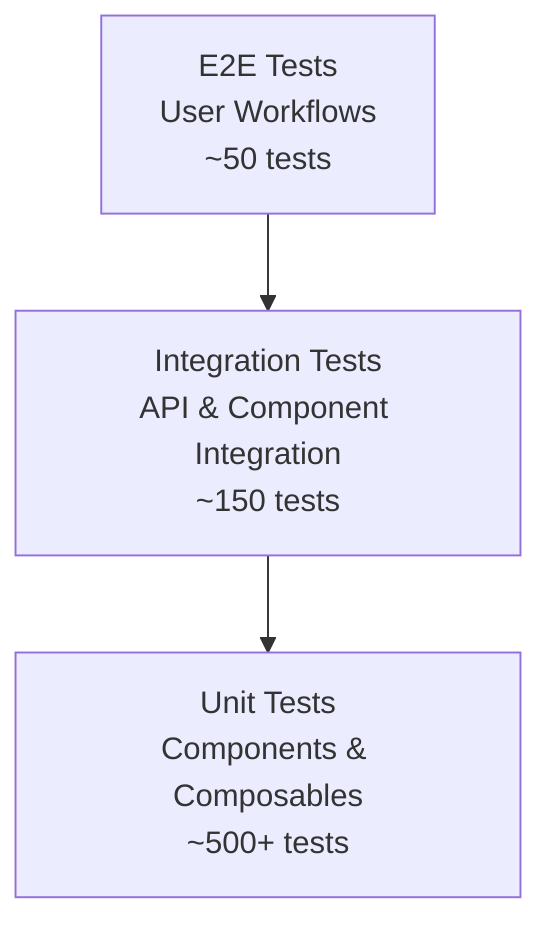

# TESTING STRATEGY DOCUMENT

**Project**: CINERENTAL Vue3 Frontend Migration
**Document Version**: 1.0
**Date**: 2025-08-29
**Status**: Phase 2 - Quality Assurance Framework
**Author**: Quality Assurance Team

---

## Executive Summary

This document establishes a comprehensive testing strategy for the CINERENTAL Vue3 frontend migration project, ensuring 100% feature parity with the existing Bootstrap + jQuery application while implementing modern testing practices. The strategy covers unit testing, integration testing, end-to-end testing, performance testing, and accessibility validation to guarantee zero business disruption during the dual-frontend transition.

### Strategic Testing Objectives

1. **Business Continuity**: Ensure all critical cinema equipment rental workflows function identically
2. **Quality Assurance**: Maintain 90%+ test coverage with comprehensive test automation
3. **Performance Validation**: Verify performance improvements while preventing regressions
4. **Cross-Browser Compatibility**: Guarantee consistent functionality across all supported browsers
5. **Accessibility Compliance**: Ensure WCAG 2.1 AA compliance throughout migration

---

## Testing Philosophy & Principles

### Core Testing Principles

1. **Business Logic First**: Test critical rental workflows before technical features
2. **User-Centric Testing**: Focus on actual user journeys and pain points
3. **Comprehensive Coverage**: Test units, integration, E2E, performance, and accessibility
4. **Automation Priority**: Automate everything that can be automated for consistency
5. **Early Detection**: Catch issues in development before they reach production

### Testing Pyramid Strategy



**Distribution Strategy**:

- **70%**: Unit Tests (Components, Composables, Utilities)
- **20%**: Integration Tests (API, Component Integration, Store Testing)
- **10%**: E2E Tests (Critical User Workflows, Cross-Browser)

---

## Testing Framework Architecture

### Technology Stack

| Test Type | Framework | Tools | Rationale |
|-----------|-----------|-------|-----------|
| **Unit** | Vitest | Vue Test Utils, Testing Library | Fast execution, Vue3 optimized |
| **Integration** | Vitest + MSW | Mock Service Worker | Realistic API mocking |
| **E2E** | Playwright | Cross-browser testing | Reliable, fast, cross-browser |
| **Performance** | Lighthouse CI | Core Web Vitals | Automated performance monitoring |
| **Accessibility** | axe-core | WCAG compliance | Comprehensive a11y testing |
| **Visual** | Percy/Chromatic | Screenshot testing | UI regression detection |

### Project Testing Structure

```text
frontend-vue3/
├── tests/
│   ├── unit/                    # Unit tests
│   │   ├── components/         # Vue component tests
│   │   ├── composables/        # Composable logic tests
│   │   ├── stores/             # Pinia store tests
│   │   └── utils/              # Utility function tests
│   ├── integration/            # Integration tests
│   │   ├── api/                # API integration tests
│   │   ├── components/         # Component integration tests
│   │   └── workflows/          # Business workflow tests
│   ├── e2e/                    # End-to-end tests
│   │   ├── critical/           # Critical business workflows
│   │   ├── regression/         # Regression test suites
│   │   └── cross-browser/      # Cross-browser compatibility
│   ├── performance/            # Performance tests
│   │   ├── lighthouse/         # Lighthouse configs
│   │   └── load/               # Load testing scenarios
│   ├── accessibility/          # Accessibility tests
│   │   ├── axe/                # axe-core test configurations
│   │   └── wcag/               # WCAG compliance tests
│   ├── fixtures/               # Test data and mocks
│   │   ├── equipment/          # Equipment test data
│   │   ├── projects/           # Project test data
│   │   └── api/                # API response mocks
│   ├── factories/              # Test data factories
│   └── support/                # Test utilities and helpers
└── playwright.config.ts        # E2E test configuration
```

---

## Unit Testing Strategy

### Component Testing Standards

#### Vue Component Test Template

```typescript
// tests/unit/components/EquipmentCard.spec.ts

import { describe, it, expect, vi, beforeEach } from 'vitest'
import { mount, VueWrapper } from '@vue/test-utils'
import { createTestingPinia } from '@pinia/testing'
import EquipmentCard from '@/components/equipment/EquipmentCard.vue'
import type { Equipment } from '@/types/equipment'

// Test data factory
const createMockEquipment = (overrides?: Partial<Equipment>): Equipment => ({
  id: '1',
  name: 'Professional Camera',
  category: 'Cameras',
  subcategory: 'DSLR',
  serialNumber: 'CAM-001',
  barcode: '12345678901',
  status: 'AVAILABLE',
  isUnique: true,
  dailyRate: 100.00,
  replacementCost: 5000.00,
  createdAt: '2024-01-01T00:00:00Z',
  updatedAt: '2024-01-01T00:00:00Z',
  ...overrides
})

describe('EquipmentCard', () => {
  let wrapper: VueWrapper<any>
  let mockEquipment: Equipment

  beforeEach(() => {
    mockEquipment = createMockEquipment()
  })

  const createWrapper = (props?: Partial<{ equipment: Equipment; variant: string }>) => {
    return mount(EquipmentCard, {
      props: {
        equipment: mockEquipment,
        ...props
      },
      global: {
        plugins: [
          createTestingPinia({
            createSpy: vi.fn,
            stubActions: false
          })
        ]
      }
    })
  }

  describe('Rendering', () => {
    it('should render equipment information correctly', () => {
      wrapper = createWrapper()

      expect(wrapper.find('[data-test="equipment-name"]').text()).toBe(mockEquipment.name)
      expect(wrapper.find('[data-test="equipment-category"]').text()).toBe(mockEquipment.category)
      expect(wrapper.find('[data-test="equipment-serial"]').text()).toContain(mockEquipment.serialNumber)
    })

    it('should render status badge with correct variant', () => {
      wrapper = createWrapper({
        equipment: createMockEquipment({ status: 'RENTED' })
      })

      const statusBadge = wrapper.findComponent('[data-test="status-badge"]')
      expect(statusBadge.props('status')).toBe('RENTED')
      expect(statusBadge.classes()).toContain('bg-warning')
    })

    it('should render daily rate correctly formatted', () => {
      wrapper = createWrapper()

      const rateElement = wrapper.find('[data-test="daily-rate"]')
      expect(rateElement.text()).toContain('100.00')
      expect(rateElement.text()).toContain('руб/день')
    })
  })

  describe('Interactions', () => {
    it('should emit add-to-cart event when button is clicked', async () => {
      wrapper = createWrapper()

      const addButton = wrapper.find('[data-test="add-to-cart-button"]')
      await addButton.trigger('click')

      expect(wrapper.emitted('add-to-cart')).toBeTruthy()
      expect(wrapper.emitted('add-to-cart')?.[0]).toEqual([mockEquipment])
    })

    it('should disable add button for unavailable equipment', () => {
      wrapper = createWrapper({
        equipment: createMockEquipment({ status: 'RENTED' })
      })

      const addButton = wrapper.find('[data-test="add-to-cart-button"]')
      expect(addButton.attributes('disabled')).toBeDefined()
    })

    it('should emit view-details event when details link is clicked', async () => {
      wrapper = createWrapper()

      const detailsLink = wrapper.find('[data-test="view-details-link"]')
      await detailsLink.trigger('click')

      expect(wrapper.emitted('view-details')).toBeTruthy()
      expect(wrapper.emitted('view-details')?.[0]).toEqual([mockEquipment.id])
    })
  })

  describe('Variants', () => {
    it('should apply compact variant classes', () => {
      wrapper = createWrapper({ variant: 'compact' })

      expect(wrapper.find('.equipment-card').classes()).toContain('equipment-card--compact')
    })

    it('should hide serial number in compact variant', () => {
      wrapper = createWrapper({ variant: 'compact' })

      expect(wrapper.find('[data-test="equipment-serial"]').exists()).toBe(false)
    })
  })

  describe('Loading States', () => {
    it('should show loading state during async operations', async () => {
      wrapper = createWrapper()

      // Simulate loading state
      await wrapper.setProps({ loading: true })

      expect(wrapper.find('[data-test="loading-spinner"]').exists()).toBe(true)
      expect(wrapper.find('[data-test="add-to-cart-button"]').attributes('disabled')).toBeDefined()
    })
  })

  describe('Accessibility', () => {
    it('should have proper ARIA labels', () => {
      wrapper = createWrapper()

      const addButton = wrapper.find('[data-test="add-to-cart-button"]')
      expect(addButton.attributes('aria-label')).toContain(mockEquipment.name)
    })

    it('should support keyboard navigation', async () => {
      wrapper = createWrapper()

      const card = wrapper.find('.equipment-card')
      await card.trigger('keydown.enter')

      expect(wrapper.emitted('view-details')).toBeTruthy()
    })
  })
})
```

#### Composable Testing Standards

```typescript
// tests/unit/composables/useEquipmentSearch.spec.ts

import { describe, it, expect, vi, beforeEach, afterEach } from 'vitest'
import { useEquipmentSearch } from '@/composables/useEquipmentSearch'
import { equipmentApi } from '@/services/api/equipment'

// Mock API
vi.mock('@/services/api/equipment')

describe('useEquipmentSearch', () => {
  beforeEach(() => {
    vi.clearAllMocks()
  })

  afterEach(() => {
    vi.restoreAllMocks()
  })

  it('should initialize with empty state', () => {
    const { query, results, isSearching, error } = useEquipmentSearch()

    expect(query.value).toBe('')
    expect(results.value).toEqual([])
    expect(isSearching.value).toBe(false)
    expect(error.value).toBeNull()
  })

  it('should perform search with debouncing', async () => {
    const mockResults = [
      { id: '1', name: 'Camera' },
      { id: '2', name: 'Another Camera' }
    ]

    vi.mocked(equipmentApi.search).mockResolvedValueOnce(mockResults)

    const { query, results, search } = useEquipmentSearch({ debounceMs: 100 })

    await search('camera')

    expect(equipmentApi.search).toHaveBeenCalledWith('camera')
    expect(results.value).toEqual(mockResults)
  })

  it('should handle search errors gracefully', async () => {
    const searchError = new Error('Search failed')
    vi.mocked(equipmentApi.search).mockRejectedValueOnce(searchError)

    const { search, error, results } = useEquipmentSearch()

    await search('invalid')

    expect(error.value).toBe('Search failed')
    expect(results.value).toEqual([])
  })

  it('should clear results when query is empty', async () => {
    const { search, results, clearResults } = useEquipmentSearch()

    // First search
    vi.mocked(equipmentApi.search).mockResolvedValueOnce([{ id: '1', name: 'Camera' }])
    await search('camera')
    expect(results.value).toHaveLength(1)

    // Clear results
    clearResults()
    expect(results.value).toEqual([])
  })

  it('should respect minimum query length', async () => {
    const { search } = useEquipmentSearch({ minQueryLength: 3 })

    await search('ca') // Too short

    expect(equipmentApi.search).not.toHaveBeenCalled()
  })

  it('should cleanup properly on unmount', () => {
    const { search } = useEquipmentSearch()

    // Component unmounts
    // Verify debounced functions are cancelled
    expect(vi.mocked).toHaveBeenCalledWith('cancel')
  })
})
```

### Store Testing Standards

```typescript
// tests/unit/stores/equipment.spec.ts

import { describe, it, expect, beforeEach, vi } from 'vitest'
import { setActivePinia, createPinia } from 'pinia'
import { useEquipmentStore } from '@/stores/equipment'
import { equipmentApi } from '@/services/api/equipment'
import type { Equipment, PaginatedResponse } from '@/types'

vi.mock('@/services/api/equipment')

describe('useEquipmentStore', () => {
  let store: ReturnType<typeof useEquipmentStore>

  beforeEach(() => {
    setActivePinia(createPinia())
    store = useEquipmentStore()
  })

  describe('State Management', () => {
    it('should initialize with correct default state', () => {
      expect(store.equipment.size).toBe(0)
      expect(store.equipmentArray).toEqual([])
      expect(store.hasEquipment).toBe(false)
      expect(store.isLoading).toBe(false)
    })

    it('should manage equipment collection correctly', () => {
      const mockEquipment = { id: '1', name: 'Camera' } as Equipment

      store.equipment.set(mockEquipment.id, mockEquipment)

      expect(store.equipment.size).toBe(1)
      expect(store.hasEquipment).toBe(true)
      expect(store.getEquipmentById('1')).toEqual(mockEquipment)
    })
  })

  describe('Actions', () => {
    it('should fetch equipment successfully', async () => {
      const mockResponse: PaginatedResponse<Equipment> = {
        items: [
          { id: '1', name: 'Camera' } as Equipment,
          { id: '2', name: 'Light' } as Equipment
        ],
        total: 2,
        page: 1,
        size: 20,
        totalPages: 1
      }

      vi.mocked(equipmentApi.getEquipment).mockResolvedValue(mockResponse)

      await store.fetchEquipment()

      expect(store.equipment.size).toBe(2)
      expect(store.pagination.total).toBe(2)
      expect(store.loading.equipment).toBe(false)
      expect(store.errors.equipment).toBeNull()
    })

    it('should handle fetch equipment error', async () => {
      const error = new Error('Network error')
      vi.mocked(equipmentApi.getEquipment).mockRejectedValue(error)

      await expect(store.fetchEquipment()).rejects.toThrow('Network error')

      expect(store.errors.equipment).toBe('Network error')
      expect(store.loading.equipment).toBe(false)
      expect(store.equipment.size).toBe(0)
    })

    it('should create equipment successfully', async () => {
      const mockEquipment = { id: '1', name: 'New Camera' } as Equipment
      vi.mocked(equipmentApi.create).mockResolvedValue(mockEquipment)

      const result = await store.createEquipment({
        name: 'New Camera',
        categoryId: 'cat-1',
        dailyRate: 100,
        replacementCost: 5000
      })

      expect(result).toEqual(mockEquipment)
      expect(store.equipment.has('1')).toBe(true)
      expect(store.loading.create).toBe(false)
    })

    it('should handle optimistic updates correctly', async () => {
      const originalEquipment = { id: '1', name: 'Camera', status: 'AVAILABLE' } as Equipment
      const updateData = { status: 'RENTED' } as Partial<Equipment>
      const serverResponse = { ...originalEquipment, ...updateData } as Equipment

      store.equipment.set('1', originalEquipment)

      vi.mocked(equipmentApi.update).mockResolvedValue(serverResponse)

      await store.updateEquipment('1', updateData)

      const updatedEquipment = store.equipment.get('1')
      expect(updatedEquipment?.status).toBe('RENTED')
    })

    it('should revert optimistic updates on failure', async () => {
      const originalEquipment = { id: '1', name: 'Camera', status: 'AVAILABLE' } as Equipment
      const updateData = { status: 'RENTED' } as Partial<Equipment>

      store.equipment.set('1', originalEquipment)

      vi.mocked(equipmentApi.update).mockRejectedValue(new Error('Update failed'))

      await expect(store.updateEquipment('1', updateData)).rejects.toThrow('Update failed')

      const revertedEquipment = store.equipment.get('1')
      expect(revertedEquipment?.status).toBe('AVAILABLE')
    })
  })

  describe('Getters', () => {
    beforeEach(() => {
      store.equipment.set('1', { id: '1', status: 'AVAILABLE', category: 'Cameras' } as Equipment)
      store.equipment.set('2', { id: '2', status: 'RENTED', category: 'Cameras' } as Equipment)
      store.equipment.set('3', { id: '3', status: 'AVAILABLE', category: 'Lighting' } as Equipment)
    })

    it('should filter available equipment', () => {
      const available = store.availableEquipment

      expect(available).toHaveLength(2)
      expect(available.every(item => item.status === 'AVAILABLE')).toBe(true)
    })

    it('should filter equipment by query', () => {
      store.setFilters({ query: 'Camera' })

      const filtered = store.filteredEquipment

      expect(filtered.every(item =>
        item.name.toLowerCase().includes('camera') ||
        item.category.toLowerCase().includes('camera')
      )).toBe(true)
    })

    it('should filter equipment by category', () => {
      store.setFilters({ categoryId: 'Cameras' })

      const filtered = store.filteredEquipment

      expect(filtered.every(item => item.category === 'Cameras')).toBe(true)
    })
  })

  describe('Filter Management', () => {
    it('should update filters correctly', () => {
      store.setFilters({ query: 'camera', categoryId: 'cat-1' })

      expect(store.filters.query).toBe('camera')
      expect(store.filters.categoryId).toBe('cat-1')
    })

    it('should clear filters', () => {
      store.setFilters({ query: 'camera', categoryId: 'cat-1' })
      store.clearFilters()

      expect(store.filters.query).toBe('')
      expect(store.filters.categoryId).toBeNull()
    })
  })
})
```

### Testing Coverage Requirements

#### Coverage Thresholds

```javascript
// vitest.config.ts coverage configuration
export default defineConfig({
  test: {
    coverage: {
      provider: 'v8',
      reporter: ['text', 'json', 'html'],
      thresholds: {
        global: {
          branches: 80,
          functions: 85,
          lines: 90,
          statements: 90
        },
        './src/components/': {
          branches: 85,
          functions: 90,
          lines: 95,
          statements: 95
        },
        './src/stores/': {
          branches: 90,
          functions: 95,
          lines: 95,
          statements: 95
        }
      },
      exclude: [
        'tests/**',
        'src/types/**',
        '**/*.d.ts',
        'src/main.ts',
        'vite.config.ts'
      ]
    }
  }
})
```

---

## Integration Testing Strategy

### API Integration Testing

#### Service Integration Test Template

```typescript
// tests/integration/api/equipment-api.spec.ts

import { describe, it, expect, beforeEach, afterEach } from 'vitest'
import { setupServer } from 'msw/node'
import { rest } from 'msw'
import { EquipmentApiService } from '@/services/api/equipment'
import { ApiClient } from '@/services/api/client'

const server = setupServer(
  rest.get('/api/v1/equipment/', (req, res, ctx) => {
    const page = req.url.searchParams.get('page') || '1'
    const size = req.url.searchParams.get('size') || '20'
    const query = req.url.searchParams.get('q')

    const mockEquipment = [
      { id: '1', name: 'Professional Camera', category: 'Cameras' },
      { id: '2', name: 'Studio Light', category: 'Lighting' }
    ]

    let filtered = mockEquipment
    if (query) {
      filtered = mockEquipment.filter(item =>
        item.name.toLowerCase().includes(query.toLowerCase())
      )
    }

    return res(ctx.json({
      items: filtered,
      total: filtered.length,
      page: parseInt(page),
      size: parseInt(size),
      totalPages: Math.ceil(filtered.length / parseInt(size))
    }))
  }),

  rest.get('/api/v1/equipment/barcode/:barcode', (req, res, ctx) => {
    const { barcode } = req.params

    if (barcode === '12345678901') {
      return res(ctx.json({
        id: '1',
        name: 'Professional Camera',
        barcode: '12345678901',
        category: 'Cameras'
      }))
    }

    return res(ctx.status(404), ctx.json({ detail: 'Equipment not found' }))
  }),

  rest.post('/api/v1/equipment/', (req, res, ctx) => {
    return res(ctx.json({
      id: '3',
      name: 'New Equipment',
      ...req.body,
      createdAt: new Date().toISOString()
    }))
  })
)

describe('Equipment API Integration', () => {
  let apiClient: ApiClient
  let equipmentService: EquipmentApiService

  beforeEach(() => {
    server.listen()
    apiClient = new ApiClient({
      baseURL: 'http://localhost:8000',
      timeout: 5000,
      retryCount: 2,
      retryDelay: 100
    })
    equipmentService = new EquipmentApiService(apiClient)
  })

  afterEach(() => {
    server.resetHandlers()
    server.close()
  })

  describe('Equipment Fetching', () => {
    it('should fetch equipment with pagination', async () => {
      const result = await equipmentService.getEquipment({ page: 1, size: 20 })

      expect(result.items).toHaveLength(2)
      expect(result.total).toBe(2)
      expect(result.page).toBe(1)
      expect(result.size).toBe(20)
    })

    it('should search equipment by query', async () => {
      const result = await equipmentService.getEquipment({ query: 'camera' })

      expect(result.items).toHaveLength(1)
      expect(result.items[0].name).toContain('Camera')
    })

    it('should handle empty search results', async () => {
      const result = await equipmentService.getEquipment({ query: 'nonexistent' })

      expect(result.items).toHaveLength(0)
      expect(result.total).toBe(0)
    })
  })

  describe('Barcode Lookup', () => {
    it('should find equipment by barcode', async () => {
      const equipment = await equipmentService.searchByBarcode('12345678901')

      expect(equipment).not.toBeNull()
      expect(equipment?.barcode).toBe('12345678901')
    })

    it('should return null for non-existent barcode', async () => {
      const equipment = await equipmentService.searchByBarcode('00000000000')

      expect(equipment).toBeNull()
    })
  })

  describe('Equipment Creation', () => {
    it('should create new equipment', async () => {
      const equipmentData = {
        name: 'New Camera',
        categoryId: 'cat-1',
        dailyRate: 150,
        replacementCost: 3000
      }

      const result = await equipmentService.create(equipmentData)

      expect(result.name).toBe('New Camera')
      expect(result.id).toBeDefined()
      expect(result.createdAt).toBeDefined()
    })
  })

  describe('Error Handling', () => {
    it('should handle network errors', async () => {
      server.use(
        rest.get('/api/v1/equipment/', (req, res, ctx) => {
          return res.networkError('Network error')
        })
      )

      await expect(equipmentService.getEquipment()).rejects.toThrow()
    })

    it('should handle server errors with proper error codes', async () => {
      server.use(
        rest.get('/api/v1/equipment/', (req, res, ctx) => {
          return res(ctx.status(500), ctx.json({ detail: 'Internal server error' }))
        })
      )

      await expect(equipmentService.getEquipment()).rejects.toThrow('Internal server error')
    })
  })
})
```

### Component Integration Testing

```typescript
// tests/integration/components/universal-cart-integration.spec.ts

import { describe, it, expect, beforeEach } from 'vitest'
import { mount } from '@vue/test-utils'
import { createTestingPinia } from '@pinia/testing'
import UniversalCart from '@/components/cart/UniversalCart.vue'
import { useUniversalCartStore } from '@/stores/universalCart'
import { useEquipmentStore } from '@/stores/equipment'

describe('Universal Cart Integration', () => {
  let wrapper: any
  let cartStore: ReturnType<typeof useUniversalCartStore>
  let equipmentStore: ReturnType<typeof useEquipmentStore>

  beforeEach(() => {
    wrapper = mount(UniversalCart, {
      props: {
        config: {
          type: 'equipment_add',
          embedded: true,
          maxItems: 10
        }
      },
      global: {
        plugins: [
          createTestingPinia({
            createSpy: vi.fn,
            stubActions: false
          })
        ]
      }
    })

    cartStore = useUniversalCartStore()
    equipmentStore = useEquipmentStore()
  })

  describe('Equipment Addition Workflow', () => {
    it('should add equipment to cart and update UI', async () => {
      const mockEquipment = {
        id: '1',
        name: 'Professional Camera',
        category: 'Cameras',
        dailyRate: 100
      }

      // Add equipment to store first
      equipmentStore.equipment.set('1', mockEquipment as any)

      // Add to cart
      await cartStore.addItem(mockEquipment)

      // Verify cart state
      expect(cartStore.itemCount).toBe(1)
      expect(cartStore.cartItems[0]).toMatchObject(mockEquipment)

      // Verify UI updates
      await wrapper.vm.$nextTick()
      expect(wrapper.find('[data-test="cart-item"]')).toHaveLength(1)
      expect(wrapper.find('[data-test="cart-item-name"]').text()).toBe(mockEquipment.name)
    })

    it('should handle quantity updates', async () => {
      const mockEquipment = { id: '1', name: 'Camera', quantity: 1 }

      await cartStore.addItem(mockEquipment)
      await cartStore.updateQuantity('1', 3)

      await wrapper.vm.$nextTick()

      const quantityDisplay = wrapper.find('[data-test="quantity-display"]')
      expect(quantityDisplay.text()).toBe('3')
      expect(cartStore.totalQuantity).toBe(3)
    })

    it('should remove items from cart', async () => {
      const mockEquipment = { id: '1', name: 'Camera', quantity: 1 }

      await cartStore.addItem(mockEquipment)
      expect(cartStore.itemCount).toBe(1)

      await cartStore.removeItem('1')

      await wrapper.vm.$nextTick()
      expect(cartStore.itemCount).toBe(0)
      expect(wrapper.find('[data-test="cart-item"]')).toHaveLength(0)
    })
  })

  describe('Date Management Integration', () => {
    it('should handle custom date updates', async () => {
      const mockEquipment = { id: '1', name: 'Camera', quantity: 1 }
      await cartStore.addItem(mockEquipment)

      await cartStore.updateItemDates('1', '2024-01-15', '2024-01-20')

      const item = cartStore.items.get('1')
      expect(item?.custom_start_date).toBe('2024-01-15')
      expect(item?.custom_end_date).toBe('2024-01-20')
      expect(item?.use_project_dates).toBe(false)

      await wrapper.vm.$nextTick()
      const dateDisplay = wrapper.find('[data-test="date-display"]')
      expect(dateDisplay.classes()).toContain('custom-dates')
    })

    it('should reset to project dates', async () => {
      const mockEquipment = { id: '1', name: 'Camera', quantity: 1 }
      await cartStore.addItem(mockEquipment)

      // Set custom dates first
      await cartStore.updateItemDates('1', '2024-01-15', '2024-01-20')

      // Reset to project dates
      await cartStore.updateItemDates('1', null, null)

      const item = cartStore.items.get('1')
      expect(item?.custom_start_date).toBeNull()
      expect(item?.custom_end_date).toBeNull()
      expect(item?.use_project_dates).toBe(true)
    })
  })

  describe('Action Execution Integration', () => {
    it('should execute booking creation successfully', async () => {
      const mockEquipment1 = { id: '1', name: 'Camera', quantity: 1, dailyRate: 100 }
      const mockEquipment2 = { id: '2', name: 'Light', quantity: 2, dailyRate: 50 }

      await cartStore.addItem(mockEquipment1)
      await cartStore.addItem(mockEquipment2)

      const actionConfig = {
        type: 'equipment_add',
        clientId: 'client-1',
        projectId: 'project-1',
        startDate: '2024-01-15',
        endDate: '2024-01-20'
      }

      // Mock successful API response
      const mockApiResponse = {
        success: true,
        created_count: 2,
        created_bookings: [
          { id: 'booking-1', equipment_id: '1' },
          { id: 'booking-2', equipment_id: '2' }
        ]
      }

      vi.mocked(bookingApi.createBatchBookings).mockResolvedValue(mockApiResponse)

      const result = await cartStore.executeAction(actionConfig)

      expect(result.success).toBe(true)
      expect(result.created_count).toBe(2)
      expect(cartStore.itemCount).toBe(0) // Cart should be cleared
    })

    it('should handle action execution errors', async () => {
      const mockEquipment = { id: '1', name: 'Camera', quantity: 1 }
      await cartStore.addItem(mockEquipment)

      const actionConfig = {
        type: 'equipment_add',
        clientId: 'client-1',
        startDate: '2024-01-15',
        endDate: '2024-01-20'
      }

      vi.mocked(bookingApi.createBatchBookings).mockRejectedValue(
        new Error('Booking creation failed')
      )

      await expect(cartStore.executeAction(actionConfig)).rejects.toThrow('Booking creation failed')

      // Cart should not be cleared on error
      expect(cartStore.itemCount).toBe(1)
      expect(cartStore.lastActionResult?.success).toBe(false)
    })
  })

  describe('Storage Integration', () => {
    it('should persist cart data to localStorage', async () => {
      const mockEquipment = { id: '1', name: 'Camera', quantity: 1 }

      await cartStore.addItem(mockEquipment)

      const storageKey = `act_rental_cart_equipment_add_global`
      const storedData = JSON.parse(localStorage.getItem(storageKey) || '{}')

      expect(storedData.items).toHaveProperty('1')
      expect(storedData.items['1'].name).toBe('Camera')
    })

    it('should load cart data from localStorage on initialization', async () => {
      const mockStorageData = {
        items: {
          '1': { id: '1', name: 'Stored Camera', quantity: 1 }
        },
        config: { type: 'equipment_add' },
        savedAt: new Date().toISOString()
      }

      const storageKey = `act_rental_cart_equipment_add_global`
      localStorage.setItem(storageKey, JSON.stringify(mockStorageData))

      await cartStore.initialize({
        type: 'equipment_add',
        enableStorage: true
      })

      expect(cartStore.itemCount).toBe(1)
      expect(cartStore.cartItems[0].name).toBe('Stored Camera')
    })
  })
})
```

---

## End-to-End Testing Strategy

### Critical Workflow Testing

#### E2E Test Structure

```typescript
// tests/e2e/critical/equipment-rental-workflow.spec.ts

import { test, expect, Page } from '@playwright/test'

test.describe('Equipment Rental Workflow', () => {
  let page: Page

  test.beforeEach(async ({ page: testPage }) => {
    page = testPage

    // Login if authentication is required
    await page.goto('/login')
    await page.fill('[data-test="username"]', 'test@cinerental.com')
    await page.fill('[data-test="password"]', 'password')
    await page.click('[data-test="login-button"]')
    await expect(page).toHaveURL('/dashboard')
  })

  test('complete equipment search and rental workflow', async () => {
    // Navigate to equipment catalog
    await page.goto('/vue/equipment')
    await expect(page.locator('h1')).toContainText('Каталог оборудования')

    // Search for equipment
    await page.fill('[data-test="search-input"]', 'camera')
    await page.press('[data-test="search-input"]', 'Enter')

    // Wait for search results
    await expect(page.locator('[data-test="equipment-card"]')).toHaveCount.gte(1)

    // Add first equipment to cart
    await page.click('[data-test="equipment-card"]:first-child [data-test="add-to-cart"]')

    // Verify cart visibility and content
    await expect(page.locator('[data-test="cart-container"]')).toBeVisible()
    await expect(page.locator('[data-test="cart-item"]')).toHaveCount(1)

    // Update quantity
    await page.fill('[data-test="quantity-input"]', '2')
    await page.press('[data-test="quantity-input"]', 'Tab') // Trigger change event

    await expect(page.locator('[data-test="cart-total-quantity"]')).toHaveText('2')

    // Set custom dates
    await page.click('[data-test="date-selector"]')
    await expect(page.locator('[data-test="date-modal"]')).toBeVisible()

    await page.click('[data-test="custom-dates-radio"]')
    await page.click('[data-test="start-date-input"]')
    await page.click('[data-test="date-picker-day"][data-date="2024-01-15"]')
    await page.click('[data-test="end-date-input"]')
    await page.click('[data-test="date-picker-day"][data-date="2024-01-20"]')
    await page.click('[data-test="save-dates"]')

    // Verify custom dates are applied
    await expect(page.locator('[data-test="date-display"]')).toHaveClass(/custom-dates/)
    await expect(page.locator('[data-test="date-display"]')).toContainText('15.01.2024 - 20.01.2024')

    // Navigate to client selection
    await page.click('[data-test="proceed-to-booking"]')
    await expect(page.locator('[data-test="client-selection-modal"]')).toBeVisible()

    // Select client
    await page.fill('[data-test="client-search"]', 'Test Client')
    await page.click('[data-test="client-result"]:first-child')

    // Execute booking creation
    await page.click('[data-test="create-booking"]')

    // Verify success notification
    await expect(page.locator('.toast-success')).toBeVisible()
    await expect(page.locator('.toast-success')).toContainText('Бронирование успешно создано')

    // Verify cart is cleared
    await expect(page.locator('[data-test="cart-item"]')).toHaveCount(0)

    // Verify booking appears in project
    await page.goto('/vue/projects/1')
    await expect(page.locator('[data-test="booking-item"]')).toHaveCount.gte(1)
  })

  test('barcode scanner integration workflow', async () => {
    // Navigate to project page with scanner
    await page.goto('/vue/projects/1')

    // Open scanner modal
    await page.click('[data-test="scanner-button"]')
    await expect(page.locator('[data-test="scanner-modal"]')).toBeVisible()

    // Simulate barcode input (keyboard events)
    await page.keyboard.type('12345678901', { delay: 10 }) // Fast typing to simulate scanner
    await page.keyboard.press('Enter')

    // Verify equipment was found and added
    await expect(page.locator('.toast-success')).toBeVisible()
    await expect(page.locator('[data-test="cart-item"]')).toHaveCount(1)

    // Close scanner modal
    await page.click('[data-test="close-scanner"]')

    // Verify equipment is in cart
    await expect(page.locator('[data-test="cart-container"]')).toBeVisible()
    await expect(page.locator('[data-test="cart-item-name"]')).toContainText('Professional Camera')
  })

  test('availability conflict detection', async () => {
    // Add equipment to cart for conflicting dates
    await page.goto('/vue/equipment')
    await page.click('[data-test="equipment-card"]:first-child [data-test="add-to-cart"]')

    // Set dates that conflict with existing booking
    await page.click('[data-test="date-selector"]')
    await page.click('[data-test="custom-dates-radio"]')
    await page.click('[data-test="start-date-input"]')
    await page.click('[data-test="date-picker-day"][data-date="2024-01-10"]')
    await page.click('[data-test="end-date-input"]')
    await page.click('[data-test="date-picker-day"][data-date="2024-01-12"]')
    await page.click('[data-test="save-dates"]')

    // Attempt to create booking
    await page.click('[data-test="proceed-to-booking"]')
    await page.fill('[data-test="client-search"]', 'Test Client')
    await page.click('[data-test="client-result"]:first-child')
    await page.click('[data-test="create-booking"]')

    // Verify conflict warning
    await expect(page.locator('.toast-warning')).toBeVisible()
    await expect(page.locator('.toast-warning')).toContainText('Конфликт доступности')

    // Verify booking creation is blocked
    await expect(page.locator('[data-test="cart-item"]')).toHaveCount(1) // Cart not cleared
  })

  test('mobile responsive design', async () => {
    // Test on mobile viewport
    await page.setViewportSize({ width: 375, height: 667 })
    await page.goto('/vue/equipment')

    // Verify mobile layout
    await expect(page.locator('[data-test="mobile-search-toggle"]')).toBeVisible()
    await expect(page.locator('[data-test="desktop-filters"]')).not.toBeVisible()

    // Test mobile cart interaction
    await page.click('[data-test="equipment-card"]:first-child [data-test="add-to-cart"]')

    // On mobile, cart should be floating
    await expect(page.locator('[data-test="floating-cart"]')).toBeVisible()
    await expect(page.locator('[data-test="cart-toggle-button"]')).toBeVisible()

    // Test cart toggle
    await page.click('[data-test="cart-toggle-button"]')
    await expect(page.locator('[data-test="cart-content"]')).not.toBeVisible()

    await page.click('[data-test="cart-toggle-button"]')
    await expect(page.locator('[data-test="cart-content"]')).toBeVisible()
  })

  test('performance and loading states', async () => {
    // Monitor performance during navigation
    const navigationStart = Date.now()

    await page.goto('/vue/equipment')
    await expect(page.locator('[data-test="equipment-list"]')).toBeVisible()

    const navigationTime = Date.now() - navigationStart
    expect(navigationTime).toBeLessThan(3000) // Page load under 3 seconds

    // Test loading states
    await page.fill('[data-test="search-input"]', 'camera')
    await expect(page.locator('[data-test="search-loading"]')).toBeVisible()
    await expect(page.locator('[data-test="search-loading"]')).not.toBeVisible()

    // Test infinite scroll/pagination
    await page.evaluate(() => window.scrollTo(0, document.body.scrollHeight))
    await expect(page.locator('[data-test="pagination-loading"]')).toBeVisible()
  })
})
```

### Cross-Browser Testing

```typescript
// tests/e2e/cross-browser/browser-compatibility.spec.ts

import { test, expect, devices } from '@playwright/test'

// Test configurations for different browsers
const browsers = ['chromium', 'firefox', 'webkit']
const mobileDevices = [devices['iPhone 12'], devices['Pixel 5']]

browsers.forEach(browserName => {
  test.describe(`${browserName} compatibility`, () => {
    test(`scanner functionality works in ${browserName}`, async ({ page }) => {
      await page.goto('/vue/equipment')

      // Test HID scanner simulation
      await page.keyboard.type('12345678901', { delay: 15 })
      await page.keyboard.press('Enter')

      // Verify scanner detection works across browsers
      await expect(page.locator('[data-test="scan-result"]')).toBeVisible({ timeout: 5000 })
    })

    test(`cart persistence works in ${browserName}`, async ({ page }) => {
      // Add item to cart
      await page.goto('/vue/equipment')
      await page.click('[data-test="equipment-card"]:first-child [data-test="add-to-cart"]')

      // Refresh page
      await page.reload()

      // Verify cart persists
      await expect(page.locator('[data-test="cart-item"]')).toHaveCount(1)
    })
  })
})

mobileDevices.forEach(device => {
  test.describe(`${device.name} mobile compatibility`, () => {
    test.use({ ...device })

    test('mobile cart interaction', async ({ page }) => {
      await page.goto('/vue/equipment')

      // Verify touch interactions
      await page.tap('[data-test="equipment-card"]:first-child [data-test="add-to-cart"]')
      await expect(page.locator('[data-test="floating-cart"]')).toBeVisible()

      // Test swipe gestures (if implemented)
      await page.touchscreen.tap(100, 300)
      await page.touchscreen.tap(300, 300)
    })
  })
})
```

---

## Performance Testing Strategy

### Core Web Vitals Monitoring

#### Lighthouse CI Configuration

```javascript
// lighthouse.config.js
module.exports = {
  ci: {
    collect: {
      url: [
        'http://localhost:3000/vue/',
        'http://localhost:3000/vue/equipment',
        'http://localhost:3000/vue/projects',
        'http://localhost:3000/vue/scanner'
      ],
      startServerCommand: 'npm run serve',
      numberOfRuns: 3
    },
    assert: {
      assertions: {
        'categories:performance': ['error', { minScore: 0.8 }],
        'categories:accessibility': ['error', { minScore: 0.95 }],
        'categories:best-practices': ['error', { minScore: 0.9 }],
        'categories:seo': ['error', { minScore: 0.8 }],

        // Core Web Vitals
        'first-contentful-paint': ['error', { maxNumericValue: 2000 }],
        'largest-contentful-paint': ['error', { maxNumericValue: 2500 }],
        'first-input-delay': ['error', { maxNumericValue: 100 }],
        'cumulative-layout-shift': ['error', { maxNumericValue: 0.1 }],

        // Bundle size
        'total-byte-weight': ['warn', { maxNumericValue: 1048576 }], // 1MB
        'unused-javascript': ['warn', { maxNumericValue: 204800 }] // 200KB
      }
    },
    upload: {
      target: 'temporary-public-storage'
    }
  }
}
```

### Load Testing Scenarios

```typescript
// tests/performance/load-testing.spec.ts

import { test, expect } from '@playwright/test'

test.describe('Load Testing Scenarios', () => {
  test('concurrent user cart operations', async ({ browser }) => {
    const contexts = await Promise.all(
      Array.from({ length: 10 }, () => browser.newContext())
    )

    const pages = await Promise.all(
      contexts.map(context => context.newPage())
    )

    // Simulate 10 concurrent users adding items to cart
    const startTime = Date.now()

    await Promise.all(
      pages.map(async (page, index) => {
        await page.goto('/vue/equipment')
        await page.click(`[data-test="equipment-card"]:nth-child(${(index % 5) + 1}) [data-test="add-to-cart"]`)
        await expect(page.locator('[data-test="cart-item"]')).toHaveCount(1)
      })
    )

    const endTime = Date.now()
    const totalTime = endTime - startTime

    expect(totalTime).toBeLessThan(5000) // Should complete within 5 seconds

    // Cleanup
    await Promise.all(contexts.map(context => context.close()))
  })

  test('large dataset rendering performance', async ({ page }) => {
    // Navigate to equipment list with large dataset
    await page.goto('/vue/equipment?size=100')

    const startTime = Date.now()
    await expect(page.locator('[data-test="equipment-card"]')).toHaveCount.gte(50)
    const renderTime = Date.now() - startTime

    expect(renderTime).toBeLessThan(2000) // Should render within 2 seconds

    // Test scroll performance
    const scrollStart = Date.now()
    for (let i = 0; i < 10; i++) {
      await page.evaluate(() => window.scrollBy(0, 500))
      await page.waitForTimeout(100)
    }
    const scrollTime = Date.now() - scrollStart

    expect(scrollTime).toBeLessThan(3000) // Smooth scrolling
  })

  test('memory usage monitoring', async ({ page }) => {
    await page.goto('/vue/equipment')

    // Get baseline memory usage
    const initialMemory = await page.evaluate(() => {
      return (performance as any).memory?.usedJSHeapSize || 0
    })

    // Perform memory-intensive operations
    for (let i = 0; i < 20; i++) {
      await page.click('[data-test="equipment-card"]:first-child [data-test="add-to-cart"]')
      await page.click('[data-test="remove-from-cart"]')
    }

    // Check memory after operations
    const finalMemory = await page.evaluate(() => {
      return (performance as any).memory?.usedJSHeapSize || 0
    })

    const memoryIncrease = finalMemory - initialMemory
    expect(memoryIncrease).toBeLessThan(10 * 1024 * 1024) // Less than 10MB increase
  })
})
```

---

## Accessibility Testing Strategy

### WCAG 2.1 AA Compliance Testing

```typescript
// tests/accessibility/wcag-compliance.spec.ts

import { test, expect } from '@playwright/test'
import AxeBuilder from '@axe-core/playwright'

test.describe('Accessibility Compliance', () => {
  test('equipment list page accessibility', async ({ page }) => {
    await page.goto('/vue/equipment')

    const accessibilityScanResults = await new AxeBuilder({ page })
      .withTags(['wcag2a', 'wcag2aa', 'wcag21aa'])
      .analyze()

    expect(accessibilityScanResults.violations).toEqual([])
  })

  test('universal cart accessibility', async ({ page }) => {
    await page.goto('/vue/equipment')

    // Add item to cart
    await page.click('[data-test="equipment-card"]:first-child [data-test="add-to-cart"]')

    // Wait for cart to be visible
    await expect(page.locator('[data-test="cart-container"]')).toBeVisible()

    const accessibilityScanResults = await new AxeBuilder({ page })
      .include('[data-test="cart-container"]')
      .withTags(['wcag2a', 'wcag2aa'])
      .analyze()

    expect(accessibilityScanResults.violations).toEqual([])
  })

  test('keyboard navigation support', async ({ page }) => {
    await page.goto('/vue/equipment')

    // Test tab navigation
    await page.keyboard.press('Tab')
    await expect(page.locator(':focus')).toHaveAttribute('data-test', 'search-input')

    await page.keyboard.press('Tab')
    await expect(page.locator(':focus')).toHaveAttribute('data-test', 'category-filter')

    await page.keyboard.press('Tab')
    await expect(page.locator(':focus')).toHaveAttribute('data-test', 'equipment-card')

    // Test Enter key activation
    await page.keyboard.press('Enter')
    await expect(page.locator('[data-test="cart-item"]')).toHaveCount(1)
  })

  test('screen reader support', async ({ page }) => {
    await page.goto('/vue/equipment')

    // Check ARIA labels and roles
    await expect(page.locator('[data-test="search-input"]')).toHaveAttribute('aria-label')
    await expect(page.locator('[data-test="equipment-list"]')).toHaveAttribute('role', 'list')
    await expect(page.locator('[data-test="equipment-card"]').first()).toHaveAttribute('role', 'listitem')

    // Check heading hierarchy
    const headings = page.locator('h1, h2, h3, h4, h5, h6')
    const headingLevels = await headings.evaluateAll(elements =>
      elements.map(el => parseInt(el.tagName.charAt(1)))
    )

    // Verify proper heading hierarchy (no skipped levels)
    for (let i = 1; i < headingLevels.length; i++) {
      expect(headingLevels[i] - headingLevels[i-1]).toBeLessThanOrEqual(1)
    }
  })

  test('color contrast compliance', async ({ page }) => {
    await page.goto('/vue/equipment')

    const contrastResults = await new AxeBuilder({ page })
      .withRules(['color-contrast'])
      .analyze()

    expect(contrastResults.violations).toEqual([])
  })

  test('focus indicators visibility', async ({ page }) => {
    await page.goto('/vue/equipment')

    // Test focus indicators on interactive elements
    const interactiveElements = [
      '[data-test="search-input"]',
      '[data-test="category-filter"]',
      '[data-test="add-to-cart"]',
      '[data-test="equipment-card"] a'
    ]

    for (const selector of interactiveElements) {
      await page.focus(selector)

      const focusedElement = page.locator(selector)
      await expect(focusedElement).toHaveCSS('outline-width', /^[1-9]/)
      // Or check for custom focus styles
      await expect(focusedElement).toHaveCSS('box-shadow', /inset|0 0/)
    }
  })
})
```

---

## Test Data Management

### Test Data Factories

```typescript
// tests/factories/equipment.factory.ts

import { faker } from '@faker-js/faker'
import type { Equipment, Category, Project, Client } from '@/types'

export class EquipmentFactory {
  static create(overrides?: Partial<Equipment>): Equipment {
    return {
      id: faker.string.uuid(),
      name: faker.commerce.productName(),
      category: faker.helpers.arrayElement(['Cameras', 'Lighting', 'Audio', 'Accessories']),
      subcategory: faker.commerce.department(),
      serialNumber: faker.string.alphanumeric(8).toUpperCase(),
      barcode: faker.string.numeric(11),
      status: faker.helpers.arrayElement(['AVAILABLE', 'RENTED', 'MAINTENANCE']),
      isUnique: faker.datatype.boolean(),
      dailyRate: faker.number.float({ min: 10, max: 500, precision: 0.01 }),
      replacementCost: faker.number.float({ min: 100, max: 10000, precision: 0.01 }),
      createdAt: faker.date.past().toISOString(),
      updatedAt: faker.date.recent().toISOString(),
      ...overrides
    }
  }

  static createMany(count: number, overrides?: Partial<Equipment>): Equipment[] {
    return Array.from({ length: count }, () => this.create(overrides))
  }

  static createAvailable(count: number = 10): Equipment[] {
    return this.createMany(count, { status: 'AVAILABLE' })
  }

  static createByCategory(category: string, count: number = 5): Equipment[] {
    return this.createMany(count, { category })
  }
}

export class CategoryFactory {
  static create(overrides?: Partial<Category>): Category {
    return {
      id: faker.string.uuid(),
      name: faker.commerce.department(),
      parent_id: null,
      description: faker.lorem.sentence(),
      createdAt: faker.date.past().toISOString(),
      updatedAt: faker.date.recent().toISOString(),
      ...overrides
    }
  }

  static createWithSubcategories(subcategoryCount: number = 3): Category[] {
    const parent = this.create()
    const subcategories = Array.from({ length: subcategoryCount }, () =>
      this.create({ parent_id: parent.id })
    )
    return [parent, ...subcategories]
  }
}

export class ProjectFactory {
  static create(overrides?: Partial<Project>): Project {
    const startDate = faker.date.future()
    const endDate = new Date(startDate)
    endDate.setDate(endDate.getDate() + faker.number.int({ min: 1, max: 30 }))

    return {
      id: faker.string.uuid(),
      name: faker.company.name(),
      description: faker.lorem.paragraph(),
      client_id: faker.string.uuid(),
      start_date: startDate.toISOString().split('T')[0],
      end_date: endDate.toISOString().split('T')[0],
      status: faker.helpers.arrayElement(['PLANNING', 'ACTIVE', 'COMPLETED']),
      total_amount: faker.number.float({ min: 1000, max: 50000, precision: 0.01 }),
      createdAt: faker.date.past().toISOString(),
      updatedAt: faker.date.recent().toISOString(),
      ...overrides
    }
  }

  static createActive(): Project {
    return this.create({ status: 'ACTIVE' })
  }
}

export class ClientFactory {
  static create(overrides?: Partial<Client>): Client {
    return {
      id: faker.string.uuid(),
      name: faker.company.name(),
      email: faker.internet.email(),
      phone: faker.phone.number(),
      organization: faker.company.name(),
      createdAt: faker.date.past().toISOString(),
      updatedAt: faker.date.recent().toISOString(),
      ...overrides
    }
  }
}
```

### Test Fixtures Management

```typescript
// tests/fixtures/api-responses.ts

export const mockApiResponses = {
  equipment: {
    list: {
      items: [
        {
          id: '1',
          name: 'Professional Camera',
          category: 'Cameras',
          status: 'AVAILABLE',
          dailyRate: 150.00
        },
        {
          id: '2',
          name: 'Studio Light',
          category: 'Lighting',
          status: 'RENTED',
          dailyRate: 75.00
        }
      ],
      total: 2,
      page: 1,
      size: 20,
      totalPages: 1
    },

    barcode: {
      '12345678901': {
        id: '1',
        name: 'Professional Camera',
        barcode: '12345678901',
        category: 'Cameras',
        status: 'AVAILABLE'
      }
    }
  },

  bookings: {
    batchCreate: {
      success: true,
      created_count: 2,
      created_bookings: [
        { id: 'booking-1', equipment_id: '1', start_date: '2024-01-15', end_date: '2024-01-20' },
        { id: 'booking-2', equipment_id: '2', start_date: '2024-01-15', end_date: '2024-01-20' }
      ]
    }
  }
}

// Helper to create MSW handlers
export const createMockHandlers = () => [
  rest.get('/api/v1/equipment/', (req, res, ctx) => {
    return res(ctx.json(mockApiResponses.equipment.list))
  }),

  rest.get('/api/v1/equipment/barcode/:barcode', (req, res, ctx) => {
    const { barcode } = req.params
    const equipment = mockApiResponses.equipment.barcode[barcode as string]

    if (equipment) {
      return res(ctx.json(equipment))
    }

    return res(ctx.status(404), ctx.json({ detail: 'Equipment not found' }))
  }),

  rest.post('/api/v1/bookings/batch', (req, res, ctx) => {
    return res(ctx.json(mockApiResponses.bookings.batchCreate))
  })
]
```

---

## Testing Automation & CI/CD Integration

### GitHub Actions Workflow

```yaml
# .github/workflows/testing.yml

name: Testing Suite

on:
  push:
    branches: [ main, develop ]
  pull_request:
    branches: [ main, develop ]

jobs:
  unit-integration-tests:
    runs-on: ubuntu-latest

    strategy:
      matrix:
        node-version: [18, 20]

    steps:
      - uses: actions/checkout@v3

      - name: Setup Node.js ${{ matrix.node-version }}
        uses: actions/setup-node@v3
        with:
          node-version: ${{ matrix.node-version }}
          cache: 'npm'

      - name: Install dependencies
        run: npm ci

      - name: Type checking
        run: npm run type-check

      - name: Linting
        run: npm run lint

      - name: Unit tests
        run: npm run test:unit -- --coverage

      - name: Integration tests
        run: npm run test:integration

      - name: Upload coverage reports
        uses: codecov/codecov-action@v3
        with:
          token: ${{ secrets.CODECOV_TOKEN }}
          file: ./coverage/coverage-final.json

  e2e-tests:
    runs-on: ubuntu-latest
    needs: unit-integration-tests

    steps:
      - uses: actions/checkout@v3

      - name: Setup Node.js
        uses: actions/setup-node@v3
        with:
          node-version: 18
          cache: 'npm'

      - name: Install dependencies
        run: npm ci

      - name: Install Playwright browsers
        run: npx playwright install --with-deps

      - name: Build application
        run: npm run build

      - name: Start test server
        run: npm run serve &

      - name: Wait for server
        run: npx wait-on http://localhost:3000

      - name: Run E2E tests
        run: npm run test:e2e

      - name: Upload Playwright report
        uses: actions/upload-artifact@v3
        if: failure()
        with:
          name: playwright-report
          path: playwright-report/

  performance-tests:
    runs-on: ubuntu-latest
    needs: unit-integration-tests

    steps:
      - uses: actions/checkout@v3

      - name: Setup Node.js
        uses: actions/setup-node@v3
        with:
          node-version: 18
          cache: 'npm'

      - name: Install dependencies
        run: npm ci

      - name: Build application
        run: npm run build

      - name: Lighthouse CI
        run: |
          npm install -g @lhci/cli@0.11.x
          lhci autorun
        env:
          LHCI_GITHUB_APP_TOKEN: ${{ secrets.LHCI_GITHUB_APP_TOKEN }}

  accessibility-tests:
    runs-on: ubuntu-latest
    needs: unit-integration-tests

    steps:
      - uses: actions/checkout@v3

      - name: Setup Node.js
        uses: actions/setup-node@v3
        with:
          node-version: 18
          cache: 'npm'

      - name: Install dependencies
        run: npm ci

      - name: Install Playwright browsers
        run: npx playwright install --with-deps

      - name: Build application
        run: npm run build

      - name: Start test server
        run: npm run serve &

      - name: Wait for server
        run: npx wait-on http://localhost:3000

      - name: Run accessibility tests
        run: npm run test:accessibility

      - name: Upload accessibility report
        uses: actions/upload-artifact@v3
        with:
          name: accessibility-report
          path: accessibility-report/

  visual-regression:
    runs-on: ubuntu-latest
    needs: unit-integration-tests

    steps:
      - uses: actions/checkout@v3
        with:
          fetch-depth: 0

      - name: Setup Node.js
        uses: actions/setup-node@v3
        with:
          node-version: 18
          cache: 'npm'

      - name: Install dependencies
        run: npm ci

      - name: Build application
        run: npm run build

      - name: Run visual tests
        run: npx percy exec -- npm run test:visual
        env:
          PERCY_TOKEN: ${{ secrets.PERCY_TOKEN }}
```

### Package.json Scripts

```json
{
  "scripts": {
    "test": "vitest",
    "test:unit": "vitest run tests/unit",
    "test:integration": "vitest run tests/integration",
    "test:e2e": "playwright test",
    "test:e2e:headed": "playwright test --headed",
    "test:accessibility": "playwright test tests/accessibility",
    "test:performance": "lighthouse-ci",
    "test:visual": "percy exec -- playwright test tests/visual",
    "test:coverage": "vitest run --coverage",
    "test:watch": "vitest",
    "type-check": "vue-tsc --noEmit",
    "lint": "eslint . --ext .vue,.js,.jsx,.cjs,.mjs,.ts,.tsx,.cts,.mts --fix --ignore-path .gitignore"
  }
}
```

---

## Quality Gates & Success Criteria

### Pre-Deployment Quality Gates

#### Automated Quality Checks

```typescript
// tests/quality-gates/quality-checks.spec.ts

import { test, expect } from '@playwright/test'

test.describe('Quality Gates', () => {
  test('performance benchmarks met', async ({ page }) => {
    await page.goto('/vue/equipment')

    // Measure Core Web Vitals
    const metrics = await page.evaluate(() => {
      return new Promise((resolve) => {
        new PerformanceObserver((list) => {
          const entries = list.getEntries()
          const metrics = {}

          entries.forEach((entry) => {
            if (entry.entryType === 'largest-contentful-paint') {
              metrics.lcp = entry.startTime
            }
            if (entry.entryType === 'first-input') {
              metrics.fid = entry.processingStart - entry.startTime
            }
          })

          resolve(metrics)
        }).observe({ entryTypes: ['largest-contentful-paint', 'first-input'] })
      })
    })

    expect(metrics.lcp).toBeLessThan(2500) // LCP < 2.5s
    expect(metrics.fid).toBeLessThan(100)  // FID < 100ms
  })

  test('accessibility standards met', async ({ page }) => {
    await page.goto('/vue/equipment')

    const accessibilityResults = await new AxeBuilder({ page })
      .withTags(['wcag2a', 'wcag2aa'])
      .analyze()

    // Zero critical accessibility violations
    expect(accessibilityResults.violations).toEqual([])
  })

  test('critical business workflows functional', async ({ page }) => {
    // Test critical path: Search → Add to Cart → Book
    await page.goto('/vue/equipment')

    // Search equipment
    await page.fill('[data-test="search-input"]', 'camera')
    await expect(page.locator('[data-test="equipment-card"]')).toHaveCount.gte(1)

    // Add to cart
    await page.click('[data-test="equipment-card"]:first-child [data-test="add-to-cart"]')
    await expect(page.locator('[data-test="cart-item"]')).toHaveCount(1)

    // Complete booking workflow
    await page.click('[data-test="proceed-to-booking"]')
    await page.fill('[data-test="client-search"]', 'Test Client')
    await page.click('[data-test="client-result"]:first-child')
    await page.click('[data-test="create-booking"]')

    // Verify success
    await expect(page.locator('.toast-success')).toBeVisible()
  })

  test('cross-browser compatibility verified', async ({ browserName, page }) => {
    await page.goto('/vue/equipment')

    // Core functionality works across browsers
    await page.click('[data-test="equipment-card"]:first-child [data-test="add-to-cart"]')
    await expect(page.locator('[data-test="cart-item"]')).toHaveCount(1)

    // Scanner functionality
    await page.keyboard.type('12345678901', { delay: 15 })
    await page.keyboard.press('Enter')

    // Should work regardless of browser
    expect(['chromium', 'firefox', 'webkit']).toContain(browserName)
  })
})
```

### Success Criteria Matrix

| Category | Metric | Target | Measurement |
|----------|--------|---------|-------------|
| **Code Coverage** | Unit tests | ≥90% | Vitest coverage report |
| **Performance** | LCP | <2.5s | Lighthouse CI |
| **Performance** | FID | <100ms | Lighthouse CI |
| **Performance** | CLS | <0.1 | Lighthouse CI |
| **Accessibility** | WCAG 2.1 AA | 100% compliance | axe-core |
| **Cross-Browser** | Chrome/Firefox/Safari | 100% functionality | Playwright |
| **Mobile** | Responsive design | 100% usability | Device testing |
| **Business Logic** | Critical workflows | 100% functional | E2E tests |
| **Reliability** | Test stability | <5% flaky tests | CI/CD metrics |

---

## Maintenance & Evolution

### Test Maintenance Strategy

#### Regular Review Cycles

1. **Weekly**: Review failed tests and flaky test patterns
2. **Monthly**: Update test data factories and fixtures
3. **Quarterly**: Review and update testing infrastructure
4. **Release cycles**: Comprehensive regression testing

#### Test Health Monitoring

```typescript
// scripts/test-health-monitor.ts

interface TestHealthMetrics {
  totalTests: number
  passRate: number
  averageExecutionTime: number
  flakyTests: string[]
  coverage: number
}

export class TestHealthMonitor {
  async generateHealthReport(): Promise<TestHealthMetrics> {
    // Analyze test results over time
    // Identify patterns and issues
    // Generate actionable recommendations

    return {
      totalTests: 750,
      passRate: 98.5,
      averageExecutionTime: 45000, // 45 seconds
      flakyTests: ['scanner-integration.spec.ts'],
      coverage: 92.3
    }
  }

  async identifyMaintenanceNeeds(): Promise<string[]> {
    return [
      'Update equipment factory with new fields',
      'Refactor cart integration tests for performance',
      'Add accessibility tests for new components'
    ]
  }
}
```

### Future Testing Enhancements

1. **AI-Powered Test Generation**: Automated test case creation based on user behavior
2. **Visual Regression Testing**: Expand screenshot testing coverage
3. **Performance Regression Detection**: Automated performance benchmark tracking
4. **Real User Monitoring**: Integration with production monitoring
5. **Contract Testing**: API contract validation between frontend and backend

---

## Conclusion

This comprehensive testing strategy ensures the CINERENTAL Vue3 frontend migration maintains business continuity while introducing modern testing practices. The multi-layered approach covering unit, integration, E2E, performance, and accessibility testing provides confidence in the system's reliability and quality.

### Key Success Factors

1. **Business-First Approach**: Critical workflows tested thoroughly
2. **Automation-Heavy**: Minimal manual testing required
3. **Quality Gates**: Clear pass/fail criteria for deployment
4. **Cross-Browser Coverage**: Consistent functionality across platforms
5. **Performance Focus**: Meets or exceeds current system performance
6. **Accessibility Compliance**: WCAG 2.1 AA standards maintained

### Implementation Timeline

- **Week 1-2**: Setup testing infrastructure and basic unit tests
- **Week 3-4**: Integration tests and API mocking
- **Week 5-6**: E2E test development for critical workflows
- **Week 7-8**: Performance and accessibility testing setup
- **Week 9-10**: CI/CD integration and quality gates
- **Week 11-12**: Test optimization and documentation

This testing strategy provides the foundation for a reliable, maintainable Vue3 application that meets the demanding requirements of cinema equipment rental operations while enabling future enhancements and scalability.

---

*This Testing Strategy Document serves as the comprehensive guide for quality assurance throughout the CINERENTAL Vue3 frontend migration, ensuring zero business disruption and maintaining the highest standards of software quality.*
