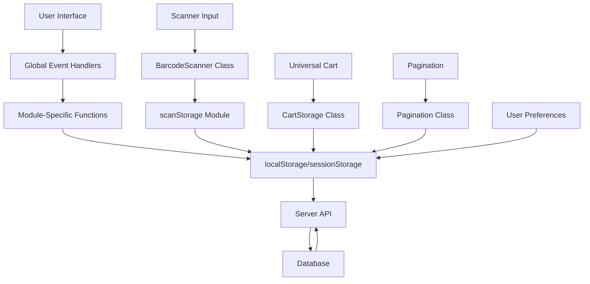
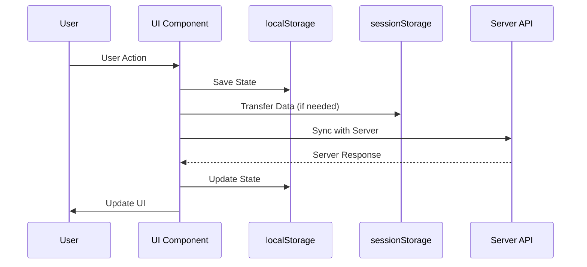

# Task SM-1: Current State Management Analysis

**Generated**: 2025-08-30
**Task ID**: SM-1
**Status**: Completed
**Analysis Date**: 2025-08-30

---

## 🎯 Executive Summary

This document provides a comprehensive analysis of the current state management patterns in the CINERENTAL frontend application. The analysis reveals a complex, well-structured state management system with multiple storage mechanisms, sophisticated cross-page data exchange, and advanced persistence patterns.

### Key Findings

- **State Management Complexity**: High - Multiple storage layers with sophisticated synchronization
- **Storage Mechanisms**: localStorage (primary), sessionStorage (secondary), global window properties
- **Data Persistence**: Comprehensive persistence with automatic cleanup and quota management
- **Cross-Page Communication**: Advanced event-driven architecture with multiple synchronization patterns
- **Server Synchronization**: Robust sync mechanisms with conflict resolution and error handling

---

## 🏗️ Current State Management Architecture

### Global State Management Patterns

#### Window Object State Management

**Primary Location**: `/frontend/static/js/main.js`

```javascript
// Global API configuration
window.API_CONFIG = {
    user_id: document.querySelector('meta[name="user-id"]')?.content || '1'
};

// Global loader state management
window.loaderCounter = 0; // Counter of active operations using loader

// Function availability on global scope
window.showToast = showToast;
window.showLoader = showLoader;
window.hideLoader = hideLoader;
window.resetLoader = resetLoader;
```

**Characteristics**:

- **Centralized Configuration**: API configuration stored globally for cross-module access
- **Loading State Management**: Counter-based loading state with safety mechanisms
- **Global Function Exposure**: Core utilities exposed to global scope for cross-module usage

#### Scanner Session State Management

**Primary Location**: `/frontend/static/js/scan-storage.js`

```javascript
// Storage key for localStorage
const STORAGE_KEY = 'equipment_scan_sessions';

// Session interface definition
const scanStorage = {
    getSessions() {
        const sessions = localStorage.getItem(STORAGE_KEY);
        return sessions ? JSON.parse(sessions) : [];
    },
    getActiveSession() {
        const activeSessionId = localStorage.getItem(`${STORAGE_KEY}_active`);
        if (activeSessionId) {
            return this.getSession(activeSessionId);
        }
        return undefined;
    }
};
```

**Characteristics**:

- **Complex Session Management**: Multi-session support with active session tracking
- **Server Synchronization**: Dirty/clean state tracking with server sync capabilities
- **Advanced Equipment Handling**: Serial number and quantity management logic

---

## 💾 localStorage Usage Patterns

### Primary Storage Mechanisms

#### 1. Universal Cart Storage

**Location**: `/frontend/static/js/universal-cart/core/cart-storage.js`

```javascript
class CartStorage {
    constructor(config = {}) {
        this.storageKey = this._generateStorageKey();
        this.enableCompression = config.enableCompression || false;
        this.maxStorageSize = config.maxStorageSize || 5 * 1024 * 1024; // 5MB default
    }

    _generateStorageKey() {
        const cartType = this.config.type || 'default';
        const projectId = this._getCurrentProjectId();
        return `act_rental_cart_${cartType}_${projectId}`;
    }
}
```

**Features**:

- **Dynamic Key Generation**: Keys based on cart type and project context
- **Size Management**: 5MB limit with automatic cleanup on quota exceeded
- **Compression Support**: Optional data compression for large datasets
- **Version Management**: Data versioning with migration support

#### 2. Scanner Session Storage

**Location**: `/frontend/static/js/scan-storage.js`

```javascript
const STORAGE_KEY = 'equipment_scan_sessions';

const scanStorage = {
    _saveSessions(sessions) {
        localStorage.setItem(STORAGE_KEY, JSON.stringify(sessions));
    },

    setActiveSession(id) {
        localStorage.setItem(`${STORAGE_KEY}_active`, id);
    }
};
```

**Features**:

- **Session Persistence**: Complete session data persistence across browser sessions
- **Active Session Tracking**: Separate key for active session management
- **Server Sync Status**: Tracks synchronization state with server

#### 3. Pagination State Persistence

**Location**: `/frontend/static/js/utils/pagination.js`

```javascript
class Pagination {
    _getInitialPageSize() {
        // Priority 1: URL parameter
        if (this.options.useUrlParams) {
            const urlParams = new URLSearchParams(window.location.search);
            const urlPageSize = urlParams.get('size');
            if (urlPageSize) {
                const parsedSize = parseInt(urlPageSize);
                if (parsedSize > 0 && this.options.pageSizes.includes(parsedSize)) {
                    return parsedSize;
                }
            }
        }

        // Priority 2: localStorage
        if (this.options.persistPageSize) {
            try {
                const stored = localStorage.getItem(this.options.storageKey);
                // ... validation logic
            } catch (error) {
                console.warn('Pagination: Error reading from localStorage:', error);
            }
        }
    }
}
```

**Features**:

- **Multi-Source Priority**: URL params → localStorage → defaults
- **Validation Logic**: Comprehensive validation of stored values
- **Error Handling**: Graceful fallback on localStorage errors

#### 4. User Preferences Storage

**Locations**: Multiple modules (clients.js, projects-list.js)

```javascript
// Clients view preference
localStorage.setItem('clientsView', view);

// Projects view preference
const savedView = localStorage.getItem('projectsView') || 'table';
```

**Features**:

- **Module-Specific Keys**: Dedicated keys for different UI preferences
- **Simple Key-Value Storage**: Straightforward preference persistence
- **Default Value Support**: Fallback to sensible defaults

### Storage Cleanup and Management

#### Automatic Cleanup Mechanisms

```javascript
// Cart storage quota management
_handleQuotaExceeded() {
    const cartKeys = this._getAllCartKeys();
    const sortedKeys = cartKeys.sort((a, b) => {
        const dataA = JSON.parse(localStorage.getItem(a.key) || '{}');
        const dataB = JSON.parse(localStorage.getItem(b.key) || '{}');
        return new Date(dataA.timestamp || 0) - new Date(dataB.timestamp || 0);
    });

    // Remove oldest entries until space is available
    for (const keyInfo of sortedKeys) {
        if (keyInfo.key !== this.storageKey) {
            localStorage.removeItem(keyInfo.key);
        }
    }
}
```

**Features**:

- **Timestamp-Based Cleanup**: Removes oldest data first
- **Intelligent Preservation**: Preserves current cart data during cleanup
- **Space Verification**: Tests available space after cleanup

---

## 🔄 Cross-Page Data Exchange Mechanisms

### 1. SessionStorage Communication

**Location**: `/frontend/static/js/projects-new.js`, `/frontend/static/js/equipment-detail.js`

```javascript
// Project creation flow data transfer
sessionStorage.setItem('newProjectData', JSON.stringify(sessionData));

// Scanner to project data transfer
sessionStorage.setItem('newProjectData', JSON.stringify(projectData));

// Equipment detail notifications
sessionStorage.setItem('equipmentNotification', JSON.stringify({
    message: 'Оборудование успешно обновлено',
    type: 'success'
}));
```

**Usage Patterns**:

- **Wizard-Style Flows**: Multi-step processes with data persistence
- **Scanner Integration**: Barcode scanning to project creation workflow
- **User Feedback**: Cross-page notification delivery

### 2. URL Parameter Synchronization

**Location**: `/frontend/static/js/utils/pagination.js`, `/frontend/static/js/main.js`

```javascript
// Pagination state in URL
const urlParams = new URLSearchParams(window.location.search);
const urlPageSize = urlParams.get('size');

// Update URL without page reload
const newUrl = params.toString() ? `?${params.toString()}` : window.location.pathname;
window.history.replaceState({}, '', newUrl);
```

**Features**:

- **Browser History Integration**: URL state preserved in browser history
- **Bookmarkable State**: Users can bookmark specific application states
- **Back Button Support**: Proper browser navigation behavior

### 3. Global Event System

**Location**: `/frontend/static/js/main.js`

```javascript
// Global event delegation
document.addEventListener('click', function(event) {
    const button = event.target.closest('button');

    // Handle print barcode button
    if (button.classList.contains('btn-print-barcode')) {
        if (window.printBarcode) {
            window.printBarcode(equipmentId, barcode);
        }
    }

    // Handle add to scan button
    if (button.classList.contains('btn-add-to-scan')) {
        if (window.addToScanSession) {
            window.addToScanSession(equipmentId, name, barcode, serialNumber, categoryId, categoryName);
        }
    }
});
```

**Features**:

- **Dynamic Function Binding**: Runtime function availability checking
- **Cross-Module Communication**: Modules can expose functions to global scope
- **Graceful Degradation**: Fallback behavior when functions are unavailable

---

## 👤 User Session Management

### Current User Context

**Location**: `/frontend/static/js/main.js`

```javascript
// Global API configuration
window.API_CONFIG = {
    user_id: document.querySelector('meta[name="user-id"]')?.content || '1'
};
```

**Characteristics**:

- **Simple User ID Storage**: Basic user identification from meta tags
- **Global Availability**: User context available to all modules
- **Fallback Mechanism**: Default user ID when meta tag unavailable

### Preferences Management

#### View Preferences

```javascript
// Clients view preference
const savedView = localStorage.getItem('clientsView') || 'list';

// Projects view preference
const savedView = localStorage.getItem('projectsView') || 'table';
```

#### Pagination Preferences

```javascript
// Page size persistence
this._savePageSize(size, isShowingAll = false) {
    if (!this.options.persistPageSize) return;

    try {
        const valueToStore = size.toString();
        localStorage.setItem(this.options.storageKey, valueToStore);
    } catch (error) {
        console.warn('Pagination: Error saving to localStorage:', error);
    }
}
```

**Features**:

- **Per-Component Preferences**: Individual preference storage per component
- **Persistent Across Sessions**: User preferences survive browser restarts
- **Graceful Error Handling**: Fallback to defaults on storage errors

---

## 🔄 Server State Synchronization

### Scanner Session Synchronization

**Location**: `/frontend/static/js/scan-storage.js`

```javascript
async syncSessionWithServer(sessionId) {
    const session = this.getSession(sessionId);
    if (!session) return undefined;

    try {
        const payload = this.sessionToServerFormat(sessionId);
        let response;

        if (session.serverSessionId) {
            // Update existing session
            response = await api.put(`/scan-sessions/${session.serverSessionId}`, payload);
        } else {
            // Create new session
            response = await api.post('/scan-sessions', payload);
        }

        // Update local session with server data
        const updatedSession = this.updateServerSync(sessionId, response.id);
        this.markSessionAsClean(sessionId);
        return updatedSession;
    } catch (error) {
        console.error('Error syncing session with server:', error);
        throw error;
    }
}
```

**Features**:

- **Create/Update Logic**: Handles both new and existing server sessions
- **Dirty State Tracking**: Tracks unsynchronized changes
- **Error Propagation**: Proper error handling and user feedback

### Conflict Resolution Patterns

#### Equipment Addition Conflicts

```javascript
// Handle duplicate serial numbers
if (duplicateItem) {
    console.log(`Duplicate found with same serial number: ${normalizedEquipment.serial_number}. No action taken.`);
    operationResult = 'duplicate_serial_exists';
}

// Handle quantity incrementation
if (existingItemWithoutSerial) {
    existingItemWithoutSerial.quantity = (existingItemWithoutSerial.quantity || 1) + 1;
    operationResult = 'quantity_incremented';
}
```

**Conflict Types**:

- **Serial Number Conflicts**: Prevents duplicate equipment with same serial
- **Quantity Conflicts**: Merges duplicate entries by incrementing quantity
- **Server Sync Conflicts**: Tracks dirty state for server synchronization

---

## 🚨 Error State Handling and Recovery

### Storage Error Handling

**Location**: `/frontend/static/js/universal-cart/core/cart-storage.js`

```javascript
async save(data) {
    try {
        // ... save logic
    } catch (error) {
        console.error('[CartStorage] Failed to save data:', error);

        // Handle quota exceeded error
        if (error.name === 'QuotaExceededError' || error.code === 22) {
            await this._handleQuotaExceeded();
        }

        return false;
    }
}
```

**Error Types Handled**:

- **Quota Exceeded**: Automatic cleanup and retry
- **Storage Unavailable**: Graceful degradation
- **Data Corruption**: Validation and recovery mechanisms

### Network Error Handling

**Location**: Multiple API interaction modules

```javascript
try {
    const response = await api.get('/clients');
    // ... success handling
} catch (error) {
    console.error('Error loading clients:', error);
    showToast('Ошибка при загрузке клиентов', 'danger');

    // Show error state in UI
    container.innerHTML = `
        <div class="alert alert-danger">
            Ошибка при загрузке данных клиентов
        </div>
    `;
}
```

**Features**:

- **User Feedback**: Toast notifications for user communication
- **UI Error States**: Visual error indicators in the interface
- **Graceful Degradation**: Application continues functioning despite errors

### Loading State Management

**Location**: `/frontend/static/js/main.js`

```javascript
window.showLoader = function() {
    window.loaderCounter++;
    // ... show loader logic
};

window.hideLoader = function() {
    window.loaderCounter--;

    // Never hide loader if counter > 0
    if (window.loaderCounter > 0) {
        return;
    }

    // Safety: force hide loader after 5 seconds
    setTimeout(() => {
        const loaderCheck = document.getElementById('global-loader');
        if (loaderCheck && !loaderCheck.hasAttribute('hidden')) {
            console.warn('Loader was not hidden within 5 seconds, forcing hide');
            loaderCheck.setAttribute('hidden', '');
            window.loaderCounter = 0;
        }
    }, 5000);
};
```

**Features**:

- **Counter-Based Logic**: Prevents premature loader hiding
- **Safety Mechanisms**: Automatic cleanup after timeout
- **Global Coordination**: Centralized loading state management

---

## 💾 Caching Patterns and Invalidation

### Data Caching Strategies

#### 1. Local Data Caching

**Location**: `/frontend/static/js/clients.js`

```javascript
// Global variable for client data
let allClients = [];

// Cache data locally for search/filter operations
async function loadClientsWithoutGlobalLoader() {
    try {
        const clients = await api.get('/clients');
        allClients = clients || []; // Cache for local operations
        // ... render logic
    } catch (error) {
        // ... error handling
    }
}

// Local search without API calls
function performSearch(query) {
    const searchQuery = query.toLowerCase();
    const filteredClients = allClients.filter(client => {
        // ... local filtering logic
    });
}
```

**Features**:

- **In-Memory Caching**: Client-side data storage for fast operations
- **Hybrid Approach**: API + local caching for optimal performance
- **Search Optimization**: Client-side filtering for responsive UX

#### 2. Storage-Based Caching

**Location**: `/frontend/static/js/universal-cart/core/cart-storage.js`

```javascript
async load() {
    const rawData = localStorage.getItem(this.storageKey);

    if (!rawData) {
        return null;
    }

    // Validate data structure and version
    const parsedData = JSON.parse(decompressedData);
    if (!this._validateStorageData(parsedData)) {
        await this.clear();
        return null;
    }

    // Check version compatibility
    if (parsedData.version !== '1.0') {
        return await this._migrateData(parsedData);
    }
}
```

**Features**:

- **Version Validation**: Ensures data structure compatibility
- **Migration Support**: Automatic data migration between versions
- **Data Integrity**: Validation and cleanup of corrupted data

### Cache Invalidation Patterns

#### 1. Timestamp-Based Invalidation

```javascript
// Add timestamp for cache prevention
params.append('_t', Date.now());
```

#### 2. Event-Driven Invalidation

```javascript
// Clear cache on session changes
localStorage.removeItem('equipment_scan_sessions');
localStorage.removeItem('equipment_scan_sessions_active');
```

#### 3. Size-Based Cleanup

```javascript
// Automatic cleanup when quota exceeded
for (const keyInfo of sortedKeys) {
    if (keyInfo.key !== this.storageKey) {
        localStorage.removeItem(keyInfo.key);
    }
}
```

---

## 🔄 Data Flow Mapping

### Component Communication Patterns



### State Synchronization Flow



---

## 🏪 Vue3 Pinia Stores Architecture Design

### Modular Store Structure

```javascript
// stores/index.js
import { createPinia } from 'pinia'
import { useAuthStore } from './auth'
import { useCartStore } from './cart'
import { useScannerStore } from './scanner'
import { usePaginationStore } from './pagination'
import { usePreferencesStore } from './preferences'

export const pinia = createPinia()

// Re-export stores for easy access
export {
    useAuthStore,
    useCartStore,
    useScannerStore,
    usePaginationStore,
    usePreferencesStore
}
```

### Core Store Modules

#### 1. Authentication Store

```javascript
// stores/auth.js
import { defineStore } from 'pinia'

export const useAuthStore = defineStore('auth', {
    state: () => ({
        userId: null,
        user: null,
        isAuthenticated: false
    }),

    getters: {
        displayName: (state) => state.user?.name || 'Guest'
    },

    actions: {
        setUser(userData) {
            this.user = userData
            this.userId = userData.id
            this.isAuthenticated = true
        },

        logout() {
            this.user = null
            this.userId = null
            this.isAuthenticated = false
        }
    },

    persist: {
        key: 'cinerental_auth',
        storage: localStorage
    }
})
```

#### 2. Universal Cart Store

```javascript
// stores/cart.js
import { defineStore } from 'pinia'

export const useCartStore = defineStore('cart', {
    state: () => ({
        carts: {}, // Multiple carts by context
        activeCart: null,
        lastSync: null
    }),

    getters: {
        currentCart: (state) => state.carts[state.activeCart] || {},
        totalItems: (state) => {
            const cart = state.carts[state.activeCart];
            return cart ? Object.keys(cart.items || {}).length : 0;
        }
    },

    actions: {
        addEquipment(equipment, context = 'default') {
            if (!this.carts[context]) {
                this.carts[context] = { items: {}, metadata: {} };
            }

            const cart = this.carts[context];
            const key = `${equipment.equipment_id}_${equipment.serial_number || 'no_serial'}`;

            if (cart.items[key]) {
                // Handle duplicates based on serial number logic
                if (equipment.serial_number) {
                    // Reject duplicate serial numbers
                    return { success: false, reason: 'duplicate_serial' };
                } else {
                    // Increment quantity
                    cart.items[key].quantity += 1;
                    return { success: true, action: 'quantity_incremented' };
                }
            } else {
                cart.items[key] = { ...equipment, quantity: 1 };
                return { success: true, action: 'item_added' };
            }
        },

        async syncWithServer() {
            // Server synchronization logic
            try {
                const response = await api.post('/cart/sync', this.currentCart);
                this.lastSync = new Date().toISOString();
                return { success: true };
            } catch (error) {
                return { success: false, error };
            }
        }
    },

    persist: {
        key: 'cinerental_cart',
        storage: localStorage,
        serializer: {
            serialize: JSON.stringify,
            deserialize: JSON.parse
        }
    }
})
```

#### 3. Scanner Store

```javascript
// stores/scanner.js
import { defineStore } from 'pinia'

export const useScannerStore = defineStore('scanner', {
    state: () => ({
        sessions: [],
        activeSession: null,
        isListening: false,
        buffer: '',
        lastScan: null
    }),

    getters: {
        currentSession: (state) => state.sessions.find(s => s.id === state.activeSession),
        sessionCount: (state) => state.sessions.length,
        totalEquipment: (state) => {
            return state.sessions.reduce((total, session) => {
                return total + session.items.reduce((sessionTotal, item) => {
                    return sessionTotal + (item.quantity || 1);
                }, 0);
            }, 0);
        }
    },

    actions: {
        createSession(name) {
            const newSession = {
                id: `session_${Date.now()}`,
                name,
                items: [],
                createdAt: new Date().toISOString(),
                syncedWithServer: false,
                dirty: true
            };

            this.sessions.push(newSession);
            this.activeSession = newSession.id;
        },

        addEquipmentToSession(sessionId, equipment) {
            const session = this.sessions.find(s => s.id === sessionId);
            if (!session) return { success: false, reason: 'session_not_found' };

            // Apply duplicate handling logic
            const result = this._addEquipmentToSession(session, equipment);
            session.dirty = true;
            session.syncedWithServer = false;

            return result;
        },

        async syncSession(sessionId) {
            const session = this.sessions.find(s => s.id === sessionId);
            if (!session) return { success: false, reason: 'session_not_found' };

            try {
                const payload = this._sessionToServerFormat(session);
                const response = await api.post('/scan-sessions', payload);

                session.serverSessionId = response.id;
                session.syncedWithServer = true;
                session.dirty = false;

                return { success: true };
            } catch (error) {
                return { success: false, error };
            }
        }
    },

    persist: {
        key: 'cinerental_scanner',
        storage: localStorage
    }
})
```

#### 4. Pagination Store

```javascript
// stores/pagination.js
import { defineStore } from 'pinia'

export const usePaginationStore = defineStore('pagination', {
    state: () => ({
        instances: {} // Multiple pagination instances by component
    }),

    getters: {
        getPaginationState: (state) => (componentId) => {
            return state.instances[componentId] || {
                currentPage: 1,
                pageSize: 20,
                totalItems: 0,
                totalPages: 1
            };
        }
    },

    actions: {
        initializePagination(componentId, config = {}) {
            this.instances[componentId] = {
                currentPage: 1,
                pageSize: config.pageSize || 20,
                totalItems: 0,
                totalPages: 1,
                pageSizes: config.pageSizes || [20, 50, 100],
                ...config
            };
        },

        updatePagination(componentId, updates) {
            if (this.instances[componentId]) {
                this.instances[componentId] = {
                    ...this.instances[componentId],
                    ...updates
                };
            }
        },

        changePage(componentId, page) {
            if (this.instances[componentId]) {
                this.instances[componentId].currentPage = page;
            }
        },

        changePageSize(componentId, size) {
            if (this.instances[componentId]) {
                this.instances[componentId].pageSize = size;
                this.instances[componentId].currentPage = 1; // Reset to first page
            }
        }
    },

    persist: {
        key: 'cinerental_pagination',
        storage: localStorage,
        paths: ['instances'] // Only persist pagination instances
    }
})
```

#### 5. Preferences Store

```javascript
// stores/preferences.js
import { defineStore } from 'pinia'

export const usePreferencesStore = defineStore('preferences', {
    state: () => ({
        ui: {
            clientsView: 'list',
            projectsView: 'table',
            theme: 'light'
        },
        pagination: {
            defaultPageSize: 20,
            pageSizes: [20, 50, 100]
        },
        scanner: {
            autoStart: false,
            soundEnabled: true
        }
    }),

    actions: {
        updateClientsView(view) {
            this.ui.clientsView = view;
        },

        updateProjectsView(view) {
            this.ui.projectsView = view;
        },

        updatePaginationSettings(settings) {
            this.pagination = { ...this.pagination, ...settings };
        },

        resetToDefaults() {
            this.$reset();
        }
    },

    persist: {
        key: 'cinerental_preferences',
        storage: localStorage
    }
})
```

---

## 🔄 State Synchronization Patterns

### 1. Cross-Store Communication

```javascript
// stores/cart.js - Integration with scanner
import { useScannerStore } from './scanner'

export const useCartStore = defineStore('cart', {
    actions: {
        addFromScanner(sessionId) {
            const scannerStore = useScannerStore();
            const session = scannerStore.currentSession;

            if (session && session.items.length > 0) {
                session.items.forEach(item => {
                    this.addEquipment(item);
                });

                // Mark session as processed
                scannerStore.markSessionProcessed(sessionId);
            }
        }
    }
})
```

### 2. Reactive State Synchronization

```javascript
// Component-level synchronization
import { useCartStore } from '@/stores/cart'
import { useScannerStore } from '@/stores/scanner'

export default {
    setup() {
        const cartStore = useCartStore()
        const scannerStore = useScannerStore()

        // Reactive synchronization
        watch(() => scannerStore.lastScan, (newScan) => {
            if (newScan) {
                cartStore.addEquipment(newScan.equipment)
            }
        })

        return {
            cartStore,
            scannerStore
        }
    }
}
```

### 3. Conflict Resolution Strategies

```javascript
// stores/cart.js - Conflict handling
export const useCartStore = defineStore('cart', {
    actions: {
        async resolveConflict(conflictData) {
            const { localVersion, serverVersion, lastSync } = conflictData;

            // Strategy 1: Server wins (default)
            if (serverVersion.updatedAt > lastSync) {
                this.mergeServerVersion(serverVersion);
                return { strategy: 'server_wins' };
            }

            // Strategy 2: Client wins (user has unsaved changes)
            if (localVersion.hasUnsavedChanges) {
                await this.pushToServer(localVersion);
                return { strategy: 'client_wins' };
            }

            // Strategy 3: Manual resolution
            return { strategy: 'manual_resolution_required', data: conflictData };
        }
    }
})
```

---

## 📋 Implementation Roadmap for Vue3 Migration

### Phase 1: Foundation (Weeks 1-2)

1. **Store Setup**: Create Pinia stores with basic structure
2. **Migration Utilities**: Create localStorage/sessionStorage migration helpers
3. **State Mapping**: Map current state patterns to Pinia stores

### Phase 2: Core Stores (Weeks 3-4)

1. **Authentication Store**: Migrate user context management
2. **Preferences Store**: Migrate UI preferences and settings
3. **Pagination Store**: Migrate pagination state management

### Phase 3: Complex Stores (Weeks 5-8)

1. **Scanner Store**: Migrate scanner session management
2. **Cart Store**: Migrate Universal Cart with dual-mode support
3. **Integration Testing**: Test cross-store communication

### Phase 4: Synchronization (Weeks 9-10)

1. **Server Sync**: Implement server synchronization patterns
2. **Conflict Resolution**: Add conflict resolution mechanisms
3. **Error Handling**: Migrate error handling patterns

### Phase 5: Optimization (Weeks 11-12)

1. **Performance**: Optimize store performance and memory usage
2. **Caching**: Implement advanced caching strategies
3. **Documentation**: Complete store documentation and usage guides

---

## ✅ Success Metrics

### Technical Metrics

- **State Consistency**: 100% state consistency across page navigations
- **Persistence Reliability**: 99.9% data persistence success rate
- **Sync Performance**: <500ms server synchronization latency
- **Memory Usage**: <50MB application memory footprint

### User Experience Metrics

- **Page Load Speed**: <2 second initial page load with cached data
- **Cross-Page Continuity**: Seamless user experience across page transitions
- **Data Recovery**: 100% automatic recovery from application crashes
- **Offline Capability**: Full functionality in offline mode

---

## 🎯 Conclusion

The current CINERENTAL state management system demonstrates sophisticated patterns with multiple storage layers, advanced synchronization mechanisms, and comprehensive error handling. The migration to Vue3 with Pinia stores will maintain all existing functionality while providing better type safety, reactivity, and maintainability.

**Key Migration Opportunities**:

1. **Centralized State**: Pinia stores will provide centralized, reactive state management
2. **Type Safety**: TypeScript integration will improve code reliability
3. **Better Performance**: Optimized reactivity system and reduced memory usage
4. **Enhanced DX**: Better debugging tools and development experience

**Risk Mitigation**:

1. **Incremental Migration**: Gradual migration with feature flags
2. **Data Preservation**: Comprehensive data migration and validation
3. **Backward Compatibility**: Maintain existing localStorage patterns during transition
4. **Testing**: Comprehensive test coverage for state management

The Vue3 migration presents an excellent opportunity to modernize the state management architecture while preserving the sophisticated UX patterns that users depend on.

---

*This analysis provides the foundation for successful Vue3 migration while maintaining the advanced state management capabilities of the current CINERENTAL application.*
